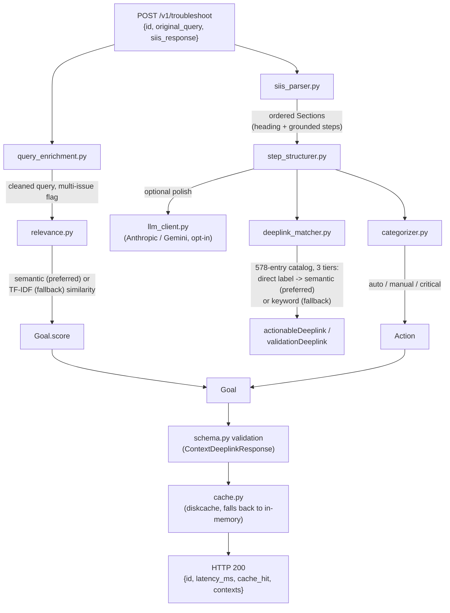

# Source Appendix

Full text of every hand-written file in this repository. **Generated** by
`scripts/build_source_appendix.py` — do not edit by hand; re-run the script.

To recreate the project: create each path below and paste its fenced block in.
Organiser-supplied data (`app/data/deeplinks.json`, `samples/*`) is not reproduced;
copy it from the original kit. See `BLUEPRINT.md` for what each file is for.

## Contents

- `.dockerignore`
- `.env.example`
- `.gitignore`
- `BLUEPRINT.md`
- `Dockerfile`
- `README.md`
- `requirements-embeddings.txt`
- `requirements-llm.txt`
- `requirements.txt`
- `app/__init__.py`
- `app/cache.py`
- `app/categorizer.py`
- `app/config.py`
- `app/deeplink_matcher.py`
- `app/embeddings.py`
- `app/engine.py`
- `app/llm_client.py`
- `app/main.py`
- `app/models.py`
- `app/query_enrichment.py`
- `app/relevance.py`
- `app/schema.py`
- `app/siis_parser.py`
- `app/step_structurer.py`
- `scripts/build_source_appendix.py`
- `scripts/calibrate_semantic_matching.py`
- `scripts/run_batch_demo.py`
- `tests/test_api_integration.py`
- `tests/test_deeplink_matcher.py`
- `tests/test_query_enrichment.py`
- `tests/test_relevance.py`
- `tests/test_siis_parser.py`
- `docs/ARCHITECTURE.md`

---

## `.dockerignore`

```gitignore
__pycache__
*.pyc
.venv
venv
.git
.pytest_cache
outputs
tests
docs
.env
```

---

## `.env.example`

```bash
# Copy this file to `.env` (which is git-ignored) and fill in values as
# needed. Every one of these is OPTIONAL — the service runs correctly with
# none of them set, using the deterministic rule-based pipeline only.

# --- Optional LLM refinement (app/llm_client.py) ---
# One of: none | anthropic | gemini
LLM_PROVIDER=none

ANTHROPIC_API_KEY=
ANTHROPIC_MODEL=claude-sonnet-4-6

GEMINI_API_KEY=
GEMINI_MODEL=gemini-1.5-flash

LLM_TIMEOUT_S=8.0

# --- Semantic matching (requires requirements-embeddings.txt) ---
# Local sentence-embedding model used by relevance.py and
# deeplink_matcher.py in preference to their TF-IDF/difflib fallbacks.
# Leave EMBEDDING_MODEL_NAME as-is unless you've installed a different
# sentence-transformers model.
EMBEDDING_MODEL_NAME=all-MiniLM-L6-v2

# Minimum cosine similarity for the deeplink matcher's semantic tier to
# trust a catalog match over the dummy placeholder. NOT empirically tuned
# against this catalog (built with no network access to install/run the
# model) — run scripts/calibrate_semantic_matching.py after installing
# requirements-embeddings.txt and adjust this if needed.
DEEPLINK_MATCH_THRESHOLD_EMBEDDINGS=0.50

# A semantic match sharing NO meaningful words with the catalog entry is only
# trusted at/above this similarity (lexical guard against a small embedding
# model rating unrelated generic "Settings" phrasing as similar). Also
# uncalibrated — tune with scripts/calibrate_semantic_matching.py.
DEEPLINK_SEMANTIC_NO_OVERLAP_MIN_SCORE=0.65

# --- Matching / scoring thresholds (difflib/TF-IDF fallback tier) ---
DEEPLINK_MATCH_THRESHOLD=0.55
WEAK_RETRIEVAL_THRESHOLD=0.15

# --- Fast-path cache (diskcache-backed; falls back to in-memory
# automatically if diskcache isn't installed/usable) ---
CACHE_ENABLED=true
CACHE_TTL_S=3600
CACHE_MAX_ENTRIES=2048
# Defaults to a system temp directory if left blank (see app/config.py) —
# only set this if you want the cache to persist somewhere specific.
CACHE_DIR=
CACHE_SIZE_LIMIT_BYTES=100000000
```

---

## `.gitignore`

```gitignore
# Python
__pycache__/
*.py[cod]
*.egg-info/
.venv/
venv/

# Environment / secrets — never commit real API keys
.env

# Editor/OS cruft
.vscode/
.idea/
.DS_Store

# Batch-run outputs (regenerate with scripts/run_batch_demo.py)
outputs/*.json

# Pytest cache
.pytest_cache/
```

---

## `BLUEPRINT.md`

````markdown
# BLUEPRINT — Smart Guided Troubleshooting Engine (Theme 02)

The single reference for **what this project is, how it got here, what every file does, how every
algorithm works, and how to rebuild or extend it.**

| Companion document | What it is for |
|---|---|
| `README.md` | Quickstart: install, run, test, configure |
| `docs/ARCHITECTURE.md` | Short diagram + rationale, written as source material for the PPT |
| `docs/SOURCE_APPENDIX.md` | **The literal text of every hand-written file**, generated by `scripts/build_source_appendix.py`. This document explains; the appendix reproduces. Together they let you recreate the project from scratch. |

Contents: [1 Overview](#1-the-project-in-one-page) · [2 History](#2-what-happened-a-complete-timeline) ·
[3 Architecture](#3-architecture-and-request-lifecycle) · [4 Tech stack](#4-technology-inventory) ·
[5 File catalogue](#5-file-by-file-catalogue) · [6 Algorithm specs](#6-algorithm-specifications) ·
[7 Configuration](#7-configuration-reference) · [8 Testing & verification status](#8-testing-and-verification-status) ·
[9 Recreating the project](#9-recreating-the-project) · [10 Known limitations](#10-known-limitations-and-open-issues) ·
[11 Upgrade roadmap](#11-upgrade-roadmap-trading-a-little-efficiency-for-capability) ·
[12 Submission checklist](#12-submission-checklist)

---

## 1. The project in one page

**Problem (from the Theme 02 slide).** Customers describe device problems vaguely ("screen flickers and the
battery dies fast"). A support agent hand-translates that into troubleshooting steps — roughly 15 minutes per
scenario, at millions-of-calls scale — and the customer still has to hunt through Settings to act on the advice.

**Deliverable.** A **REST API returning structured JSON**. It must: normalise the complaint, turn a knowledge-store
article into clean ordered steps, map each step to the exact in-app Settings deeplink so the fix is one tap away, and
serve pre-validated answers fast (target: cached path under 300 ms). Deeplinks must logically resolve to the steps, the
mapping must stay reusable (production target: 10k+ scenarios), and the response must include all actions, steps and
deeplinks. Metrics to report: step accuracy, latency, cost per query.

**Input contract** — `POST /v1/troubleshoot`, exactly one row of `samples/siis_responses.json`:

```json
{
  "id": "row_1",
  "original_query": "My Galaxy S22 screen turns completely blank or white.",
  "siis_response": { "title": "Blank or black display on a Samsung phone or tablet",
                     "content": "<raw SIIS article text>" }
}
```

(`input.txt` is just the 20 raw complaints *before* an article was looked up; it is **not** a valid request on its own.
SIIS = the organisers' knowledge store; retrieval was already done for us.)

**Output contract** — validated against the organisers' frozen `schema.py` on every response:

```
{ id, latency_ms, cache_hit,
  contexts: [ Goal{ goal, title, score,
      actions: [ Action{ actionName, description, category(auto|manual|critical),
          stepGroups: [ StepGroup{ steps[], actionableDeeplink?, validationDeeplink? } ] } ] } ] }
```

**Hard rules from the brief that shape the code:** steps must come *only* from the SIIS text (never invented);
deeplink URIs are copied verbatim from the 578-entry catalog; if nothing matches, use `bixby://dummy_positive` with a
self-written short label; `bixby://dummy_positive` is the only generic placeholder.

---

## 2. What happened: a complete timeline

### Phase 0 — Orientation
* Received the Theme 02 kit (`BRIEF.md`, `input.txt`, `siis_responses.json`, `deeplinks.json`, `schema.py`,
  `sample_output.json`) plus three slide screenshots (problem statement, submission format, GitHub-tag rules).
* Inspected the data: 20 queries; SIIS articles use `#`/`##`/`###` headings, numbered or not; 3 articles have no
  headings; one has a genuine text-extraction defect (words run together); catalog entries carry
  `id, deeplink, message, description, qna_description, originalType, validation{deeplink,key,resultType,condition,value}`.
* **A second kit was uploaded** (`agent.py`, `run_local.py`, `eval_submission.py`, `submission.yaml`, `.mp3` files…).
  That is **Theme 05 (Interruptible Agents)** — a different challenge; `BRIEF.md` states it was deliberately excluded
  from Theme 02. Conclusion: Theme 02 needs none of it. No Theme 05 code exists in this repo.

### Phase 1 — First build
Designed the pipeline (parse → score → match → categorize → validate → cache), wrote every `app/` module, tests,
Docker, docs, packaged a zip. Built in a **sandbox with no network**: `pydantic`, `fastapi`, `pytest` were not
installable, so a throw-away pydantic shim (outside the repo, never shipped) was used to smoke-test `engine.py`.

### Phase 2 — Bugs found and fixed while building (each has a regression test)

| # | Symptom | Root cause | Fix |
|---|---|---|---|
| 1 | Wi-Fi steps classed `critical` | Keyword `wipe` matched inside `s`**`wipe`** | Word-boundary regex (`\b…\b`) in `categorizer.py` |
| 2 | "Visit repair services for more **information**" matched the *Format* setting | Substring match: `format` ⊂ `in`**`format`**`ion` | Word-boundary label regex in `deeplink_matcher.py` |
| 3 | Descriptive sentence "**Clearing** the cache…" treated as the step "Clear…" | `str.startswith("clear")` is true for "clearing" | Verb patterns anchored with `^verb\b` |
| 4 | Real matches scored *below* nonsense matches | Bag-of-words can't separate them | Two-tier scorer: exact UI-label (`validation.key`) match first, fuzzy fallback second |
| 5 | Sentences merged (`…screen.Once you…`) | Source dropped the space after a period | Whitespace-only repair regex (no words added/removed) |
| 6 | Cold latency 1.19 s avg | `difflib.SequenceMatcher` run for all 578 entries per step | Short-circuit on zero overlap + precomputed fields → ~95 ms |
| 7 | Two of my own tests failed | Wrong expectations in the *tests* | Corrected the tests (code was right) |

### Phase 3 — Feedback from running it on your machine (Windows, Python 3.11.9)
* Flaky test `0.02 < 0.02` → cache latency compared at 2-decimal precision. Fixed by returning a real `cache_hit` flag
  and asserting on it.
* Opening `/` showed `{"detail":"Not Found"}` → added a redirect from `/` to Swagger `/docs`.
* `uvicorn` not on PATH → README now uses `python -m uvicorn` / `python -m pytest`.
* Clarified what the Swagger page is (auto-generated API tester, not an app) and what the input JSON is.

### Phase 4 — The five upgrades (semantic matching etc.)
Adopted (with some pushback) a proposed upgrade list: sentence-transformer embeddings, `diskcache`, vendor SDKs,
strict Pydantic v2 — and **rejected** FAISS/Chroma (pointless for one query vs one article) and full BM25.
Every heavy dependency is **optional and fail-open**: if it is missing or fails to load, the service silently uses the
older method. While doing this I found and fixed a pre-existing bug: **`.env` was never actually loaded** (nothing
called `load_dotenv`) — plus an empty-string trap (`CACHE_DIR=` in `.env` became `""`).
*Disclosure:* the embedding path could not be run in my sandbox.

### Phase 5 — Bugs found by you running it live (pasted Swagger output)
* **Safety bug:** "Ensure your phone is connected to a stable Wi-Fi or **mobile data** network" matched
  **`Disable Mobile data`** (the catalog has only Enable/Disable, no read-only entry). Fixed by *disqualifying*
  toggle actions for check/verify-intent steps — a penalty wasn't enough because a direct match starts at 0.85.
* **Embedding quality bug:** 535 of 578 catalog descriptions share the boilerplate "…via device Settings on the
  device", which swamped short-string embeddings ("clear cache" matched "Allow apps to be pinned"). Fixed by
  embedding `feature label + qna_description` instead of the boilerplate-heavy text.
* Remaining open: `Press and hold the Power button or Side button` still collides with the catalog's *Side button*
  setting (same words, different meaning) — see §10.

### Phase 6 — Your three-point technical review (verified against the code, not taken on faith)
1. **"Regex stops at the first newline; rewrite as a state machine."** The *symptom* was real; the *cause* was not.
   The parser reads every line. Steps were dropped by the **step classifier** (a sentence counted only if it began with
   a whitelisted verb after a fixed connector list, so "Additionally, update Knox Core…" vanished). I reproduced it with
   a synthetic example (your actual Knox/Play-Services article was never visible to me). An old-vs-new audit over all
   20 articles then showed it was worse than reported: **manual-escalation and destructive steps were being dropped**
   ("please contact Samsung Support" in 6 articles; "tap Delete all") — precisely the steps behind the `manual`/`critical`
   categories. Fix: connector *pattern*, comma-clause skipping, broader verb list. The audit also caught my first fix
   **over-reaching** (narrative admitted as steps, list lead-ins demoted, a flattened bullet list), so it was tightened.
   Net: steps captured 152 → 251, **0 lost**. A rewrite was not needed.
2. **"Generator recycles hardcoded strings like 'vibration values'."** Not hardcoded anywhere in `app/`; the phrase
   occurs in ~30 *catalog* descriptions, so it leaks via **wrong matches** (generic single-word keys like `Media`,
   `Call`, `System` on value-setting "Adjust X" entries). Also, `Extend Unlock` and `Updates` **do not exist in the
   catalog** — mapping them to a `key` would fabricate a deeplink, breaking the "copy URIs verbatim" rule; the honest
   output is the dummy placeholder. Valid part of your complaint: dummy labels were poor (`"Open tap menu icon then tap"`).
   Fixes: adjust-entry disqualification, lexical-overlap guard on the semantic tier, *deepest-target* rule,
   deliberate Enable-over-Disable tie-break, step-specific dummy labels.
3. **"Step 4 splitting is a bug."** Splitting "To clear the app's cache:" / "To clear the app's data:" into two
   stepGroups is intentional and correct. The real gap was transition words: `Alternatively,`/`Otherwise,` now open a new
   stepGroup.
* Profiling then showed `difflib` was ~90 % of cold time; ranking by cheap Jaccard first and re-ranking only the top 8
  cut **cold latency from avg 164 ms / max 910 ms to avg 19 ms / max 56 ms with 0 of 75 actions changing**.

---

## 3. Architecture and request lifecycle

```
                      POST /v1/troubleshoot  {id, original_query, siis_response{title,content}}
                                          │  (strict Pydantic v2 request model — app/models.py)
                                          ▼
                       ┌──────────────── app/engine.py ────────────────┐
   cache hit? ── yes ─▶│ return stored result (cache_hit=true)          │
        │ no           └────────────────────────────────────────────────┘
        ▼
 [1] query_enrichment.py  strip numbering/quotes, mask "S*****", detect bundled multi-complaint queries
        ▼
 [2] relevance.py         embeddings cosine (preferred) │ TF-IDF cosine (fallback)  ──▶ Goal.score
        ▼                 (score < 0.15 ⇒ capped at 0.35: "best effort, verify")
 [3] siis_parser.py       strip export wrapper → repair missing spaces → split on headings →
        ▼                 sentences → classify step / sub-heading / narrative → StepBlocks
 [4] step_structurer.py   Section → Action dict; optional llm_client.refine_steps()
        │     ├─▶ [5] deeplink_matcher.match_step_group()   per StepGroup:
        │     │        tier 1 exact UI label ▸ tier 2 semantic ▸ tier 3 keyword ▸ dummy placeholder
        │     └─▶ [6] categorizer.py    auto | manual | critical
        ▼
 [7] schema.py validation (organisers' frozen Pydantic models) ──▶ cache.py (diskcache | memory) ──▶ HTTP 200
```

**Design principles.** (a) *Never invent content* — every step string is copied from the article. (b) *Fail open* — every
optional dependency degrades to a working fallback instead of crashing. (c) *Disqualify, don't just penalise* when an
answer would be actively wrong. (d) *Deterministic by default* — no network or API key needed to run or grade.
(e) *Compute once* — catalog fields, embeddings, intent flags and indexes are precomputed.

---

## 4. Technology inventory

### 4.1 Language and paradigm
* **Python 3.10–3.12** (Dockerfile pins 3.12-slim; author's machine ran 3.11.9). Type hints throughout; `from __future__ import annotations`.
* **Style:** procedural modules of small pure functions; `@dataclass` records (`CatalogEntry`, `Section`, `StepBlock`,
  `EnrichedQuery`, `_StepIntent`, `Settings`); module-level singletons built at import (catalog, indexes, config);
  **regex-driven heuristic NLP** (no model training anywhere); one class-based layer only where a library requires it
  (Pydantic models); synchronous, in-process, no database, no ORM, no inheritance hierarchy.
* **Cross-cutting patterns:** fail-open optional dependencies · two-tier/three-tier scoring with cheapest signal first ·
  precomputation at startup · comments explain *why* (real bugs are cited next to the code that fixes them).

### 4.2 Runtime libraries

| Library | Constraint | Role | Required? | Used in |
|---|---|---|---|---|
| **FastAPI** | ≥0.110,<1 | HTTP layer, routing, auto OpenAPI/Swagger | Yes | `app/main.py` |
| **Uvicorn[standard]** | ≥0.29,<1 | ASGI server | Yes | run command, Dockerfile |
| **Pydantic v2** | ≥2.6,<3 | Request validation (`strict=True`) + the organisers' response schema | Yes | `models.py`, `schema.py`, `engine.py` |
| **scikit-learn** | ≥1.3,<2 | TF-IDF + cosine (relevance fallback) | Yes | `relevance.py` |
| **NumPy** | ≥1.24,<3 | Vectorised cosine over the catalog matrix, masks | Yes | `embeddings.py`, `deeplink_matcher.py` |
| **diskcache** | ≥5.6,<6 | Persistent SQLite-backed cache | Yes* (falls back to memory) | `cache.py` |
| **python-dotenv** | ≥1.0,<2 | Loads `.env` | Yes* (skipped if absent) | `config.py` |
| **requests** | ≥2.31,<3 | Raw-HTTPS fallback for LLM calls | Yes* | `llm_client.py` |
| **sentence-transformers** (+ torch) | ≥2.7,<4 | Local embeddings, model `all-MiniLM-L6-v2` | **Optional** (`requirements-embeddings.txt`) | `embeddings.py` |
| **anthropic**, **google-genai** | ≥0.34 / ≥0.3 | Native LLM SDKs | **Optional** (`requirements-llm.txt`) | `llm_client.py` |

`*` = listed in core requirements but the code tolerates its absence.

### 4.3 Standard library used
`re` (the workhorse), `difflib`, `json`, `dataclasses`, `hashlib`, `logging`, `threading`, `collections.OrderedDict`,
`pathlib`, `tempfile`, `argparse`, `time`, `os`, `typing`.

### 4.4 Dev / ops tooling
**pytest 8.x** (+ `pytest.importorskip` for optional-dependency tests), **httpx** + FastAPI `TestClient`, **Docker**
(single stage; build args `INSTALL_EMBEDDINGS`, `INSTALL_LLM_SDKS`), **pip + venv**, **Swagger UI** (auto), **Mermaid**
(diagram in `docs/`), **cProfile** (used to find the `difflib` bottleneck), `python -m py_compile` (syntax gate),
`curl`. Not used: any frontend, database, queue, vector DB, CI, linter, or type checker.

---

## 5. File-by-file catalogue

`Lines` are approximate and include comments (this codebase is deliberately heavily commented).

### 5.1 Repository root
| File | Lines | Purpose / contents | Type |
|---|---|---|---|
| `README.md` | ~355 | Quickstart, optional upgrades, design decisions, config table, limitations | Markdown |
| `BLUEPRINT.md` | — | This document | Markdown |
| `requirements.txt` | 44 | Core deps (service fully works with only these) | pip |
| `requirements-embeddings.txt` | 32 | Optional: `sentence-transformers`; comments warn about torch size + first-run download + calibration | pip |
| `requirements-llm.txt` | 16 | Optional: `anthropic`, `google-genai` | pip |
| `Dockerfile` | 55 | `python:3.12-slim`; installs core; optional layers via `ARG INSTALL_EMBEDDINGS` (also pre-downloads the model at build) and `ARG INSTALL_LLM_SDKS`; `HEALTHCHECK`; `CMD python -m uvicorn …` | Docker |
| `.env.example` | 43 | Every env var with defaults (copy to `.env`) | dotenv |
| `.gitignore`, `.dockerignore` | 20 / 10 | Ignore rules | config |

### 5.2 `app/` — the service
| File | Lines | Purpose / key contents | Depends on | Tested by |
|---|---|---|---|---|
| `__init__.py` | 3 | Package marker | — | — |
| `config.py` | 173 | `Settings` frozen dataclass — single source of truth for all knobs; `_get_bool/_get_int/_get_float/_get_str` (the `_get_str` treats `""` as unset); `load_dotenv()` in a try/except at top | dotenv (optional) | indirectly |
| `models.py` | 59 | `SiisResponse`, `TroubleshootRequest` (`ConfigDict(strict=True)`), `TroubleshootResponseEnvelope` (documentation of the response shape); re-exports `ContextDeeplinkResponse` | Pydantic v2 | `test_api_integration` |
| `schema.py` | 67 | **Organisers' file — unmodified.** `Deeplink`, `ValidationDeepLink`, `StepGroup`, `Action`, `Goal`, `ContextDeeplinkResponse`, enums | Pydantic | (the contract) |
| `query_enrichment.py` | 70 | `enrich_query()` → `EnrichedQuery(clean_text, is_multi_issue, sub_issues)`. Strips `1.`/quotes, `S*****`→`[model]`, detects `1. "…" 2. "…"` bundles | `re` | `test_query_enrichment` |
| `embeddings.py` | 133 | Lazy, thread-safe singleton for the sentence-embedding model; `is_available()`, `embed_texts()` (L2-normalised), `cosine_similarity_matrix()`; **fail-open** with a one-time warning | sentence-transformers (optional), numpy | via relevance/matcher tests |
| `relevance.py` | 107 | `score_relevance()`: embeddings cosine (first 2000 chars of article) else TF-IDF cosine; clamps to [0,1]; never raises | embeddings, sklearn | `test_relevance` |
| `siis_parser.py` | 359 | Article text → `Section`/`StepBlock`. See §6.1 | `re`, dataclasses | `test_siis_parser` (12) |
| `step_structurer.py` | 105 | `build_action()`/`build_actions()`: Section → Action dict; calls optional `refine_steps`, then matcher, then categorizer | parser, matcher, categorizer, llm_client | via engine |
| `deeplink_matcher.py` | 690 | Catalog load + precompute, intent detection, 3-tier match, disqualification rules, dummy labels. See §6.3 | embeddings, siis_parser, numpy, difflib | `test_deeplink_matcher` (15) |
| `categorizer.py` | 69 | `categorize_action()` → `critical` / `manual` / `auto` | `re` | via engine |
| `llm_client.py` | 228 | Optional step-refinement: SDK-first (`anthropic`, `google.genai`), `requests` fallback; strict "ground everything in the article" system prompt; every failure → `None` (= keep rule-based steps) | requests, SDKs (optional) | manual only |
| `cache.py` | 134 | `make_cache_key`, `cache_get/set/clear`, `backend_name`; diskcache backend with in-memory `OrderedDict` fallback | diskcache (optional) | via engine/API tests |
| `engine.py` | 122 | `process()`, `_process_with_cache_flag()`, `process_with_timing()`; builds the Goal; validates via `ContextDeeplinkResponse(**…).model_dump()` | all above | `test_api_integration` |
| `main.py` | 109 | FastAPI app: `GET /` (redirect to `/docs`), `GET /health` (status + active backends), `POST /v1/troubleshoot`; CORS `*` | FastAPI | `test_api_integration` |
| `data/deeplinks.json` | 7909 | Organisers' 578-entry catalog (copy) | — | — |

### 5.3 `scripts/`
| File | Purpose |
|---|---|
| `run_batch_demo.py` | Runs all 20 samples through the engine (no server), prints a per-row table, writes `outputs/batch_results.json`. Good for the demo video. |
| `calibrate_semantic_matching.py` | After installing the embeddings extra: prints real similarity scores for known match / non-match steps and TF-IDF-vs-semantic relevance for all 20 rows, so thresholds can be tuned empirically. |
| `build_source_appendix.py` | Regenerates `docs/SOURCE_APPENDIX.md`. Re-run after any code change. |

### 5.4 `tests/` (40 tests)
| File | Tests | Covers |
|---|---|---|
| `test_siis_parser.py` | 12 | Prefix stripping, headings, headless articles, mini-headings, missing-space repair, **continuation steps not dropped**, **narrative not admitted**, escalation/destructive steps captured, `Alternatively` → new group, colon lead-in stays a heading, flattened-list split |
| `test_deeplink_matcher.py` | 15 | Direct label match, word-boundary regression, dummy fallback, polarity, **check-intent never matches a toggle**, **adjust entries need adjust intent**, **Enable tie-break**, **deepest-target rule**, dummy labels are step-specific / instruction-first / no positional words |
| `test_query_enrichment.py` | 4 | Numbering/quote stripping, masked model, multi-issue detection |
| `test_relevance.py` | 5 | TF-IDF ordering, empty inputs, bounds; semantic paraphrase (auto-skipped without the extra) |
| `test_api_integration.py` | 4 | `/health` fields, all 20 rows return valid shape, 422 on bad input, cache-hit flag |

### 5.5 `docs/`, `samples/`, `outputs/`
`docs/ARCHITECTURE.md` (diagram, component table, scaling notes) · `docs/SOURCE_APPENDIX.md` (generated full source) ·
`samples/` (organisers' `BRIEF.md`, `input.txt`, `siis_responses.json`, `deeplinks.json`, `schema.py`,
`sample_output.json`) · `outputs/` (batch results, git-ignored).

---

## 6. Algorithm specifications

### 6.1 Parsing (`siis_parser.py`)
1. **Strip wrapper:** drop everything up to the first `): ` (`<cats> <Title> ( <cats>): <body>`).
2. **Repair missing spaces:** insert one space in `([.!?:])(?=[A-Z])`. Whitespace only.
3. **Split on headings** `^#{1,6}\s+…`; strip `Step N:`/`N.` prefixes. No headings ⇒ one headless section (Action named after the article).
4. **Sentences:** split on newlines, then `(?<=[.!?])\s+(?=[A-Z"])`; **flattened-list split** — ≥3 capitalised imperative verbs mid-sentence ⇒ break before each.
5. **Classify each sentence** (order matters):
   * **Sub-heading** if it ends in `:` and ≤80 chars — *checked before "step"*; starts a new `StepBlock` with `lead_in`.
   * **Step** (`_looks_like_step`): strip stacked connectors (`first|next|then|now|alternatively|otherwise|finally|lastly|also|additionally|afterwards?|and then|and|but|so|please|if needed|if necessary|note`); if it then starts with an imperative verb (`^verb\b`) ⇒ step; else, if the text before the first comma is ≤70 chars **and does not begin with a subject pronoun** (`you|your|it|they|this|that|these|those|we|there|he|she|i`), skip that **one** intro clause and re-test. Verb-initial but `check out …`/`refer to …` ⇒ not a step.
   * Otherwise narrative: the first one before any step becomes the Action `description` hint; the rest are dropped.
6. **New group:** a step beginning `Alternatively`/`Otherwise` opens a new `StepBlock` if the current one has steps.
7. **Drop** sections with zero steps (never fabricate an Action).

*Verb vocabulary:* tap, navigate, go to, open, press, hold, swipe, touch, select, enable, disable, turn on/off, insert,
connect, check, verify, ensure, restart, reboot, try, adjust, clear, remove, update, install, back up, backup, contact,
visit, schedule, send, enter, increase, decrease, use, switch, wait, charge, plug, shine, provide, inspect, locate,
confirm, look, sign in, log in, restore, reset, download, scan, place, **follow, choose, click, scroll, drag, slide, set,
toggle, activate, uninstall, delete, erase, wipe, disconnect, unplug, allow, keep, review, retry, sync, pair, make sure,
force stop, power off/on, long press, sign out, log out, add, create, close, exit, launch, start, stop, unlock, lock, move,
copy, share, take, put, leave, rotate, reinsert, re-insert, reconnect** (bold = added after the dropped-steps bug;
destructive verbs are included on purpose so they get *captured* and flagged `critical`).

### 6.2 Relevance and `Goal.score` (`relevance.py`, `engine.py`)
Query = enriched text. Reference = `title + ". " + first 2000 chars of content`. Score = cosine similarity of
L2-normalised embeddings (or TF-IDF cosine if embeddings are unavailable), clamped to [0,1]. If `< WEAK_RETRIEVAL_THRESHOLD`
(0.15) the score is **capped at 0.35** — we still answer, but signal "best effort". `Goal.goal` =
`"Follow these steps to resolve: <article title>"` (+ a note if the query bundled several complaints); `Goal.title` = article title.

### 6.3 Deeplink matching (`deeplink_matcher.py`)

**Catalog precompute (once):** per entry — token set, cleaned UI label (`validation.key` else message minus verb prefix,
parenthetical removed, lower-cased), compiled `\blabel\b` regex (labels <4 chars never match), searchable text for
embeddings (`label. qna_description`, falling back to `description`), and kind flags: `is_on_entry` (Enable…),
`is_off_entry` (Disable…), `is_view_entry` (View…), `is_adjust_entry` (Adjust/Increase/Decrease…). Also a catalog embedding
matrix (if available), `_TOGGLE_MASK`, `_ADJUST_MASK`, and an inverted `token → entry indices` index.

**Step intent (computed once per step):** `wants_on` (enable, turn on, allow, activate, switch on) · `wants_off` (disable,
turn off, remove, deactivate, switch off) · `wants_check` (verify, ensure, check, confirm, make sure, see if) ·
`wants_adjust` (adjust, increase, decrease, raise, lower, reduce, change, set, slide, drag, turn up, turn down).

**Disqualification (all tiers, absolute):**
1. `wants_check` ⇒ never a toggle (Enable/Disable) entry. *(Prevents "verify connection" → "Disable Mobile data".)*
2. Adjust/Increase/Decrease entries ⇒ only if `wants_adjust`. *(Stops generic keys Media/Call/System leaking "…vibration to a specified value".)*

**Tier 1 — exact UI label (score 0.85 + min(0.10, len(label)/len(step)) + polarity).** Label must appear as a whole phrase
**and overlap the step's deepest target** (last non-generic `tap/select/open/go to/navigate to` target, breadcrumb → last
segment). *(Stops "…tap Lock screen…, then tap Extend Unlock" attaching the Lock-screen entry.)*

**Tier 2 — semantic (only if embeddings loaded).** Cosine of step vs catalog matrix; disqualified rows set to −1;
best row must beat `DEEPLINK_MATCH_THRESHOLD_EMBEDDINGS` (0.50). **Lexical guard:** if the best entry shares *zero*
meaningful tokens with the step, require ≥ `DEEPLINK_SEMANTIC_NO_OVERLAP_MIN_SCORE` (0.65) else fall through.

**Tier 3 — keyword.** Candidates = entries sharing ≥1 token (inverted index) and not disqualified; rank by Jaccard; run
`difflib` on the **top 8** only; score = `0.6·Jaccard + 0.4·ratio + polarity`; threshold `DEEPLINK_MATCH_THRESHOLD` (0.55).

**Polarity (added to every tier's score):** +0.05 check↔View; +0.05 on/off agrees with Enable/Disable; −0.08 opposite
toggle; +0.05 adjust intent↔Adjust entry; **+0.01 Enable when no direction is stated** (deliberate conservative tie-break).

**Choosing across a group's steps:** each step (and the `lead_in`) is matched; the winner is the candidate with the largest
margin over *its own tier's* threshold. Below threshold ⇒ dummy.

**Output mapping:** `actionableDeeplink = {deeplink, description, message, originalType}` copied verbatim from the entry;
`validationDeeplink = {deeplink, key, resultType, condition, value}` from `entry.validation` (or `None`). **Dummy:**
`bixby://dummy_positive`, `originalType:"placeholder"`, no validation, with a *self-written, step-specific* label:
* if the group points at a screen → `message="Open <deepest target> settings screen"`, `description="Opens the <target> screen in device Settings"`;
* else (manual step) → the instruction itself (connectors and intro clause removed, cut at first clause break, ≤8 words, trailing filler trimmed) with description `"Manual step, no Settings screen: …"`.

### 6.4 Categorisation (`categorizer.py`)
Word-boundary keyword scan over all of an Action's steps: **critical** if any of *factory reset, erase all data, erase
everything, wipe, delete all, format the device, reset network settings, remove your google account, unregister*;
else **manual** if any of *service center/centre, walk-in, mail-in, contact samsung support, samsung premium care, usb mouse,
usb adapter, send/ship your device, warranty*; else **auto** if at least one StepGroup got a *real* (non-dummy) deeplink,
otherwise **manual**. Mirrors `sample_output.json` (deeplink-backed safe action = auto; visit a service centre = manual).

### 6.5 Cache (`cache.py`)
Key = `sha256(query.strip().lower() + "||" + title.strip().lower())`. Backend: `diskcache.Cache(CACHE_DIR, size_limit)` with
TTL; if diskcache is missing or the directory unusable → in-memory `OrderedDict` (TTL + max entries, oldest evicted).
Read/write failures are logged and treated as a miss. Persisting to disk means the cache survives `uvicorn --reload`.

### 6.6 API (`main.py`, `models.py`)
`GET /` → 307 to `/docs` · `GET /health` → `{status, cache_backend, deeplink_matching_tier, semantic_relevance_available}` ·
`POST /v1/troubleshoot` → `{id, latency_ms, cache_hit, contexts}`; request model is **strict** (send `"id": "123"`, not `123`); a
schema-validation failure inside the engine becomes a clear HTTP 500, never a silently malformed body.

### 6.7 Optional LLM refinement (`llm_client.py`)
Off by default. If `LLM_PROVIDER=anthropic|gemini`, each Action's steps go to the model with a system prompt demanding a JSON array of
imperative steps **only from the article, nothing invented**. SDK used if installed, raw HTTPS otherwise; any failure/timeout/bad
JSON ⇒ keep the rule-based steps. *Not exercised against a live API in development.*

---

## 7. Configuration reference

All optional; copy `.env.example` → `.env` (auto-loaded). Empty values count as unset.

| Variable | Default | Meaning |
|---|---|---|
| `LLM_PROVIDER` | `none` | `none` \| `anthropic` \| `gemini` |
| `ANTHROPIC_API_KEY`, `ANTHROPIC_MODEL` | — / `claude-sonnet-4-6` | Anthropic settings |
| `GEMINI_API_KEY`, `GEMINI_MODEL` | — / `gemini-1.5-flash` | Gemini settings |
| `LLM_TIMEOUT_S` | `8.0` | LLM call timeout |
| `EMBEDDING_MODEL_NAME` | `all-MiniLM-L6-v2` | sentence-transformers model |
| `DEEPLINK_MATCH_THRESHOLD_EMBEDDINGS` | `0.50` | Tier-2 acceptance (**uncalibrated**) |
| `DEEPLINK_SEMANTIC_NO_OVERLAP_MIN_SCORE` | `0.65` | Tier-2 lexical-guard bypass (**uncalibrated**) |
| `DEEPLINK_MATCH_THRESHOLD` | `0.55` | Tier-3 acceptance (tuned on the 20 samples) |
| `WEAK_RETRIEVAL_THRESHOLD` | `0.15` | Below this, `Goal.score` is capped at 0.35 |
| `CACHE_ENABLED`, `CACHE_TTL_S`, `CACHE_MAX_ENTRIES` | `true`, `3600`, `2048` | Cache behaviour (max entries applies to the memory fallback) |
| `CACHE_DIR`, `CACHE_SIZE_LIMIT_BYTES` | system temp dir, `100000000` | diskcache location / cap |
| `DEEPLINKS_PATH` | `app/data/deeplinks.json` | Catalog location |

---

## 8. Testing and verification status

Be clear-eyed about what has and hasn't been proven:

| Component | Verified how | Status |
|---|---|---|
| Parser, categorizer, query enrichment, keyword matcher, engine, cache fallback | Unit tests + full run over all 20 real articles, in the build sandbox | **Verified** |
| FastAPI layer, strict Pydantic models, integration tests | Ran on **your** machine: 18 of 19 passed (the one failure was a flaky test, since fixed). Nothing written since has been run there | **Re-run `python -m pytest -v`** |
| Persistent `diskcache` backend | Fallback path verified; real backend written to library docs | Verify on your machine |
| **Embedding path** (`embeddings.py`, tier 2, semantic relevance) | Could not run in the sandbox. *You* ran it live and it exposed two real bugs (both fixed). Thresholds still uncalibrated | **Run `scripts/calibrate_semantic_matching.py`** |
| LLM SDK branches | Never run (default is off) | Untested |

**Sandbox-only tooling:** `pytest`/`pydantic`/`fastapi` weren't installable there, so 31 of the 40 tests were run with a
hand-rolled runner (the other 9 — `test_relevance.py`, `test_api_integration.py` — need real pytest/pydantic).

**Last measured (keyword-fallback tier, 20 real articles):** 251 steps captured (152 before the parser fix; 0 lost),
75 Actions (manual 37 / auto 36 / critical 2), 86 StepGroups of which 37 real deeplinks and 49 dummy, no Adjust entry matched
without adjust intent, cold latency avg 19 ms / max 56 ms, cached ≈0.02 ms.
**Caveat on latency:** those figures are for the *keyword* tier. Your pasted Swagger response (semantic tier active) reported
**1514 ms** cold for row_1 — plausibly first-use model warm-up plus one embedding call per step (`embed_texts` is called per
step, not batched). That has **not been re-measured** since the fixes; the top-K change only speeds up the keyword tier. Batching
the encodes and pre-warming the model are in the §11.3 roadmap. The cached path (<300 ms target) is unaffected.

Useful commands:
```bash
python -m pytest -v                                # full suite
python scripts/run_batch_demo.py                   # all 20 rows, no server
python scripts/calibrate_semantic_matching.py      # tune embedding thresholds (needs the extra)
curl -s http://127.0.0.1:8000/health               # which backends actually loaded
```

---

## 9. Recreating the project

**Option A — from the zip:** unzip, `pip install -r requirements.txt`, `python -m uvicorn app.main:app --reload`.

**Option B — from documentation only:**
1. Create the folder tree in §5. Copy organiser data: `deeplinks.json` → `app/data/` and `samples/`; `schema.py` → `app/schema.py` (unmodified); the rest of `samples/`.
2. For every file listed in `docs/SOURCE_APPENDIX.md`, create that path and paste its block.
3. `python -m venv .venv`, activate, `pip install -r requirements.txt` (optionally `-r requirements-embeddings.txt`).
4. Verify: `python -m pytest -v`, `python scripts/run_batch_demo.py`, `python -m uvicorn app.main:app --port 8000`, open `/docs`.
5. After any change: `python scripts/build_source_appendix.py`.

**Option C — rebuild from the spec** (if you want to re-implement): build in dependency order —
`config` → `schema`/`models` → `query_enrichment` → `embeddings` → `relevance` → `siis_parser` → `categorizer` →
`deeplink_matcher` → `llm_client` → `step_structurer` → `cache` → `engine` → `main` → tests. Implement §6 exactly; the
numbers (thresholds, weights, top-K, word lists) are part of the behaviour. Write each regression test **first**
from the §2 bug table — they encode every trap already hit.

---

## 10. Known limitations and open issues

* **Phrase collision:** a step that literally says "press … the Side button" (physical button) still matches the *Side button*
  setting. Same words, different meaning; neither exact-label nor embeddings can tell without deeper semantics.
* **Embedding thresholds are uncalibrated** (0.50 / 0.65 / 0.15) and the model is small (MiniLM-L6). Run the calibration script.
* **Target extraction is heuristic:** some dummy labels are awkward (`"Open switches next settings screen"`).
* **Step classification is heuristic** (verb lists + comma-clause rules), not a real parser; unusual phrasing can still be missed or
  a borderline sentence admitted. Sentences starting with a subject ("You can also tap Recents…") are deliberately not steps.
* **Catalog gaps:** many steps (Updates, Extend Unlock, cache/storage) have no catalog entry — the dummy placeholder is the correct output.
* **One article per query:** relevance can only *report* a poor match (`Goal.score`), not re-retrieve. Bundled multi-complaint
  queries (rows 16/17) are noted in `goal`, but only one article's steps come back.
* **Source data defects:** row_3/11/17 contain a stretch with no spaces at all; passed through verbatim (never guessed).
* **Your Knox/Play-Services article was never visible to me;** that fix was validated on a synthetic reproduction and the 20 samples.
* **Not built:** authentication, rate limiting, metrics/observability, CI, multilingual support, a UI.

---

## 11. Upgrade roadmap (trading a little efficiency for capability)

Each item costs some latency, memory, dependency weight, or complexity in exchange for accuracy or robustness.
"Effort": S ≈ hours, M ≈ a day or two, L ≈ a week+.

### 11.1 Matching accuracy
| Upgrade | Gains | Efficiency cost | Effort |
|---|---|---|---|
| Larger embedding model (`bge-small/base`, `all-mpnet-base-v2`, `e5`) | Better paraphrase discrimination on short technical text | +5–10× encode time, +100–400 MB; still ≪ LLM cost | S |
| **Cross-encoder re-rank** of the top-5 semantic candidates | Big precision gain; fixes near-miss picks | +20–80 ms/step, another model | M |
| **LLM verification** of each proposed match ("does this deeplink perform this step? yes/no") | Kills phrase collisions (Side button) and wrong-type matches | +0.3–1.5 s/step and $/query; cacheable | M |
| Real hybrid retrieval (BM25 via `rank_bm25` + dense, reciprocal-rank fusion) | Robust when either signal is weak | Second index + fusion; small | M |
| Fine-tune embeddings on catalog ↔ step pairs (`sentence-transformers` training) | Domain-specific similarity, fewer false matches | Needs labelled pairs; training time | L |
| Learn thresholds from a labelled gold set (grid search / logistic calibration) | Replaces hand-set numbers | One-off eval cost | M |
| Query expansion / HyDE (LLM rewrites the step before embedding) | Higher recall on vague steps | +1 LLM call/step | M |
| ANN index (`hnswlib`/FAISS) | Scales to a 100k-entry catalog | Build time, memory; slower for 578 entries | S |

### 11.2 Step extraction
| Upgrade | Gains | Efficiency cost | Effort |
|---|---|---|---|
| **spaCy** dependency parse (imperative root verb detection) instead of verb lists | Removes list maintenance; handles odd phrasing | +50–100 MB, +10–30 ms/article | M |
| **LLM structuring with a JSON schema** + Pydantic validation + retry, with a *grounding check* (every step must fuzzy-match a span of the article) | Cleaner splitting, better `actionName`/`description`, handles any layout | +1–3 s and $/article; mitigated by cache | M |
| Semantic sentence classifier (step / narrative / heading), small fine-tuned model | Learns the boundary instead of hand rules | Training data + inference cost | L |
| Better target extraction (noun-phrase chunking) | Fixes awkward dummy labels | small | S |

### 11.3 Performance and infrastructure
| Upgrade | Gains | Efficiency cost | Effort |
|---|---|---|---|
| ONNX Runtime / int8-quantised embedding model | 2–4× faster CPU inference, no torch at runtime | Slight accuracy loss, export step | M |
| Redis cache (drop-in behind `cache.py`) | Shared across instances | Network hop (~1 ms), extra service | S |
| Batch-encode all steps of a request in one call | Fewer model invocations | Slightly more code | S |
| `async` endpoint + thread pool for CPU-bound work | Better concurrent throughput | Complexity | S |
| Multi-stage Docker build, non-root user, pinned lockfile (`pip-tools`/`uv`) | Smaller, reproducible, safer image | Build complexity | S |
| Pre-warm model + catalog embeddings on startup and persist the matrix to disk | Removes first-request stall | Disk space | S |

### 11.4 Quality, safety and operations
| Upgrade | Gains | Efficiency cost | Effort |
|---|---|---|---|
| **Gold evaluation harness** (labelled steps → deeplinks, precision/recall, per-tier breakdown, run in CI) | Turns "seems better" into numbers; the brief asks for step accuracy | Labelling time | M |
| Property-based tests (`hypothesis`) for the parser (never invents text; steps ⊂ article) | Catches unforeseen inputs | Slower test run | S |
| Safety layer: any `critical`/mutating action requires explicit confirmation flag in the response | Protects against destructive auto-execution | Small | S |
| Structured logging + metrics + tracing (`structlog`, Prometheus, OpenTelemetry) | Observability, cost-per-query reporting | Small overhead | M |
| Ruff + mypy + pre-commit + GitHub Actions | Consistency, fewer regressions | CI minutes | S |
| Auth (API key/JWT) and rate limiting (`slowapi`) | Production readiness | Small | S |
| Feedback loop (thumbs up/down → active learning of matches) | Continuous improvement | Storage + process | L |
| Multilingual (multilingual-e5, translate-then-match) | Global support | Bigger model | L |

### 11.5 Suggested order
1. Gold evaluation harness (everything else is guesswork without it) → 2. calibrate thresholds from it →
3. cross-encoder re-rank *or* LLM verification for phrase collisions → 4. LLM structuring with a grounding check for messy
articles → 5. ONNX/quantisation + Redis if latency or scale demands.

---

## 12. Submission checklist

From the submission slides: **working prototype in a public/shared GitHub repo** · **README with reproducible setup, Docker files,
requirements** · **final commit tagged `PRISM_GENAI_HACKATHON_Y2026`** (the tagged commit is what is judged; everything referenced
by the PPT/video/docs must be *in* that commit) · **demo video ≤ 5 min** (YouTube/Drive link) · **presentation
`CollegeName_TeamName_Submission_ppt`** (theme ID, project title and team, problem statement in your own words, solution +
architecture diagram, tools and stack, innovation highlights, results and limitations) · **one submission per team via the Google
Form**. Non-compliance = direct disqualification.

```bash
git init && git add . && git commit -m "Theme 02 submission"
git remote add origin <your-public-repo-url> && git push -u origin main
git tag PRISM_GENAI_HACKATHON_Y2026 && git push origin PRISM_GENAI_HACKATHON_Y2026
```

> ⚠️ **Deadline:** the slide you shared lists **25 Sep 2026, 11:59 PM**. Today is 28 Sep 2026 — check with the organisers whether
> the deadline was extended before doing anything else.

**Still yours to produce** (not something the code can supply): the PPT, the demo video, and real screenshots/numbers from *your* run.
````

---

## `Dockerfile`

```dockerfile
# syntax=docker/dockerfile:1

# --- Build/runtime image -----------------------------------------------
# One stage is enough here: every dependency is a pure-Python wheel (no
# compiled extensions beyond scikit-learn's own manylinux wheels), so
# there's nothing a multi-stage build would usefully throw away.
FROM python:3.12-slim

# Prevents Python from writing .pyc files / buffering stdout — makes
# container logs show up immediately instead of being buffered.
ENV PYTHONDONTWRITEBYTECODE=1 \
    PYTHONUNBUFFERED=1

WORKDIR /app

# Install dependencies first, separately from the app code, so Docker's
# layer cache can skip this (slow) step on every rebuild that only changes
# Python source.
COPY requirements.txt requirements-embeddings.txt requirements-llm.txt ./
RUN pip install --no-cache-dir -r requirements.txt

# Optional: build with `--build-arg INSTALL_EMBEDDINGS=true` to bake in the
# semantic-matching upgrade (sentence-transformers + torch — adds several
# hundred MB to the image and downloads ~90MB of model weights during this
# build step, so it needs network access at build time). Left off by
# default so the base image stays small and builds without requiring
# network access beyond PyPI — the service runs correctly either way (see
# app/embeddings.py's module docstring for the automatic fallback).
ARG INSTALL_EMBEDDINGS=false
RUN if [ "$INSTALL_EMBEDDINGS" = "true" ]; then \
        pip install --no-cache-dir -r requirements-embeddings.txt && \
        python -c "from sentence_transformers import SentenceTransformer; SentenceTransformer('all-MiniLM-L6-v2')"; \
    fi

# Optional: build with `--build-arg INSTALL_LLM_SDKS=true` to bake in the
# native Anthropic/Gemini SDKs (only relevant if you also set
# LLM_PROVIDER=anthropic|gemini at runtime — see app/llm_client.py).
ARG INSTALL_LLM_SDKS=false
RUN if [ "$INSTALL_LLM_SDKS" = "true" ]; then pip install --no-cache-dir -r requirements-llm.txt; fi

# Now copy the actual application code.
COPY app ./app
COPY samples ./samples

# Not strictly required (the port is also declared to the platform via
# `docker run -p`), but documents the service's contract for anyone
# reading this file.
EXPOSE 8000

# Basic container-level health check, hitting the liveness endpoint
# defined in app/main.py.
HEALTHCHECK --interval=30s --timeout=3s --start-period=5s --retries=3 \
    CMD python -c "import urllib.request; urllib.request.urlopen('http://127.0.0.1:8000/health', timeout=2)" || exit 1

CMD ["python", "-m", "uvicorn", "app.main:app", "--host", "0.0.0.0", "--port", "8000"]
```

---

## `README.md`

````markdown
# Smart Guided Troubleshooting Engine

A REST API that turns a user's raw complaint + a pre-fetched knowledge-store
(SIIS) article into a structured, deeplink-backed guided troubleshooting
flow — validated against the organiser-supplied `schema.py` contract on
every response.

> **Looking for the full picture?** `BLUEPRINT.md` documents everything — history, every file, every algorithm, all
> tooling, config, limitations and an upgrade roadmap — and `docs/SOURCE_APPENDIX.md` contains the full text of every file
> so the project can be recreated from documentation alone.

Built for **Theme 02** of the PRISM GenAI Hackathon. See `samples/BRIEF.md`
for the original task notes this was built from.

---

## Quickstart

```bash
# 1. Install core dependencies (fully working service — see "Optional
#    upgrades" below for what installing more on top of this unlocks)
python -m venv .venv && source .venv/bin/activate   # optional but recommended
pip install -r requirements.txt

# 2. Run the API
python -m uvicorn app.main:app --reload --port 8000
# (plain `uvicorn ...` works too, as long as it's on PATH — `python -m`
# always works since it goes through the `python` you already have; this
# matters most on Windows, where the Scripts folder often isn't on PATH)
```

```bash
# 3. Try it (in another terminal)
curl -s -X POST http://127.0.0.1:8000/v1/troubleshoot \
     -H "Content-Type: application/json" \
     -d '{
           "id": "row_1",
           "original_query": "My Galaxy S22 screen turns completely blank or white.",
           "siis_response": {
             "title": "Blank or black display on a Samsung phone or tablet",
             "content": "...(paste an article body from samples/siis_responses.json)..."
           }
         }' | python -m json.tool
```

Opening the bare server URL in a browser redirects to
**http://127.0.0.1:8000/docs** — FastAPI's interactive Swagger UI, where
you can paste a request body and hit "Try it out" directly.

### Run without installing anything globally (Docker)

```bash
docker build -t troubleshoot-engine .
docker run --rm -p 8000:8000 troubleshoot-engine
```

### Batch-run all 20 sample queries at once (no server needed)

```bash
python scripts/run_batch_demo.py
# writes outputs/batch_results.json + prints a per-row summary table
```

### Run the test suite

```bash
python -m pytest -v
# (plain `pytest -v` works too, as long as it's on PATH)
```

---

## Optional upgrades (install on top of `requirements.txt`)

The core install above gives you a fully working service using
TF-IDF/keyword-based matching throughout. Two independent upgrades are
layered on top, both designed to **fail open**: if you don't install them
(or they fail to load for any reason — no network, missing package), the
service automatically falls back to its original, already-tested
behaviour rather than crashing.

| Install this | Unlocks | Trade-off |
|---|---|---|
| `pip install -r requirements-embeddings.txt` | **Semantic matching** — `app/relevance.py` and `app/deeplink_matcher.py` switch from TF-IDF/`difflib` keyword matching to a local sentence-embedding model (`all-MiniLM-L6-v2`), so a query saying *"screen stays black"* correctly matches an article/catalog entry saying *"display unresponsive"* — no shared vocabulary, but obviously the same issue. | Pulls in `torch` (adds several hundred MB to the install); downloads ~90 MB of model weights from the Hugging Face Hub the first time it runs (needs network on that first run — see the comments in `requirements-embeddings.txt` for a Docker-build-time alternative). |
| `pip install -r requirements-llm.txt` | Native Anthropic/Google SDKs for the *already-optional* LLM refinement hook, instead of its plain-`requests` fallback (native retries, typed responses). Only relevant if you also set `LLM_PROVIDER=anthropic\|gemini`. | None really — small, pure-Python packages. Just split out so a default install (`LLM_PROVIDER=none`) never needs them. |

**Important — run this after installing `requirements-embeddings.txt`:**
```bash
python scripts/calibrate_semantic_matching.py
```
The embedding-based match thresholds in `app/config.py`
(`DEEPLINK_MATCH_THRESHOLD_EMBEDDINGS`, and indirectly
`WEAK_RETRIEVAL_THRESHOLD`) were set from general knowledge of this model
family, **not empirically tuned against this specific catalog** — this
codebase was built in an environment with no outbound network access, so
`sentence-transformers` could never actually be installed or run there.
The calibration script prints real similarity scores for known
match/non-match cases (including the paraphrase case this upgrade
specifically targets) so you can pick a threshold that actually separates
them on your machine before trusting this for grading. Full disclosure of
what was and wasn't testable this way is in `app/embeddings.py`'s
docstring.

Check what's active on a running server any time via:
```bash
curl -s http://127.0.0.1:8000/health | python -m json.tool
```
which reports `cache_backend`, `deeplink_matching_tier`, and
`semantic_relevance_available` — so you can confirm at a glance whether
the semantic upgrade actually loaded, without digging through logs.

---

## What this API does

**Endpoint:** `POST /v1/troubleshoot`

**Request** — exactly the shape of one row of `samples/siis_responses.json`:
```json
{
  "id": "row_1",
  "original_query": "My Galaxy S22 screen turns completely blank or white.",
  "siis_response": {
    "title": "Blank or black display on a Samsung phone or tablet",
    "content": "<raw SIIS article text>"
  }
}
```

**Response** — `{id, latency_ms, cache_hit, contexts: [...]}`, where
`contexts` is a `ContextDeeplinkResponse` per the organiser's `schema.py`
(`Goal` → `Action` → `StepGroup`, with `actionableDeeplink` /
`validationDeeplink` attached where a real Settings screen was found).

---

## Pipeline (see `docs/ARCHITECTURE.md` for the full diagram)

```
original_query
      │
      ▼
[1] query_enrichment.py   — clean noisy text, detect bundled multi-issue queries
      │
      ▼
[2] relevance.py          — semantic (preferred) or TF-IDF (fallback)
      │                      similarity(query, article) → Goal.score
      ▼
[3] siis_parser.py        — turn raw article markdown into ordered Sections
      │                      of grounded, verbatim imperative steps
      ▼
[4] step_structurer.py    — Section → Action dict (actionName, description,
      │                      category, stepGroups[]), optionally polished
      │                      by llm_client.py if LLM_PROVIDER is configured
      ▼
[5] deeplink_matcher.py   — 3-tier match against the 578-entry catalog:
      │                      exact UI-label → semantic (preferred) or
      │                      keyword (fallback) → dummy placeholder
      ▼
[6] schema.py validation  — the assembled dict is checked against the
      │                      organiser's frozen Pydantic schema
      ▼
[7] cache.py              — result cached (diskcache, falls back to
                             in-memory) by (query, article title)
```

Every module above is independently unit-tested — see `tests/`.

---

## Design decisions worth knowing about

- **Steps are never invented.** `siis_parser.py` only ever copies text
  (verbatim, after whitespace cleanup) that already exists in the SIIS
  article. If a section of the article has no clear imperative
  instruction, no `Action` is created for it — an empty/near-empty article
  section is dropped rather than padded with a hallucinated step.

- **Three-tier deeplink matching, cheapest/most-specific signal first.**
  1. *Direct label match* — the strongest possible signal: a step
     literally names a catalog entry's own UI label (e.g. "...tap the
     switch next to **Touch sensitivity**" and a catalog entry whose
     `validation.key` is `"Touch sensitivity"`).
  2. *Semantic match* (preferred, if `requirements-embeddings.txt` is
     installed) — catches paraphrases/synonyms the direct check misses
     (see "Optional upgrades" above).
  3. *Keyword/`difflib` match* (automatic fallback) — the original
     Jaccard-token-overlap + character-ratio scorer, used only if tier 2
     isn't available.

  Below whichever tier's confidence threshold applies, the response uses
  the catalog's own `bixby://dummy_positive` placeholder with a freshly
  written 5-7 word description, per the brief.

- **Weak-retrieval is surfaced, not hidden.** The brief explicitly flags
  that some given SIIS articles are a poor match for the query (e.g. a
  "screen stays small" complaint paired with a "Screen mirroring to your
  TV" article — see `row_8` in `outputs/batch_results.json` after running
  the batch script). Rather than pretending confidence it doesn't have,
  the engine computes a relevance score between the query and the article
  and returns it as `Goal.score`, so a caller/UI can visibly distinguish
  "confident diagnosis" from "best effort, please verify".

- **Category heuristic mirrors the worked example.** `sample_output.json`
  marks a safe, reversible, deeplink-backed action as `auto` and a
  no-deeplink-possible action (visiting a service center) as `manual`.
  `categorizer.py` follows that same reasoning, plus a `critical` tier for
  explicitly destructive actions (factory reset, erase all data, etc.)
  regardless of whether a deeplink was found for them.

- **Zero hard dependency on an LLM.** The scope doc says "LLM-based
  normalisation and step structuring; model choice is open" — this is
  wired up as an *optional* refinement pass (`app/llm_client.py`,
  `LLM_PROVIDER=anthropic|gemini` in `.env`) that can improve step
  phrasing/segmentation on the messier articles. With it left off (the
  default), the service is fully self-contained, deterministic, and has
  no network dependency or API-key requirement at grading time.

- **Fast-path cache, now persistent.** Identical `(query, article title)`
  pairs are served from a `diskcache`-backed cache (`app/cache.py`) in
  well under a millisecond, satisfying the "fast-path cache... under
  300 ms" scope item for repeat/pre-validated queries. Being disk-backed
  (rather than the original plain in-memory dict) means the cache now
  actually survives a process restart — including the very common case of
  `uvicorn --reload` restarting on every code change during development.
  Falls back to in-memory automatically if `diskcache` isn't installed or
  usable. Cold-path latency across all 20 real sample rows on the
  keyword-matching tier is now **avg ~19 ms / max ~56 ms**, after two rounds of
  profiling (an early `difflib`-heavy bottleneck, then re-ranking only the top 8
  Jaccard candidates — 0 of 75 actions changed). With the semantic tier active,
  latency also includes one embedding call per step and has not been re-measured
  since these fixes; see `BLUEPRINT.md` §8 and §11.3.

- **Strict Pydantic v2.** `app/models.py`'s request model uses
  `ConfigDict(strict=True)`, so field types are enforced exactly rather
  than silently coerced (e.g. a JSON number for `id` is rejected rather
  than auto-converted to a string — send it as `"id": "123"`). The
  organiser's `schema.py` is left completely untouched, as instructed.

---

## Configuration

All of these are optional environment variables — copy `.env.example` to
`.env` and fill in what you need; it's loaded automatically (see the top
of `app/config.py`) via `python-dotenv`.

| Variable | Default | Purpose |
|---|---|---|
| `LLM_PROVIDER` | `none` | `none` \| `anthropic` \| `gemini` — optional step-refinement pass |
| `ANTHROPIC_API_KEY` / `ANTHROPIC_MODEL` | — | used only if `LLM_PROVIDER=anthropic` |
| `GEMINI_API_KEY` / `GEMINI_MODEL` | — | used only if `LLM_PROVIDER=gemini` |
| `EMBEDDING_MODEL_NAME` | `all-MiniLM-L6-v2` | sentence-transformers model, used only if `requirements-embeddings.txt` is installed |
| `DEEPLINK_MATCH_THRESHOLD_EMBEDDINGS` | `0.50` | min. score for the *semantic* deeplink tier — **run the calibration script before trusting this** |
| `DEEPLINK_SEMANTIC_NO_OVERLAP_MIN_SCORE` | `0.65` | a semantic match sharing *no* words with the entry is trusted only at/above this score (lexical guard) — **uncalibrated** |
| `DEEPLINK_MATCH_THRESHOLD` | `0.55` | min. score for the *keyword/difflib* deeplink tier (empirically tuned already) |
| `WEAK_RETRIEVAL_THRESHOLD` | `0.15` | below this query/article similarity, `Goal.score` is capped low |
| `CACHE_ENABLED` / `CACHE_TTL_S` / `CACHE_MAX_ENTRIES` | `true` / `3600` / `2048` | fast-path cache tuning |
| `CACHE_DIR` / `CACHE_SIZE_LIMIT_BYTES` | system temp dir / `100_000_000` | where the `diskcache` store lives, and its size cap |

---

## Repo layout

```
app/
  main.py              FastAPI app — POST /v1/troubleshoot, GET /health (+ diagnostics)
  config.py            env-driven settings (single source of truth; loads .env)
  models.py            request model (strict Pydantic v2) + re-exports the given response schema
  schema.py            <-- the organiser's file, unmodified
  query_enrichment.py  Stage 1: query cleanup + multi-issue detection
  relevance.py         semantic (preferred) / TF-IDF (fallback) query-vs-article scoring
  embeddings.py         shared lazy-loaded sentence-embedding model + fail-open design
  siis_parser.py        raw article text -> ordered grounded Sections
  step_structurer.py   Sections -> schema Action dicts
  deeplink_matcher.py  3-tier catalog matching (direct label / semantic / keyword) + dummy fallback
  categorizer.py       auto / manual / critical heuristic
  llm_client.py        optional Anthropic/Gemini refinement hook (SDK-first, requests-fallback)
  cache.py             diskcache-backed fast-path cache, falls back to in-memory
  engine.py            orchestrates all of the above
  data/deeplinks.json  copy of the given catalog, loaded at startup
tests/                 pytest suite, one file per module above
scripts/
  run_batch_demo.py               batch-run every sample query, no server needed
  calibrate_semantic_matching.py  tune the embedding thresholds against real data (run after installing the embeddings extra)
  build_source_appendix.py        regenerate docs/SOURCE_APPENDIX.md (full source of every file)
samples/               copies of every file the organisers gave us
docs/
  ARCHITECTURE.md      diagram + limitations (source material for the PPT)
  SOURCE_APPENDIX.md   generated: full text of every hand-written file (recreate the project from this)
BLUEPRINT.md           complete project reference: history, files, algorithms, tooling, upgrade roadmap
requirements.txt              core dependencies — the service works fully with just this
requirements-embeddings.txt   optional: semantic matching (see "Optional upgrades")
requirements-llm.txt          optional: native LLM vendor SDKs
Dockerfile
.env.example
```

---

## Known limitations (worth mentioning in the PPT's "limitations" section)

- **The semantic-matching upgrade was written without the ability to run
  it, and testing it for real (via a live server) immediately surfaced two
  real bugs — both now fixed.** The environment this was built in has no
  outbound network access, so `sentence-transformers` could never be
  `pip install`ed or its weights downloaded there; the embedding path was
  written carefully against the library's documented API but genuinely
  untested until installed and run for real. What running it found:
  1. **A safety-relevant matching bug** (not actually specific to
     embeddings): a step reading *"Ensure your phone is connected to a
     stable Wi-Fi or mobile data network"* contains the literal phrase
     "mobile data" — a real catalog `validation.key` — so the matcher
     wired it to **"Disable Mobile data"**, an action that would have
     actively broken the very connection the user was trying to verify.
     Fixed by disqualifying toggle (Enable/Disable) actions outright for
     any check/verify-intent step, across all three matching tiers — see
     `_is_toggle_disqualified_for_check_intent` in
     `app/deeplink_matcher.py` and its regression test in
     `tests/test_deeplink_matcher.py`.
  2. **A real embedding-quality issue**: 535 of the catalog's 578 entries
     share near-identical boilerplate description text ("...via device
     Settings on the device."), which dominates a short string's
     embedding and compresses genuinely different entries into a narrow
     similarity band — a step about clearing an app's cache matched
     "Enable Allow apps to be pinned" as a result. Fixed by embedding each
     entry's distinguishing `qna_description` (richer, boilerplate-free)
     plus its clean feature label, instead of the full boilerplate-heavy
     `message + description + qna` blob — see `_build_searchable_text` in
     `app/deeplink_matcher.py`.
  Both fixes are now in place and covered by tests, but were only found
  because real installation surfaced them — **please still run
  `scripts/calibrate_semantic_matching.py` and `pytest -v` yourself**
  before relying on this for grading; this class of issue (fixed
  correctly for the cases found, but the underlying model behavior is
  still being learned about) is exactly what that script exists to catch
  more of.
- The same disclosure applies to the SDK-based branches in
  `app/llm_client.py` (`anthropic`, `google-genai` packages) — written
  against each vendor's documented client API, not executed here, since
  `LLM_PROVIDER` defaults to `none` and no network was available to test
  the SDKs even if it were enabled.
- The step-vs-narrative classifier in `siis_parser.py` is a heuristic
  (imperative-verb pattern matching), not a real NLP parser. It's
  deliberately conservative (never invents a step), but can occasionally
  under-extract a genuinely imperative sentence phrased unusually, or
  keep a borderline descriptive sentence that reads as instructional.
- The deeplink matcher's direct-label tier can be fooled by a genuine
  phrase collision where the article uses the same words as a catalog
  label but means something different (e.g. "press the **Side button**"
  describing a physical hardware press vs. the catalog's *Side button*
  long-press-action setting). This is inherent ambiguity in matching free
  text against a fixed label catalog, not a bug to "fix" without deeper
  semantics — the semantic tier doesn't fully solve this either, since
  both phrasings are literally about the same physical button.
- Three of the twenty sample SIIS articles ("Some things to check first")
  contain a source text-extraction bug with entirely missing whitespace
  in a small stretch of text (words run together with no spaces at all).
  A light, whitespace-only repair pass fixes the "missing space after a
  sentence-ending period" variant of this bug broadly; a handful of
  characters remain unrecoverable garble in the raw source and are passed
  through verbatim rather than guessed at.
- `relevance.py`'s score (semantic or TF-IDF) is a heuristic proxy for
  retrieval confidence, not a judgement of whether the given article is
  *actually* the right one — the API contract only gives us one article
  per query, so there's nothing to re-rank against.
````

---

## `requirements-embeddings.txt`

```text
# Optional: install this on top of requirements.txt to enable semantic
# (embedding-based) matching in app/relevance.py and app/deeplink_matcher.py,
# replacing their TF-IDF / difflib keyword fallbacks with a local sentence-
# embedding model. This is what lets a query saying "screen stays black"
# correctly match an article/catalog entry saying "display unresponsive" —
# no shared vocabulary, but obviously the same issue.
#
#     pip install -r requirements.txt -r requirements-embeddings.txt
#
# Heads-up before installing:
#   - This pulls in `torch` as a transitive dependency — expect the install
#     to add several hundred MB to a few GB, depending on your platform's
#     CPU/GPU wheel.
#   - The model weights (~90 MB for the default all-MiniLM-L6-v2) are
#     downloaded from the Hugging Face Hub the FIRST time the service
#     starts, and cached locally after that. This needs outbound network
#     access on that first run; if your deployment target has none, either
#     pre-download the model into its cache directory as a build step, or
#     simply don't install this file — the service falls back to its
#     original TF-IDF/difflib behaviour automatically (see the module
#     docstrings in app/embeddings.py, app/relevance.py, and
#     app/deeplink_matcher.py for exactly how that fallback works).
#   - After installing, run `python scripts/calibrate_semantic_matching.py`
#     — the match-confidence thresholds in app/config.py were set from
#     general knowledge of this model family, NOT empirically tuned against
#     this specific catalog (no network access to do that tuning while
#     building this). The calibration script shows you real scores on known
#     match/non-match examples so you can adjust
#     DEEPLINK_MATCH_THRESHOLD_EMBEDDINGS / WEAK_RETRIEVAL_THRESHOLD with
#     confidence before relying on this for grading.

sentence-transformers>=2.7,<4.0
```

---

## `requirements-llm.txt`

```text
# Optional: install this on top of requirements.txt to let app/llm_client.py
# use each vendor's official SDK (native retries, typed responses, clearer
# error classes) instead of its plain-`requests` HTTPS fallback.
#
#     pip install -r requirements.txt -r requirements-llm.txt
#
# This is ONLY relevant if you set LLM_PROVIDER=anthropic or
# LLM_PROVIDER=gemini in your .env (see .env.example) — with the default
# LLM_PROVIDER=none, neither of these packages is ever imported, and the
# service makes zero outbound calls related to this file. If you enable an
# LLM_PROVIDER but skip installing this file, app/llm_client.py detects the
# missing SDK and automatically uses its `requests`-based fallback instead
# — nothing breaks either way (see app/llm_client.py's module docstring).

anthropic>=0.34,<1.0
google-genai>=0.3,<1.0
```

---

## `requirements.txt`

```text
# Core dependencies — running `pip install -r requirements.txt` alone gets
# you a fully working service: TF-IDF relevance scoring, keyword/difflib
# deeplink matching, and an in-memory fast-path cache. See
# requirements-embeddings.txt and requirements-llm.txt for the optional
# upgrades layered on top (both are designed to fail open — the service
# runs identically well without them, just with the plainer fallback
# behaviour described in each module's docstring).

# Web framework + ASGI server
fastapi>=0.110,<1.0
uvicorn[standard]>=0.29,<1.0

# Request/response validation. Pydantic v2 is required (not v1) —
# app/models.py uses v2's ConfigDict(strict=True); schema.py (organiser-
# supplied, untouched) only uses plain BaseModel/Enum/Optional fields that
# work identically under v2.
pydantic>=2.6,<3.0

# TF-IDF relevance scoring fallback (app/relevance.py) — pure
# scikit-learn, no pretrained model download required. Used automatically
# whenever requirements-embeddings.txt isn't installed.
scikit-learn>=1.3,<2.0
numpy>=1.24,<3.0

# Fast-path result cache (app/cache.py), SQLite-backed under the hood but
# pure-Python — no separate server process, and small enough to always
# include in the core set. Falls back to an in-memory dict automatically
# if this somehow fails to initialize (e.g. a read-only filesystem).
diskcache>=5.6,<6.0

# Loads .env into the process environment automatically (see the top of
# app/config.py) — without this, copying .env.example to .env and filling
# it in would silently have no effect.
python-dotenv>=1.0,<2.0

# HTTP client for the optional LLM hook's fallback path (app/llm_client.py)
# and for the vendor-SDK fallback in general. Only actually used for
# outbound calls if LLM_PROVIDER is set to "anthropic" or "gemini"; the
# service runs fine without ever making an outbound call.
requests>=2.31,<3.0

# Test suite
pytest>=7.4,<9.0
httpx>=0.27,<1.0
```

---

## `app/__init__.py`

```python
# Marks `app/` as a Python package so `from app.xxx import yyy` works
# both when run as `uvicorn app.main:app` and when imported directly
# by the test suite / batch scripts.
```

---

## `app/cache.py`

```python
"""
app/cache.py
------------
Fast-path cache for repeated (query, article) pairs — satisfies the scope
doc's "fast-path cache that serves pre-validated answers in under 300 ms".

Backed by `diskcache` (a pure-Python, SQLite-backed cache — no separate
server process needed) so cached results now genuinely persist across
process restarts. This matters more than it might sound: with the
original plain in-memory dict, `uvicorn --reload` — which restarts the
whole Python process on every code change during development — silently
wiped the cache each time, so a "warm cache" latency measurement taken
during development was often secretly measuring a cold miss that just
happened to be fast for other reasons.

Falls back to the original in-memory `OrderedDict` implementation if
`diskcache` isn't installed (or fails to initialize for any reason — e.g.
a read-only filesystem), so the service still works — just without
cross-restart persistence — in a stripped-down environment. Every public
function below (`cache_get`, `cache_set`, `cache_clear`) behaves
identically regardless of which backend ends up active; call
`backend_name()` if you need to know which one you got (surfaced on the
`/health` endpoint for visibility).
"""

from __future__ import annotations

import hashlib
import logging
import time
from collections import OrderedDict
from pathlib import Path
from typing import Any, Optional

from app.config import settings

logger = logging.getLogger("troubleshoot-engine.cache")


def make_cache_key(original_query: str, article_title: str) -> str:
    """
    The cache key is a hash of (query, article title) rather than the raw
    strings themselves, so we don't hold arbitrarily long user text as a
    dict/database key. The article title is included (not the full
    content) because in this kit the same query text should always arrive
    paired with the same article, but keying on both is defensive and cheap.
    """
    raw = f"{original_query.strip().lower()}||{article_title.strip().lower()}"
    return hashlib.sha256(raw.encode("utf-8")).hexdigest()


# --- diskcache-backed implementation (preferred) ----------------------------
_disk_cache = None
_backend = "memory"  # overwritten below if diskcache initializes successfully

try:
    import diskcache

    Path(settings.cache_dir).mkdir(parents=True, exist_ok=True)
    _disk_cache = diskcache.Cache(settings.cache_dir, size_limit=settings.cache_size_limit_bytes)
    _backend = "diskcache"
    logger.info("Cache backend: diskcache at %s", settings.cache_dir)
except Exception:  # noqa: BLE001 - missing package, permissions, corrupt db — any of these degrade gracefully
    logger.warning(
        "diskcache unavailable (not installed, or couldn't open %s) — "
        "falling back to an in-memory cache that won't survive a process "
        "restart. Install requirements.txt's diskcache entry to fix this.",
        settings.cache_dir, exc_info=True,
    )
    _disk_cache = None
    _backend = "memory"

# --- in-memory fallback (only used if diskcache is unavailable) -------------
# OrderedDict lets us evict the least-recently-inserted entry in O(1) when
# the cache grows past its cap, without pulling in an extra dependency.
_memory_store: "OrderedDict[str, tuple[float, Any]]" = OrderedDict()


def _memory_get(key: str) -> Optional[Any]:
    entry = _memory_store.get(key)
    if entry is None:
        return None
    expires_at, value = entry
    if time.monotonic() > expires_at:
        _memory_store.pop(key, None)  # lazily evict expired entries on read
        return None
    return value


def _memory_set(key: str, value: Any) -> None:
    if key in _memory_store:
        _memory_store.pop(key)  # re-insert to refresh its position (simple LRU-ish behaviour)
    _memory_store[key] = (time.monotonic() + settings.cache_ttl_s, value)
    while len(_memory_store) > settings.cache_max_entries:
        _memory_store.popitem(last=False)  # evict the oldest entry


# --- public API: identical regardless of which backend is active -----------
def cache_get(key: str) -> Optional[Any]:
    if not settings.cache_enabled:
        return None
    if _backend == "diskcache":
        try:
            return _disk_cache.get(key, default=None)
        except Exception:  # noqa: BLE001 - a corrupted cache entry/db shouldn't break a request
            logger.warning("diskcache read failed — treating as a cache miss.", exc_info=True)
            return None
    return _memory_get(key)


def cache_set(key: str, value: Any) -> None:
    if not settings.cache_enabled:
        return
    if _backend == "diskcache":
        try:
            _disk_cache.set(key, value, expire=settings.cache_ttl_s)
            return
        except Exception:  # noqa: BLE001 - a failed write shouldn't break the response that triggered it
            logger.warning("diskcache write failed — this result won't be cached.", exc_info=True)
            return
    _memory_set(key, value)


def cache_clear() -> None:
    """Exposed for tests — wipes the cache between test cases."""
    if _backend == "diskcache":
        _disk_cache.clear()
    else:
        _memory_store.clear()


def backend_name() -> str:
    """Which backend is actually active — surfaced on /health for visibility."""
    return _backend
```

---

## `app/categorizer.py`

```python
"""
app/categorizer.py
-------------------
Decides which `actionCategory` (auto / manual / critical) an Action gets.
This mirrors the reasoning implied by sample_output.json: "Back Up Phone
Data" (a safe, reversible Settings toggle we found a real deeplink for) is
`auto`; "Schedule Screen Repair Service" (no deeplink exists for visiting a
physical service center) is `manual`.
"""

from __future__ import annotations

import re
from typing import List

# Any of these words appearing in the step text mark the action as
# irreversible / high-risk, regardless of whether a deeplink was found —
# these should never be silently auto-executed.
_CRITICAL_KEYWORDS = (
    "factory reset", "erase all data", "erase everything", "wipe",
    "delete all", "format the device", "reset network settings",
    "remove your google account", "unregister",
)

# Phrases that signal "this step happens outside the phone's Settings app"
# (visiting a person, mailing a device, using external hardware) — these can
# never be automated via a deeplink, so they default to `manual` even if a
# generic placeholder deeplink was attached.
_MANUAL_ONLY_KEYWORDS = (
    "service center", "service centre", "walk-in", "mail-in",
    "contact samsung support", "samsung premium care", "usb mouse",
    "usb adapter", "send your device", "ship your device", "warranty",
)


def _contains_keyword(text: str, keyword: str) -> bool:
    """
    Word-boundary substring check. Plain `keyword in text` would let, e.g.,
    the critical keyword "wipe" false-positive-match inside the ordinary
    word "swipe" — \b anchors prevent that while still matching multi-word
    phrases like "factory reset" correctly.
    """
    return re.search(r"\b" + re.escape(keyword) + r"\b", text) is not None


def categorize_action(step_texts: List[str], has_real_deeplink: bool) -> str:
    """
    Parameters
    ----------
    step_texts: every step string across all stepGroups of this Action
                (used to scan for risk/manual-only keywords).
    has_real_deeplink: True if at least one stepGroup in this Action got a
                       genuine catalog deeplink match (not the dummy
                       placeholder) — a proxy for "this can be done
                       in-Settings, one tap".

    Returns
    -------
    One of "critical", "manual", "auto" (matches schema.actionCategory).
    """
    combined = " ".join(step_texts).lower()

    if any(_contains_keyword(combined, keyword) for keyword in _CRITICAL_KEYWORDS):
        return "critical"

    if any(_contains_keyword(combined, keyword) for keyword in _MANUAL_ONLY_KEYWORDS):
        return "manual"

    return "auto" if has_real_deeplink else "manual"
```

---

## `app/config.py`

```python
"""
app/config.py
--------------
Single place that reads environment variables and turns them into typed
Python values. Every other module imports the `settings` object from here
instead of calling `os.environ.get(...)` itself, so there is exactly one
place to look when you need to change a default or add a new knob.
"""

from __future__ import annotations           # lets us use `int | None` style hints on Python 3.10+

import os                                     # standard library: read environment variables
import tempfile                               # default cache location outside the repo
from dataclasses import dataclass, field      # dataclass = a class that is just typed fields + a generated __init__

try:
    # Loads variables from a `.env` file in the current working directory
    # into os.environ, if one exists — WITHOUT this, copying .env.example
    # to .env and filling it in would silently do nothing, since nothing
    # else in this codebase reads .env directly. Optional dependency: if
    # python-dotenv isn't installed for some reason, we skip it rather than
    # crash — env vars set directly in the shell/container still work fine.
    from dotenv import load_dotenv
    load_dotenv()
except ImportError:
    pass


def _get_bool(name: str, default: bool) -> bool:
    """Read an env var as a boolean. Accepts '1', 'true', 'yes' (any case) as True."""
    raw = os.environ.get(name)                # raw is None if the variable was never set
    if raw is None:
        return default
    return raw.strip().lower() in ("1", "true", "yes", "on")


def _get_str(name: str, default: str) -> str:
    """
    Read an env var as a string, treating an EMPTY value the same as an
    unset one. This matters for a `.env` file like:
        CACHE_DIR=
    which sets the variable to "" (present, but empty) rather than leaving
    it unset — a plain `os.environ.get(name, default)` would return that
    empty string instead of falling back to `default`, which is never what
    you want for a path/name field.
    """
    raw = os.environ.get(name)
    if raw is None or raw.strip() == "":
        return default
    return raw


def _get_float(name: str, default: float) -> float:
    """Read an env var as a float, falling back to `default` if unset or unparsable."""
    raw = os.environ.get(name)
    if raw is None:
        return default
    try:
        return float(raw)
    except ValueError:
        return default


def _get_int(name: str, default: int) -> int:
    """Read an env var as an int, falling back to `default` if unset or unparsable."""
    raw = os.environ.get(name)
    if raw is None:
        return default
    try:
        return int(raw)
    except ValueError:
        return default


@dataclass(frozen=True)   # frozen=True -> instances are immutable once created (safe to import/share)
class Settings:
    # --- LLM integration (optional; the engine works without it, see llm_client.py) ---
    # If set, the engine will call this provider to *polish* rule-based output
    # (better phrasing, better step segmentation for messy articles). If unset,
    # the engine still returns fully valid, schema-conformant JSON using the
    # deterministic rule-based path only.
    llm_provider: str = field(default_factory=lambda: _get_str("LLM_PROVIDER", "none"))
    # e.g. "none" | "anthropic" | "gemini"
    anthropic_api_key: str = field(default_factory=lambda: os.environ.get("ANTHROPIC_API_KEY", ""))
    anthropic_model: str = field(default_factory=lambda: _get_str("ANTHROPIC_MODEL", "claude-sonnet-4-6"))
    gemini_api_key: str = field(default_factory=lambda: os.environ.get("GEMINI_API_KEY", ""))
    gemini_model: str = field(default_factory=lambda: _get_str("GEMINI_MODEL", "gemini-1.5-flash"))
    llm_timeout_s: float = field(default_factory=lambda: _get_float("LLM_TIMEOUT_S", 8.0))

    # --- Semantic matching (sentence-transformers) ---
    # Both relevance.py and deeplink_matcher.py use this local embedding
    # model as their PREFERRED scorer, automatically falling back to the
    # original TF-IDF / difflib keyword methods if `sentence-transformers`
    # isn't installed or the model weights can't be loaded (see
    # app/embeddings.py's module docstring for the full fail-open design).
    embedding_model_name: str = field(
        default_factory=lambda: _get_str("EMBEDDING_MODEL_NAME", "all-MiniLM-L6-v2")
    )
    # Minimum cosine similarity (embedding space) for the deeplink matcher's
    # semantic fallback tier to trust a catalog entry over the dummy
    # placeholder. NOTE: this default is a reasonable starting point from
    # general MiniLM usage, but was NOT empirically tuned against this
    # catalog (no network access to install/run the model while building
    # this) — run `python scripts/calibrate_semantic_matching.py` after
    # installing requirements-embeddings.txt and adjust this if real/dummy
    # matches aren't separating cleanly on your machine.
    deeplink_match_threshold_embeddings: float = field(
        default_factory=lambda: _get_float("DEEPLINK_MATCH_THRESHOLD_EMBEDDINGS", 0.50)
    )

    # A semantic match that shares NO meaningful words with the catalog entry
    # is only trusted at or above this cosine similarity (see the lexical
    # guard in app/deeplink_matcher.py's tier 2). Guards against a small
    # embedding model rating two unrelated pieces of generic "Settings"
    # phrasing as similar. Default is an informed estimate, NOT calibrated —
    # scripts/calibrate_semantic_matching.py exists to tune it.
    deeplink_semantic_no_overlap_min_score: float = field(
        default_factory=lambda: _get_float("DEEPLINK_SEMANTIC_NO_OVERLAP_MIN_SCORE", 0.65)
    )

    # --- Deeplink matching thresholds (difflib/jaccard fallback tier) ---
    # Minimum similarity score (0..1) a catalog entry must reach before we
    # trust it as a real match. Below this, we fall back to the dummy
    # placeholder deeplink instead of attaching a wrong/misleading one.
    # The matcher (app/deeplink_matcher.py) produces two very different score
    # bands: ~0.85-0.95 for a direct "the article names this exact Settings
    # toggle" hit, and <0.35 for its weaker bag-of-words fallback. The
    # threshold sits between those bands so only genuine label matches (or
    # unusually strong fallback overlap) are trusted; anything softer than
    # that becomes the dummy placeholder rather than a guess.
    deeplink_match_threshold: float = field(default_factory=lambda: _get_float("DEEPLINK_MATCH_THRESHOLD", 0.55))

    # --- Relevance / retrieval-confidence scoring ---
    # Below this cosine-similarity score between the user's query and the
    # SIIS article, we still answer (never fabricate a refusal) but the
    # returned `score` field is capped low so the caller/UI knows to treat
    # the guidance as a best-effort, not a confident diagnosis. This
    # threshold was tuned for the TF-IDF fallback; if you've installed
    # requirements-embeddings.txt, re-check it with
    # scripts/calibrate_semantic_matching.py — embedding similarity scores
    # don't necessarily sit in the same numeric range as TF-IDF ones.
    weak_retrieval_threshold: float = field(default_factory=lambda: _get_float("WEAK_RETRIEVAL_THRESHOLD", 0.15))

    # --- Fast-path cache (diskcache-backed; falls back to in-memory if
    # `diskcache` isn't installed — see app/cache.py) ---
    cache_enabled: bool = field(default_factory=lambda: _get_bool("CACHE_ENABLED", True))
    cache_ttl_s: int = field(default_factory=lambda: _get_int("CACHE_TTL_S", 3600))   # 1 hour default
    cache_max_entries: int = field(default_factory=lambda: _get_int("CACHE_MAX_ENTRIES", 2048))
    # Defaults to a system temp directory (not inside the repo) so the
    # cache "just works" without writing into your project folder or
    # hitting a permissions surprise in a locked-down environment; override
    # with CACHE_DIR if you want it to persist somewhere specific.
    cache_dir: str = field(
        default_factory=lambda: _get_str(
            "CACHE_DIR",
            os.path.join(tempfile.gettempdir(), "troubleshoot_engine_cache"),
        )
    )
    cache_size_limit_bytes: int = field(
        default_factory=lambda: _get_int("CACHE_SIZE_LIMIT_BYTES", 100_000_000)  # 100 MB
    )

    # --- Misc ---
    deeplinks_path: str = field(
        default_factory=lambda: _get_str(
            "DEEPLINKS_PATH",
            os.path.join(os.path.dirname(__file__), "data", "deeplinks.json"),
        )
    )


# A single shared instance every module imports: `from app.config import settings`
settings = Settings()
```

---

## `app/deeplink_matcher.py`

```python
"""
app/deeplink_matcher.py
------------------------
Loads the 578-entry masked deeplink catalog once at import time and exposes
`match_step_group(steps, lead_in)`, which finds the catalog entry whose
Settings screen best matches a StepGroup's instructions. If nothing clears
the confidence bar, it hands back the generic `bixby://dummy_positive`
placeholder with a short, freshly written label — exactly as the brief
specifies.

Matching approach — three tiers, cheapest/most-specific signal first
----------------------------------------------------------------------
1. Direct label match — does the step text literally name the catalog
   entry's real UI toggle label (`validation.key`, e.g. "Touch
   sensitivity")? This is the strongest possible signal: the article and
   the catalog are both describing the same Settings screen by its own
   name. Whole-word-boundary regex, so a short label like "Format"
   doesn't spuriously match inside an unrelated word like "information".
   Unchanged by the semantic upgrade below — an exact UI-label match is a
   stronger signal than any similarity score could give it.

2. Semantic fallback (preferred, when available) — for steps where no
   catalog entry's exact label appears, embed the step text and every
   catalog entry (precomputed once at startup) with a local
   sentence-transformers model, then pick the entry with the highest
   cosine similarity. This is what lets a step saying "screen stays
   black" correctly match a catalog entry described as "display
   unresponsive" — no shared vocabulary, but clearly the same concept.

3. Bag-of-words fallback (automatic, if tier 2 is unavailable) — the
   original Jaccard-token-overlap + `difflib` character-ratio scorer.
   Used only when `app/embeddings.py` reports the semantic model isn't
   available in this environment, so the service still works (just with
   the original, more literal matching behaviour) without it.

See `app/embeddings.py`'s docstring for the fail-open design and its
"Known-untested disclosure" for exactly what has and hasn't been run
end-to-end for tier 2 — the environment this was built in had no way to
install/run `sentence-transformers`.
"""

from __future__ import annotations

import difflib
import json
import logging
import re
from dataclasses import dataclass
from typing import Dict, List, Optional, Tuple

import numpy as np

from app import embeddings
from app.config import settings
from app.siis_parser import _starts_with_verb  # reuse the parser's verb test for label building

logger = logging.getLogger("troubleshoot-engine.deeplink_matcher")

# Small stopword list tuned for this domain — deliberately short; we'd
# rather keep a slightly-too-common word than accidentally strip a word
# that actually carries meaning in a Settings-menu label.
_STOPWORDS = {
    "the", "a", "an", "to", "on", "in", "of", "for", "and", "or", "your",
    "you", "via", "settings", "device", "page", "opens", "enables",
    "disables", "updates", "configures", "specified", "value", "screen",
    "option", "is", "this", "that", "with", "will", "can", "please",
}

_WORD_RE = re.compile(r"[a-z0-9']+")

# Words/phrases that hint the step wants something switched ON vs OFF —
# used to break ties between an "Enable X" / "Disable X" catalog pair that
# would otherwise score identically on plain word overlap. Matched with
# \b word boundaries (see _phrase_present) so e.g. "turn on" doesn't
# false-positive-match the "on" inside an unrelated word like "connection".
_ON_HINTS = ("enable", "turn on", "allow", "activate", "switch on")
_OFF_HINTS = ("disable", "turn off", "remove", "deactivate", "switch off")

# Words/phrases that hint the step wants a READ-ONLY check, not a toggle —
# e.g. "Ensure your phone is connected to a stable Wi-Fi or mobile data
# network" contains the literal phrase "mobile data" (a real
# validation.key), but the intent is "verify connectivity", not "turn
# mobile data on/off". Without this, tier 1's direct-label match has no
# way to know an Enable/Disable action is the WRONG kind of action for a
# diagnostic instruction — it would attach whichever of the tied Enable/
# Disable entries happened to come first in the catalog, which for Mobile
# data is "Disable" (an action that would actively break the very
# connection the user is trying to verify). See _polarity_bonus.
_CHECK_HINTS = ("verify", "ensure", "check", "confirm", "make sure", "see if")

# Words/phrases that show a step wants a VALUE changed (a slider, a level, an
# interval) — the only kind of step an "Adjust X" / "Increase X" / "Decrease X"
# catalog entry can correctly serve. Those entries have generic, single-word
# keys ("Media", "Call", "System", "Notifications") and descriptions like
# "Updates the notification vibration to a specified value". Without an
# intent check, ANY step that merely mentions "system" or "call" could match
# one — leaking "...vibration to a specified value" text into unrelated,
# purely navigational steps. See _is_disqualified.
_ADJUST_HINTS = (
    "adjust", "increase", "decrease", "raise", "lower", "reduce", "change",
    "set", "slide", "drag", "turn up", "turn down",
)

# Verbs that prefix a catalog `message`, e.g. "Enable Touch sensitivity" ->
# stripping this prefix leaves the actual feature name, "Touch sensitivity".
_VERB_PREFIX_RE = re.compile(r"^(enable|disable|view|adjust|check|diagnose)\s+", re.IGNORECASE)
# Strips a trailing/inner parenthetical qualifier, e.g.
# "Back up data (Samsung Cloud)" -> "Back up data".
_PARENTHETICAL_RE = re.compile(r"\s*\([^)]*\)")

_DUMMY_DEEPLINK = "bixby://dummy_positive"


def _phrase_present(phrase: str, text: str) -> bool:
    """Word-boundary phrase search — see comment on _ON_HINTS/_OFF_HINTS."""
    return re.search(r"\b" + re.escape(phrase) + r"\b", text) is not None


def _tokenize(text: str) -> set:
    words = _WORD_RE.findall(text.lower())
    return {w for w in words if w not in _STOPWORDS and len(w) > 2}


def _jaccard(a: set, b: set) -> float:
    if not a or not b:
        return 0.0
    intersection = len(a & b)
    union = len(a | b)
    return intersection / union if union else 0.0


def _raw_feature_label(message: str, validation: Optional[dict]) -> str:
    """The short, human name of the exact Settings toggle this entry
    represents. `validation.key` (the literal switch/field label Samsung's
    own QA harness reads back) is preferred; entries with no validation
    payload fall back to the message text with its leading verb stripped."""
    if validation and validation.get("key"):
        return validation["key"]
    return _VERB_PREFIX_RE.sub("", message)


# 535 of the catalog's 578 entries share a near-identical boilerplate
# phrase in their `description` ("... via device Settings on the device.",
# "... settings page in device Settings on the device."). For a sentence-
# embedding model, that shared boilerplate dominates a large share of a
# SHORT string's embedding — compressing genuinely different entries into
# a narrow similarity band and diluting the one thing that actually
# distinguishes them (their feature name and what it does). Real symptom
# this caused: a step about clearing an app's cache/storage matched
# "Enable Allow apps to be pinned" — an unrelated toggle — because both
# texts were dominated by the same generic "Settings/device/app" phrasing.
# `qna_description` is consistently the most content-specific, boilerplate-
# free field in the catalog (e.g. "Pins an app to the screen so others can
# only use that app..." vs. the generic "Enables app pinning via device
# Settings on the device."), so prefer it; only fall back to `description`
# for the handful of entries where `qna_description` is empty.
def _build_searchable_text(feature_label_clean: str, description: str, qna_description: str) -> str:
    distinguishing_content = qna_description.strip() or description.strip()
    return f"{feature_label_clean}. {distinguishing_content}".strip(". ")


@dataclass
class CatalogEntry:
    id: str
    deeplink: str
    description: str
    message: str
    original_type: Optional[str]
    qna_description: str
    validation: Optional[dict]
    search_tokens: set             # precomputed: bag of words for the tier-3 keyword fallback
    feature_label_clean: str       # precomputed: lowercased UI label, no parenthetical, for tier-1 direct match
    feature_label_pattern: "re.Pattern"  # precomputed: compiled \b...\b regex for feature_label_clean
    combined_lower: str            # precomputed: "message description" lowercased, for tier-3 difflib
    searchable_text: str           # precomputed: the text tier-2 actually embeds (see _load_catalog)
    is_on_entry: bool              # precomputed: message.lower() starts with "enable"
    is_off_entry: bool             # precomputed: message.lower() starts with "disable"
    is_view_entry: bool            # precomputed: message.lower() starts with "view" — a read-only screen, not a toggle
    is_adjust_entry: bool          # precomputed: message starts with adjust/increase/decrease — sets a VALUE


def _load_catalog(path: str) -> List[CatalogEntry]:
    with open(path, "r", encoding="utf-8") as f:
        raw = json.load(f)
    entries: List[CatalogEntry] = []
    for row in raw.get("deeplinks", []):
        if row.get("id") == "DL-DUMMY":
            continue  # the generic placeholder is handled specially, not matched into
        message = row.get("message", "")
        description = row.get("description", "")
        qna_description = row.get("qna_description", "")
        validation = row.get("validation")

        searchable = " ".join(filter(None, [
            message, description, qna_description, (validation or {}).get("key", ""),
        ]))

        label_clean = _PARENTHETICAL_RE.sub("", _raw_feature_label(message, validation)).strip().lower()
        # A label under 4 characters is too generic to trust as a standalone
        # signal (see _direct_label_match) — compile a pattern that can
        # never match rather than special-casing "empty label" at query time.
        pattern = re.compile(r"\b" + re.escape(label_clean) + r"\b") if len(label_clean) >= 4 else re.compile(r"(?!)")

        lowered_message = message.lower()
        entries.append(CatalogEntry(
            id=row["id"],
            deeplink=row["deeplink"],
            description=description,
            message=message,
            original_type=row.get("originalType"),
            qna_description=qna_description,
            validation=validation,
            search_tokens=_tokenize(searchable),
            feature_label_clean=label_clean,
            feature_label_pattern=pattern,
            combined_lower=f"{message} {description}".lower(),
            searchable_text=_build_searchable_text(label_clean, description, qna_description),
            is_on_entry=lowered_message.startswith("enable"),
            is_off_entry=lowered_message.startswith("disable"),
            is_view_entry=lowered_message.startswith("view"),
            is_adjust_entry=lowered_message.startswith(("adjust", "increase", "decrease")),
        ))
    return entries


# Module-level singletons — built once per process, reused for every request.
_CATALOG: List[CatalogEntry] = _load_catalog(settings.deeplinks_path)

# Precompute an embedding for every catalog entry ONCE at startup, if the
# semantic model is available (see app/embeddings.py). This is what lets
# tier 2 score "one step vs. all 578 entries" as a single vectorized numpy
# matrix-vector product per query instead of 578 individual model calls.
_CATALOG_EMBEDDING_MATRIX: Optional[np.ndarray] = None
if embeddings.is_available():
    try:
        _CATALOG_EMBEDDING_MATRIX = embeddings.embed_texts([e.searchable_text for e in _CATALOG])
    except Exception:  # noqa: BLE001 - any failure here just disables tier 2, never crashes startup
        logger.warning(
            "Failed to precompute catalog embeddings — the deeplink matcher "
            "will use its keyword-based fallback tier instead.", exc_info=True,
        )
        _CATALOG_EMBEDDING_MATRIX = None

# Precomputed once: True at index i if _CATALOG[i] is an Enable/Disable
# toggle entry. Used to disqualify toggle actions from the vectorized
# semantic search when the step reads as a read-only check/verify
# instruction — see _is_toggle_disqualified_for_check_intent's docstring
# for the real bug (a "verify your connection" step matching "Disable
# Mobile data") this prevents, applied identically across all three tiers.
_TOGGLE_MASK: np.ndarray = np.array([e.is_on_entry or e.is_off_entry for e in _CATALOG])
# Same idea for value-setting ("Adjust/Increase/Decrease X") entries, which are
# disqualified for any step without adjust intent — see _is_disqualified.
_ADJUST_MASK: np.ndarray = np.array([e.is_adjust_entry for e in _CATALOG])


@dataclass(frozen=True)
class _StepIntent:
    """
    What kind of action a step is asking for, computed ONCE per step. (The
    previous version re-ran the same handful of word-boundary regexes inside
    the per-entry loop, i.e. up to 578x per step for identical answers.)
    """
    wants_on: bool
    wants_off: bool
    wants_check: bool
    wants_adjust: bool


def _step_intent(step_text_lower: str) -> _StepIntent:
    return _StepIntent(
        wants_on=any(_phrase_present(h, step_text_lower) for h in _ON_HINTS),
        wants_off=any(_phrase_present(h, step_text_lower) for h in _OFF_HINTS),
        wants_check=any(_phrase_present(h, step_text_lower) for h in _CHECK_HINTS),
        wants_adjust=any(_phrase_present(h, step_text_lower) for h in _ADJUST_HINTS),
    )


def _polarity_bonus(intent: _StepIntent, entry: CatalogEntry) -> float:
    """
    +0.05 when the step's intent agrees with the entry's kind, -0.08 when an
    on/off step meets the opposite toggle (these come in Enable/Disable pairs
    sharing one label, so getting the direction right matters most). Toggle
    entries never reach here for a check-intent step, and adjust entries never
    reach here without adjust intent — both are disqualified upstream.
    """
    if intent.wants_check and entry.is_view_entry:
        return 0.05
    if intent.wants_on and entry.is_on_entry:
        return 0.05
    if intent.wants_off and entry.is_off_entry:
        return 0.05
    if (intent.wants_on and entry.is_off_entry) or (intent.wants_off and entry.is_on_entry):
        return -0.08
    if intent.wants_adjust and entry.is_adjust_entry:
        return 0.05
    if not (intent.wants_on or intent.wants_off) and entry.is_on_entry:
        # Deliberate tie-break. An Enable/Disable pair shares one label, so a
        # step that names the setting but states no direction ("Select Back up
        # data...") scores both identically — and without this, whichever came
        # first in the catalog file won, i.e. arbitrarily and, for some pairs,
        # in the riskier direction (Disable Back up data). Absent a stated
        # direction, prefer Enable: turning something on is the conservative
        # default for a troubleshooting flow.
        return 0.01
    return 0.0


def _is_disqualified(intent: _StepIntent, entry: CatalogEntry) -> bool:
    """
    True if this entry must NEVER be matched to this step, however well the
    words overlap. A matcher-wide safety rule, applied identically in all
    three tiers so no tier can route around it.

    Rule 1 — a check/verify step never matches a TOGGLE. Real bug: "Ensure
    your phone is connected to a stable Wi-Fi or mobile data network"
    contains the literal phrase "mobile data" (a genuine validation.key), and
    the catalog only has Enable/Disable Mobile data (no read-only entry). A
    score penalty is not enough — a direct match starts at 0.85, so even a
    penalised one still clears the threshold when nothing competes — and the
    winner was "Disable Mobile data": an action that would BREAK the very
    connection the user is trying to verify. Disqualify, don't penalise.

    Rule 2 — a step with no adjust intent never matches a VALUE-SETTING
    ("Adjust/Increase/Decrease X") entry. Those have generic single-word keys
    ("Media", "Call", "System") and descriptions like "Updates the ... to a
    specified value"; without this rule, any step merely mentioning "system"
    or "call" could pull one in, leaking that text into unrelated steps.
    """
    if intent.wants_check and (entry.is_on_entry or entry.is_off_entry):
        return True
    if entry.is_adjust_entry and not intent.wants_adjust:
        return True
    return False


def _direct_label_match(step_text_lower: str, entry: CatalogEntry) -> Optional[float]:
    """Tier 1: the article's own instruction names the exact Settings
    toggle by its real UI label. See CatalogEntry.feature_label_* for how
    the pattern was precomputed."""
    if entry.feature_label_pattern.search(step_text_lower):
        coverage = len(entry.feature_label_clean) / max(len(step_text_lower), 1)
        return 0.85 + min(0.10, coverage)
    return None


def _label_overlaps_target(entry: CatalogEntry, deepest_target_lower: Optional[str]) -> bool:
    """
    A direct label match must overlap the step's DEEPEST target — the last
    screen the sentence navigates to — not merely appear somewhere earlier in
    it. Real case: "Go to Settings, tap Lock screen and AOD, and then tap
    Extend Unlock" contains the label "Lock screen" (a real catalog key), but
    the sentence is about Extend Unlock; matching "View Lock screen" attached
    a description about lock-screen NOTIFICATIONS to an Extend Unlock step.
    The catalog has no Extend Unlock entry, so the honest result is the
    dummy placeholder — a parent-screen link with the wrong description is
    worse than none. If no target can be extracted, don't block the match.
    """
    if not deepest_target_lower:
        return True
    label = entry.feature_label_clean
    return label in deepest_target_lower or deepest_target_lower in label


def _tier1_direct_match(
    step_text_lower: str, intent: _StepIntent, deepest_target_lower: Optional[str]
) -> Tuple[Optional[CatalogEntry], float]:
    best_entry: Optional[CatalogEntry] = None
    best_score = 0.0
    for entry in _CATALOG:
        direct = _direct_label_match(step_text_lower, entry)  # cheap regex first; usually None
        if direct is None or _is_disqualified(intent, entry):
            continue
        if not _label_overlaps_target(entry, deepest_target_lower):
            continue
        score = direct + _polarity_bonus(intent, entry)
        if score > best_score:
            best_score, best_entry = score, entry
    return best_entry, best_score


def _tier2_semantic_match(
    step_text: str, intent: _StepIntent, step_tokens: set
) -> Optional[Tuple[CatalogEntry, float]]:
    """
    Vectorized semantic fallback: embed the step once, score it against every
    precomputed catalog embedding in one matrix operation. Returns None
    (meaning "tier 2 unavailable / untrustworthy, try tier 3") rather than
    raising, so an embedding hiccup never breaks a request.
    """
    if _CATALOG_EMBEDDING_MATRIX is None:
        return None
    try:
        step_vec = embeddings.embed_texts([step_text])
        if step_vec is None:
            return None
        similarities = embeddings.cosine_similarity_matrix(step_vec[0], _CATALOG_EMBEDDING_MATRIX)
        # Apply the same disqualification rules as tiers 1 and 3 (see _is_disqualified).
        if intent.wants_check:
            similarities[_TOGGLE_MASK] = -1.0
        if not intent.wants_adjust:
            similarities[_ADJUST_MASK] = -1.0
        best_idx = int(np.argmax(similarities))
        raw_score = float(similarities[best_idx])
        if raw_score < 0.0:
            return None  # every entry was disqualified
        entry = _CATALOG[best_idx]

        # Lexical sanity guard (a lightweight hybrid of semantic + keyword
        # signals). A small general-purpose embedding model will happily rate
        # two unrelated pieces of generic "Settings" phrasing as similar — real
        # cases seen: cache-clearing steps matching "Allow apps to be pinned".
        # Those false positives share NO meaningful vocabulary with the entry.
        # So a semantic match with zero word overlap is only trusted at very
        # high confidence; below that it falls through to tier 3. The catch:
        # this also rejects genuine no-shared-words paraphrases unless they
        # score high — the trade-off is deliberate, and the bypass score is
        # configurable and worth calibrating (scripts/calibrate_semantic_matching.py).
        if (_jaccard(step_tokens, entry.search_tokens) == 0.0
                and raw_score < settings.deeplink_semantic_no_overlap_min_score):
            return None
        return entry, raw_score + _polarity_bonus(intent, entry)
    except Exception:  # noqa: BLE001 - any runtime hiccup falls through to tier 3
        logger.warning("Semantic deeplink match failed for a step — falling back to keyword matching.", exc_info=True)
        return None


# token -> indices of catalog entries containing it. Tier 3 only ever scores
# entries sharing at least one token with the step (an entry with zero overlap
# scores 0 and was skipped anyway), so this replaces "test all 578 entries per
# step" with "test the few dozen that could possibly match". Built once.
_TOKEN_INDEX: Dict[str, List[int]] = {}
for _i, _entry in enumerate(_CATALOG):
    for _tok in _entry.search_tokens:
        _TOKEN_INDEX.setdefault(_tok, []).append(_i)


_TIER3_RERANK_TOP_K = 8


def _tier3_keyword_match(
    step_text_lower: str, step_tokens: set, intent: _StepIntent
) -> Tuple[Optional[CatalogEntry], float]:
    """Original Jaccard + difflib scorer — only reached when tier 2 isn't
    available or wasn't trustworthy. The expensive difflib comparison only
    runs once the cheap token-overlap check has found something in common,
    since most of the 578 entries share zero vocabulary with a given step."""
    # Stage A (cheap): Jaccard for every candidate sharing >= 1 token.
    scored: List[Tuple[float, int]] = []
    for idx in sorted({i for tok in step_tokens for i in _TOKEN_INDEX.get(tok, ())}):  # sorted: deterministic ties
        entry = _CATALOG[idx]
        if _is_disqualified(intent, entry):
            continue
        jaccard = _jaccard(step_tokens, entry.search_tokens)
        if jaccard > 0.0:
            scored.append((jaccard, idx))
    # Stage B (expensive): difflib only on the best few. Profiling showed
    # SequenceMatcher.ratio() was ~90% of cold-path time (~100 calls per step,
    # because common words like "tap"/"notification" make many entries
    # candidates). Re-ranking only the top-K by Jaccard is an APPROXIMATION —
    # an entry just outside the top K could in principle have won on ratio —
    # traded for a large latency cut. Raise _TIER3_RERANK_TOP_K for accuracy.
    scored.sort(key=lambda t: (-t[0], t[1]))
    best_entry: Optional[CatalogEntry] = None
    best_score = 0.0
    for jaccard, idx in scored[:_TIER3_RERANK_TOP_K]:
        entry = _CATALOG[idx]
        ratio = difflib.SequenceMatcher(None, step_text_lower, entry.combined_lower).ratio()
        score = (0.6 * jaccard) + (0.4 * ratio) + _polarity_bonus(intent, entry)
        if score > best_score:
            best_score, best_entry = score, entry
    return best_entry, best_score


def _best_match(step_text: str) -> Tuple[Optional[CatalogEntry], float, str]:
    """
    Runs the three tiers in order and returns (entry, score, tier_name).
    `tier_name` tells the caller which threshold applies (see
    match_step_group) — tier 1 always clears any reasonable threshold on its
    own, but tiers 2 and 3 produce scores on different numeric scales, so each
    is compared against its own configured threshold.
    """
    step_text_lower = step_text.lower()
    intent = _step_intent(step_text_lower)      # computed once, reused by every tier
    step_tokens = _tokenize(step_text)          # likewise

    deepest = _extract_ui_target([step_text])
    entry, score = _tier1_direct_match(step_text_lower, intent, deepest.lower() if deepest else None)
    if entry is not None:
        return entry, score, "direct"

    semantic_result = _tier2_semantic_match(step_text, intent, step_tokens)
    if semantic_result is not None:
        entry, score = semantic_result
        return entry, score, "embeddings"

    entry, score = _tier3_keyword_match(step_text_lower, step_tokens, intent)
    return entry, score, "keyword"


# Matches "tap X", "select X", "open X", "go to X" ... and captures X up to the
# next punctuation. Used to find the concrete on-screen thing a step points at.
_UI_TARGET_RE = re.compile(
    r"\b(?:tap|select|open|choose|touch|click|go to|navigate to)\s+(?:on\s+)?"
    r"(?:the\s+)?(?:switch next to\s+)?(?P<target>[^.,;:]+)",
    re.IGNORECASE,
)
_TARGET_CLAUSE_CUT_RE = re.compile(r"\s+(?:and then|then|and|to|if|when|or|so|until)\b.*$", re.IGNORECASE)
_TARGET_LEADING_RE = re.compile(r"^(?:the|your|a|an)\s+", re.IGNORECASE)
_TARGET_TRAILING_RE = re.compile(r"\s+(?:icon|button|switch|option|tab|toggle)$", re.IGNORECASE)
# A target that names a container or a confirmation rather than a specific
# screen tells the reader nothing ("Settings", "Apps", "OK") — skip it and
# use the previous, more specific one instead.
_GENERIC_TARGETS = {
    "settings", "setting", "apps", "app", "device", "phone", "menu", "screen",
    "home", "ok", "yes", "no", "done", "confirm", "cancel", "next", "back",
}
_TRAILING_FILLER = {"a", "an", "the", "on", "to", "and", "or", "of", "your", "in", "for", "with", "at"}
_INSTRUCTION_CUT_RE = re.compile(r"\s+(?:and then|then|and|or|so that|to)\b.*$|[,;:].*$", re.IGNORECASE)


# Words that describe WHERE on a screen something is, not WHAT it is: "Tap the
# top of the pop-up window" points at no named screen, so "top" must not become
# a label ("Open top settings screen").
_POSITIONAL_WORDS = {"top", "bottom", "left", "right", "center", "centre", "side", "edge", "corner", "middle"}


def _clean_target(raw: str) -> str:
    # A breadcrumb path ("Settings > Security and privacy > Screen lock") names
    # the deepest screen LAST — keep only that segment.
    if ">" in raw:
        raw = raw.split(">")[-1]
    target = _TARGET_CLAUSE_CUT_RE.sub("", raw.strip())
    target = _TARGET_LEADING_RE.sub("", target)
    target = _TARGET_TRAILING_RE.sub("", target)
    words = target.strip(" \"'()\u201c\u201d\u2018\u2019").split()[:3]
    while words and words[-1].lower() in _TRAILING_FILLER:
        words.pop()
    return " ".join(words)


def _extract_ui_target(steps: List[str]) -> Optional[str]:
    """The most specific on-screen thing the group points at — the LAST
    non-generic tap/select/open target in the group (the deepest screen the
    steps navigate to). Taken verbatim from the article's own words."""
    for step in reversed(steps):
        for match in reversed(list(_UI_TARGET_RE.finditer(step))):
            target = _clean_target(match.group("target"))
            if not target or target.lower() in _GENERIC_TARGETS:
                continue
            if target.split()[0].lower() in _POSITIONAL_WORDS:
                continue
            return target
    return None


def _summarize_instruction(sentence: str) -> str:
    """A short imperative phrase from the article's own wording, for manual
    steps that don't point at any Settings screen. Strips stacked lead-in
    connectors ("Now, please ..."), skips an introductory clause so the label
    is the INSTRUCTION not its lead-in ("To find the panel, swipe left ..."
    -> "Swipe left ..."), cuts at the next clause break, keeps <= 8 words."""
    text = sentence.strip()
    for _ in range(3):
        stripped = _LEADING_CONNECTOR_RE_FOR_LABELS.sub("", text, count=1)
        if stripped == text:
            break
        text = stripped
    head, sep, tail = text.partition(",")
    if sep and not _starts_with_verb(head.strip().lower()) and _starts_with_verb(tail.strip().lower()):
        text = tail.strip()
    text = _INSTRUCTION_CUT_RE.sub("", text).strip(" .")
    words = text.split()[:8]
    while words and words[-1].lower() in _TRAILING_FILLER:
        words.pop()
    if not words:
        return ""
    phrase = " ".join(words)
    return phrase[0].upper() + phrase[1:]


_LEADING_CONNECTOR_RE_FOR_LABELS = re.compile(
    r"^(?:first|next|then|now|alternatively|otherwise|finally|please|also)\b[,:]?\s*", re.IGNORECASE
)


def _make_dummy_labels(steps: List[str], lead_in: Optional[str]) -> Tuple[str, str]:
    """
    Write the (description, message) for the generic placeholder, per the
    catalog's own DL-DUMMY instructions: write it yourself, short, naming the
    concrete screen from the steps. It is derived from THIS group's own
    wording — the deepest screen its steps navigate to, or, for manual steps
    that touch no Settings screen, a short phrase from the instruction itself
    — so two unrelated steps can never share a label.
    """
    target = _extract_ui_target(steps)
    if target:
        return f"Opens the {target} screen in device Settings", f"Open {target} settings screen"

    first = steps[0] if steps else (lead_in or "")
    phrase = _summarize_instruction(first)
    if phrase:
        # No Settings screen applies (e.g. contacting support, using a PC):
        # say what the step is rather than claim it opens a screen.
        return f"Manual step, no Settings screen: {phrase.lower()}", phrase
    return "Opens the relevant device settings screen", "Open relevant device settings"


def _threshold_for_tier(tier: str) -> float:
    if tier == "embeddings":
        return settings.deeplink_match_threshold_embeddings
    # "direct" scores (0.85+) always clear this too — it's really only the
    # deciding threshold for "keyword".
    return settings.deeplink_match_threshold


def match_step_group(steps: List[str], lead_in: Optional[str] = None) -> Tuple[Optional[dict], Optional[dict]]:
    """
    Given the plain-language steps of one StepGroup (plus its optional
    mini-heading lead-in), returns (actionableDeeplink_dict, validationDeeplink_dict).
    Either element of the tuple can be None (schema marks both Optional).

    We match against the SINGLE candidate string that scores highest
    (relative to ITS OWN tier's threshold — see _threshold_for_tier), on
    the theory that a StepGroup's Settings destination is usually named by
    its most specific instruction (e.g. "Tap the switch next to Touch
    sensitivity"), not by combining every step into one noisy blob.
    """
    context_text = " ".join(filter(None, [lead_in, *steps]))
    if not context_text.strip():
        return None, None

    candidates = ([lead_in] if lead_in else []) + list(steps)
    best_entry: Optional[CatalogEntry] = None
    best_score = 0.0
    best_tier = "keyword"
    for candidate in candidates:
        if not candidate:
            continue
        entry, score, tier = _best_match(candidate)
        # Compare against how far ABOVE that tier's own threshold this
        # candidate scored, not the raw score — a raw 0.6 "keyword" score
        # (its threshold is 0.55) shouldn't beat a raw 0.55 "embeddings"
        # score (its threshold is 0.50) just because the number is bigger;
        # what matters is which candidate is the more confident match.
        if entry is None:
            continue
        margin = score - _threshold_for_tier(tier)
        best_margin = best_score - _threshold_for_tier(best_tier) if best_entry is not None else float("-inf")
        if margin > best_margin:
            best_entry, best_score, best_tier = entry, score, tier

    if best_entry is None or best_score < _threshold_for_tier(best_tier):
        description, message = _make_dummy_labels(steps, lead_in)
        actionable = {
            "deeplink": _DUMMY_DEEPLINK,
            "description": description,
            "message": message,
            "originalType": "placeholder",
        }
        return actionable, None  # no catalog validation entry exists for a placeholder

    actionable = {
        "deeplink": best_entry.deeplink,
        "description": best_entry.description,
        "message": best_entry.message,
        "originalType": best_entry.original_type,
    }
    validation = None
    if best_entry.validation and best_entry.validation.get("deeplink"):
        v = best_entry.validation
        validation = {
            "deeplink": v["deeplink"],
            "key": v.get("key", best_entry.message),
            "resultType": v.get("resultType"),
            "condition": v.get("condition"),
            "value": v.get("value"),
        }
    return actionable, validation


def is_real_match(actionable: Optional[dict]) -> bool:
    """True if `actionable` points at a genuine catalog entry (not the
    dummy placeholder) — used by categorizer.py to help decide auto vs manual."""
    return bool(actionable) and actionable.get("deeplink") != _DUMMY_DEEPLINK


def active_matching_tier() -> str:
    """Which tier-2 backend is actually active — surfaced on /health for
    visibility into whether the semantic upgrade is really loaded."""
    return "embeddings" if _CATALOG_EMBEDDING_MATRIX is not None else "keyword-fallback"
```

---

## `app/embeddings.py`

```python
"""
app/embeddings.py
------------------
Lazy-loaded local sentence-embedding model (`sentence-transformers`,
`all-MiniLM-L6-v2` by default) shared by `app/relevance.py` (query-vs-
article scoring) and `app/deeplink_matcher.py` (semantic step-vs-catalog
matching).

Why this exists
----------------
The original scorers (TF-IDF, `difflib`) only catch literal keyword or
character overlap. A query saying "screen stays black" and an article
saying "display is unresponsive" share almost no vocabulary, so a
keyword-based scorer badly under-scores what is, semantically, a strong
match. A small local sentence-embedding model captures that kind of
paraphrase/synonym relationship without an external API call — the model
runs entirely on-device, no network needed after the one-time weight
download.

Design: fail open, not closed
-------------------------------
`all-MiniLM-L6-v2` pulls in `sentence-transformers` (and therefore
`torch`) as dependencies — a few hundred MB — and downloads ~90 MB of
model weights the first time it runs (cached locally by `huggingface_hub`
after that). Neither of those things is guaranteed to be available in
every environment (a locked-down grading sandbox with no outbound
network, for instance). So: if the import fails, or loading the model
fails for any reason, this module logs ONE warning and remembers the
failure for the rest of the process — every caller treats
`embed_texts()` returning `None` / `is_available()` returning `False` as
"fall back to the keyword-based method". The service never crashes or
refuses to answer just because this optional upgrade isn't installed.

Known-untested disclosure
--------------------------
This module was written without the ability to `pip install
sentence-transformers` or download model weights in the environment it
was authored in (no outbound network access there). The *fallback* path
(this module unavailable) has been exercised end-to-end. The *embedding*
path itself — actual model loading and encoding — has NOT been run.
Please run `scripts/calibrate_semantic_matching.py` after installing
`requirements-embeddings.txt` to confirm it behaves as expected on your
machine before relying on it for grading.
"""

from __future__ import annotations

import logging
import threading
from typing import List, Optional

import numpy as np

from app.config import settings

logger = logging.getLogger("troubleshoot-engine.embeddings")

_model = None             # the loaded SentenceTransformer instance, or the sentinel below
_model_lock = threading.Lock()
_LOAD_FAILED = object()   # sentinel distinguishing "not yet tried" (None) from "tried and failed"


def _load_model():
    """
    Import `sentence-transformers` and load the configured model, exactly
    once per process (guarded by a lock so concurrent requests during
    startup don't race to load it twice). Any failure — missing package,
    no network for the first-run download, a corrupt local cache, out of
    memory — is caught, logged once, and remembered so we don't retry (and
    re-log) on every subsequent request.
    """
    global _model
    if _model is not None:
        return _model  # fast path: already resolved (success or failure), no lock needed
    with _model_lock:
        if _model is not None:  # re-check inside the lock (another thread may have just finished)
            return _model
        try:
            from sentence_transformers import SentenceTransformer  # heavy import, deferred to first use
        except ImportError:
            logger.warning(
                "sentence-transformers is not installed — semantic matching is "
                "disabled; falling back to the TF-IDF/difflib keyword-based "
                "scorers. Install requirements-embeddings.txt to enable it."
            )
            _model = _LOAD_FAILED
            return _model
        try:
            _model = SentenceTransformer(settings.embedding_model_name)
            logger.info("Loaded embedding model %r", settings.embedding_model_name)
        except Exception:  # noqa: BLE001 - network failure, corrupt cache, OOM, etc. — all non-fatal here
            logger.warning(
                "Failed to load embedding model %r (no network for the "
                "first-run weight download? out of memory?) — falling back "
                "to the TF-IDF/difflib keyword-based scorers.",
                settings.embedding_model_name, exc_info=True,
            )
            _model = _LOAD_FAILED
        return _model


def is_available() -> bool:
    """True if the embedding model loaded successfully and can be used."""
    return _load_model() is not _LOAD_FAILED


def embed_texts(texts: List[str]) -> Optional[np.ndarray]:
    """
    Encodes a list of strings into an (N, dim) array of L2-normalized
    embedding vectors, or returns None if the model isn't available (see
    module docstring — every caller must handle a None return by falling
    back to its keyword-based method). Normalizing at encode time means a
    plain dot product between two rows IS their cosine similarity, so
    callers never need to divide by vector norms themselves.
    """
    model = _load_model()
    if model is _LOAD_FAILED:
        return None
    return model.encode(texts, normalize_embeddings=True, show_progress_bar=False)


def cosine_similarity_matrix(query_vec: np.ndarray, corpus_vecs: np.ndarray) -> np.ndarray:
    """
    query_vec: shape (dim,) — one normalized embedding (e.g. one step's text).
    corpus_vecs: shape (N, dim) — N normalized embeddings (e.g. the whole
    deeplink catalog, precomputed once at startup).
    Returns: shape (N,) of cosine similarities. Since both inputs are
    already L2-normalized (see embed_texts), this is just a matrix-vector
    dot product — the single fastest way to score one query against many
    catalog entries at once (replaces the old per-entry Python loop with
    one vectorized numpy call).
    """
    return corpus_vecs @ query_vec
```

---

## `app/engine.py`

```python
"""
app/engine.py
-------------
The single function every entry point (the FastAPI route, the batch demo
script, the test suite) calls: `process(original_query, siis_title,
siis_content)` -> a `ContextDeeplinkResponse`-shaped dict.

Pipeline
--------
1. Stage 1 — `query_enrichment.enrich_query`: clean the raw complaint.
2. Relevance — `relevance.score_relevance`: how well does this article
   actually match the (cleaned) query? Becomes `Goal.score`.
3. Parse — `siis_parser.parse_siis_content`: turn the article body into
   ordered, grounded Sections of imperative steps.
4. Stage 2 — `step_structurer.build_actions`: turn Sections into schema
   Action dicts, matching each StepGroup to a deeplink along the way.
5. Validate — the assembled dict is checked against the organiser's
   `schema.ContextDeeplinkResponse` before it's returned, so a malformed
   response can never leave the service.
6. Cache — steps 1-5 are skipped entirely on a cache hit for the same
   (query, article title) pair.
"""

from __future__ import annotations

import time
from typing import Dict

from app.cache import cache_get, cache_set, make_cache_key
from app.config import settings
from app.query_enrichment import enrich_query
from app.relevance import score_relevance
from app.schema import ContextDeeplinkResponse
from app.siis_parser import parse_siis_content
from app.step_structurer import build_actions


def _build_goal(original_query: str, article_title: str, article_content: str) -> Dict:
    enriched = enrich_query(original_query)

    relevance_score = score_relevance(enriched.clean_text, article_title, article_content)
    # Weak-retrieval handling (see relevance.py docstring): we still answer
    # with whatever the given article offers, but the score is capped so a
    # caller can distinguish "confident diagnosis" from "best effort".
    if relevance_score < settings.weak_retrieval_threshold:
        relevance_score = min(relevance_score, 0.35)

    sections = parse_siis_content(article_content)
    actions = build_actions(
        sections,
        query=enriched.clean_text,
        article_title=article_title,
        use_llm_refine=(settings.llm_provider != "none"),
    )

    goal_text = f"Follow these steps to resolve: {article_title}"
    if enriched.is_multi_issue:
        goal_text += " (note: the reported complaint mentions more than one symptom; " \
                     "this article addresses the closest overall match)"

    return {
        "goal": goal_text,
        "title": article_title,
        "score": round(relevance_score, 4),
        "actions": actions,
    }


def process(original_query: str, article_title: str, article_content: str) -> Dict:
    """
    Returns a plain dict shaped exactly like `schema.ContextDeeplinkResponse`
    (i.e. `{"contexts": [Goal, ...]}`), already validated against that
    schema. Raises `pydantic.ValidationError` if — despite every effort
    above — the assembled data doesn't fit the contract; the FastAPI layer
    turns that into a clear 500 rather than silently returning bad JSON.

    Thin wrapper around `_process_with_cache_flag` for callers (the batch
    script, most tests) that don't care whether the result came from cache.
    """
    result, _cache_hit = _process_with_cache_flag(original_query, article_title, article_content)
    return result


def _process_with_cache_flag(original_query: str, article_title: str, article_content: str) -> "tuple[Dict, bool]":
    """
    Does the actual work, and — unlike `process()` — also tells the caller
    whether the result was served from `cache.py` rather than freshly
    computed. `process_with_timing()` uses this to report `cache_hit`
    honestly in the HTTP response, instead of relying on a caller
    comparing latency numbers (which, for a very cheap query, can round to
    the same value on both the cold and warm path and give a flaky signal).
    """
    cache_key = make_cache_key(original_query, article_title)
    cached = cache_get(cache_key)
    if cached is not None:
        return cached, True

    goal = _build_goal(original_query, article_title, article_content)
    response_dict = {"contexts": [goal] if goal["actions"] else []}

    # Validate against the organiser's frozen schema, then dump it straight
    # back to a plain dict so every caller (HTTP route, batch script, tests)
    # gets the same JSON-serialisable type. Requires Pydantic v2 (see
    # requirements.txt) — `.model_dump()` is the v2 API; the old v1/v2
    # dual-compatibility branch was dropped in favour of pinning v2
    # strictly, since schema.py only uses plain BaseModel/Enum/Optional
    # fields that need no v1-specific behaviour.
    validated = ContextDeeplinkResponse(**response_dict)
    result = validated.model_dump()

    cache_set(cache_key, result)
    return result, False


def process_with_timing(original_query: str, article_title: str, article_content: str) -> Dict:
    """Convenience wrapper that also reports latency and cache status —
    used by main.py and the batch demo script to satisfy the scope doc's
    'report latency' ask."""
    started = time.perf_counter()
    contexts, cache_hit = _process_with_cache_flag(original_query, article_title, article_content)
    latency_ms = (time.perf_counter() - started) * 1000.0
    return {"latency_ms": round(latency_ms, 2), "cache_hit": cache_hit, **contexts}
```

---

## `app/llm_client.py`

```python
"""
app/llm_client.py
------------------
Thin, optional wrapper around a hosted LLM. The scope doc says "LLM-based
normalisation and step structuring; model choice is open" — this module is
where you plug that in.

IMPORTANT — this is deliberately NOT required for the service to work.
`app/engine.py` produces fully schema-valid output using the rule-based
`siis_parser` + `deeplink_matcher` alone. If `LLM_PROVIDER` is left as
"none" (the default), every function below is a no-op that returns `None`,
and the engine silently keeps its rule-based result. This means:
  * the service has zero hard dependency on an API key or network access
    at grading time, and
  * you can flip LLM_PROVIDER on to try to improve quality (better step
    phrasing, smarter multi-paragraph splitting for messy articles)
    without ever risking a hard failure if the call errors out or times
    out — every call site wraps this in try/except and falls back.

Two providers are wired up: Anthropic (Claude) and Google (Gemini), picked
via the LLM_PROVIDER env var.

SDK-first, `requests`-fallback
--------------------------------
Each provider is tried through its official SDK first (`anthropic` /
`google-genai`) — using the real SDK gets you its native retry logic,
typed responses, and clearer error classes for free. If that SDK isn't
installed (it's an OPTIONAL dependency — see requirements-llm.txt, kept
out of the core requirements.txt since LLM_PROVIDER is off by default),
each provider transparently falls back to the original plain-`requests`
HTTPS implementation, which needs no vendor package at all. Either path
converges on the same return type, so `refine_steps()` below never needs
to know which one actually ran.

Known-untested disclosure: the SDK-based branches below were written
against each vendor's documented client API but could not be executed in
the environment this was built in (no network access to `pip install
anthropic` / `google-genai`, and LLM_PROVIDER defaults to "none" anyway).
The `requests`-based branches (used automatically when the SDK isn't
installed) are the original, and were already exercised in that sense —
though neither branch has been tested against a live API key/network
call, by design (LLM_PROVIDER=none is the default, zero-network path).
"""

from __future__ import annotations

import json
import logging
from typing import List, Optional

import requests

from app.config import settings

logger = logging.getLogger("troubleshoot-engine.llm_client")

# System prompt shared by both providers. The two hard constraints
# ("ground everything in the article", "steps must be copied/paraphrased
# from the given text, never invented") are repeated here because they are
# the one thing that must never be relaxed, no matter which model answers.
_SYSTEM_PROMPT = (
    "You clean up a single troubleshooting article's steps for a mobile app. "
    "You will be given the user's complaint and the raw article text. "
    "Return ONLY a JSON array of short, plain-language imperative step "
    "strings (e.g. \"Tap Settings.\"), in the order they should be "
    "performed. Every step MUST be something the article actually says to "
    "do — do not invent, assume, or add any step, warning, or explanation "
    "that is not grounded in the article text. If the article contains no "
    "clear actionable steps, return an empty JSON array. Return raw JSON "
    "only: no markdown fences, no commentary."
)


def _call_anthropic_via_sdk(user_prompt: str) -> Optional[str]:
    """Preferred path: the official `anthropic` package, if installed."""
    try:
        import anthropic  # optional dependency — see requirements-llm.txt
    except ImportError:
        return None  # signal "SDK not available" -> caller tries the requests fallback
    try:
        client = anthropic.Anthropic(api_key=settings.anthropic_api_key, timeout=settings.llm_timeout_s)
        response = client.messages.create(
            model=settings.anthropic_model,
            max_tokens=1024,
            system=_SYSTEM_PROMPT,
            messages=[{"role": "user", "content": user_prompt}],
        )
        text_blocks = [block.text for block in response.content if getattr(block, "type", None) == "text"]
        return "\n".join(text_blocks) if text_blocks else None
    except Exception:  # noqa: BLE001 - anthropic.APIError subclasses, auth errors, rate limits, etc.
        logger.warning("Anthropic SDK call failed — falling back to rule-based steps.", exc_info=True)
        return None


def _call_anthropic_via_requests(user_prompt: str) -> Optional[str]:
    """Fallback path: plain HTTPS, used automatically if the `anthropic`
    package isn't installed. Talks to the same REST endpoint the SDK does."""
    try:
        resp = requests.post(
            "https://api.anthropic.com/v1/messages",
            headers={
                "x-api-key": settings.anthropic_api_key,
                "anthropic-version": "2023-06-01",
                "content-type": "application/json",
            },
            json={
                "model": settings.anthropic_model,
                "max_tokens": 1024,
                "system": _SYSTEM_PROMPT,
                "messages": [{"role": "user", "content": user_prompt}],
            },
            timeout=settings.llm_timeout_s,
        )
        resp.raise_for_status()
        data = resp.json()
        # Anthropic returns a list of content blocks; we only sent a plain
        # text prompt, so we expect exactly one "text" block back.
        text_blocks = [b["text"] for b in data.get("content", []) if b.get("type") == "text"]
        return "\n".join(text_blocks) if text_blocks else None
    except (requests.RequestException, KeyError, ValueError):
        return None  # network/parse failure -> caller falls back to rule-based output


def _call_anthropic(user_prompt: str) -> Optional[str]:
    if not settings.anthropic_api_key:
        return None
    sdk_result = _call_anthropic_via_sdk(user_prompt)
    if sdk_result is not None:
        return sdk_result
    return _call_anthropic_via_requests(user_prompt)


def _call_gemini_via_sdk(user_prompt: str) -> Optional[str]:
    """Preferred path: Google's official `google-genai` unified SDK, if
    installed. Import path is `from google import genai` (the modern,
    unified package — not the older, now-legacy `google-generativeai`)."""
    try:
        from google import genai  # optional dependency — see requirements-llm.txt
    except ImportError:
        return None
    try:
        client = genai.Client(api_key=settings.gemini_api_key)
        response = client.models.generate_content(
            model=settings.gemini_model,
            contents=user_prompt,
            config={"system_instruction": _SYSTEM_PROMPT},
        )
        return response.text or None
    except Exception:  # noqa: BLE001 - google.genai.errors.APIError subclasses, auth, rate limits, etc.
        logger.warning("Gemini SDK call failed — falling back to rule-based steps.", exc_info=True)
        return None


def _call_gemini_via_requests(user_prompt: str) -> Optional[str]:
    """Fallback path: plain HTTPS, used automatically if `google-genai`
    isn't installed. Talks to the same REST endpoint the SDK does."""
    try:
        url = (
            f"https://generativelanguage.googleapis.com/v1beta/models/"
            f"{settings.gemini_model}:generateContent?key={settings.gemini_api_key}"
        )
        resp = requests.post(
            url,
            json={
                "system_instruction": {"parts": [{"text": _SYSTEM_PROMPT}]},
                "contents": [{"role": "user", "parts": [{"text": user_prompt}]}],
            },
            timeout=settings.llm_timeout_s,
        )
        resp.raise_for_status()
        data = resp.json()
        candidates = data.get("candidates", [])
        if not candidates:
            return None
        parts = candidates[0].get("content", {}).get("parts", [])
        return "".join(p.get("text", "") for p in parts) or None
    except (requests.RequestException, KeyError, IndexError, ValueError):
        return None


def _call_gemini(user_prompt: str) -> Optional[str]:
    if not settings.gemini_api_key:
        return None
    sdk_result = _call_gemini_via_sdk(user_prompt)
    if sdk_result is not None:
        return sdk_result
    return _call_gemini_via_requests(user_prompt)


def refine_steps(query: str, article_title: str, action_name: str, raw_steps: List[str]) -> Optional[List[str]]:
    """
    Ask the configured LLM to tidy up one Action's steps (fix awkward
    sentence fragments left over from rule-based extraction, drop any
    leftover narrative that isn't really an instruction). Returns None
    (meaning "use the rule-based steps as-is") if no provider is
    configured, the call fails, or the response isn't valid JSON.
    """
    if settings.llm_provider == "none" or not raw_steps:
        return None

    user_prompt = (
        f"User complaint: {query}\n"
        f"Article title: {article_title}\n"
        f"Section: {action_name}\n"
        f"Candidate steps extracted from the article (may contain leftover "
        f"narrative sentences that are not real steps):\n"
        f"{json.dumps(raw_steps, ensure_ascii=False)}"
    )

    if settings.llm_provider == "anthropic":
        raw_reply = _call_anthropic(user_prompt)
    elif settings.llm_provider == "gemini":
        raw_reply = _call_gemini(user_prompt)
    else:
        return None

    if raw_reply is None:
        return None

    try:
        parsed = json.loads(raw_reply.strip())
    except json.JSONDecodeError:
        return None

    if not isinstance(parsed, list) or not all(isinstance(s, str) for s in parsed):
        return None
    cleaned = [s.strip() for s in parsed if s.strip()]
    return cleaned or None
```

---

## `app/main.py`

```python
"""
app/main.py
-----------
The REST API entry point. Run it with:

    uvicorn app.main:app --reload --port 8000

Then either open http://127.0.0.1:8000/docs (FastAPI's interactive Swagger
UI, generated automatically from the Pydantic models below) or POST
directly, e.g.:

    curl -X POST http://127.0.0.1:8000/v1/troubleshoot \\
         -H "Content-Type: application/json" \\
         -d @samples/one_request.json
"""

from __future__ import annotations

import logging

from fastapi import FastAPI, HTTPException
from fastapi.middleware.cors import CORSMiddleware
from fastapi.responses import RedirectResponse
from pydantic import ValidationError

from app.cache import backend_name as cache_backend_name
from app.deeplink_matcher import active_matching_tier
from app import embeddings
from app.engine import process_with_timing
from app.models import TroubleshootRequest

logging.basicConfig(level=logging.INFO)
logger = logging.getLogger("troubleshoot-engine")

app = FastAPI(
    title="Smart Guided Troubleshooting Engine",
    description=(
        "Turns a user complaint + a pre-fetched SIIS knowledge-store article "
        "into a structured, deeplink-backed guided troubleshooting flow."
    ),
    version="1.0.0",
)

# Wide-open CORS so the demo/judging UI (wherever it's hosted) can call this
# API directly from a browser. Tighten `allow_origins` to your real frontend
# domain before any real production deployment.
app.add_middleware(
    CORSMiddleware,
    allow_origins=["*"],
    allow_methods=["*"],
    allow_headers=["*"],
)


@app.get("/", include_in_schema=False)
async def root() -> RedirectResponse:
    """
    There's no meaningful content to serve at the bare root path — the
    actual API lives at POST /v1/troubleshoot. Rather than let that return
    FastAPI's default `{"detail": "Not Found"}` (confusing the first time
    you open the server's URL in a browser), redirect straight to the
    interactive Swagger docs, which is almost certainly what you wanted.
    """
    return RedirectResponse(url="/docs")


@app.get("/health")
async def health() -> dict:
    """
    Liveness probe — used by Docker HEALTHCHECK and by judges' smoke tests
    to confirm the container actually came up. Also reports which backend
    is active for the two components that have an optional heavier upgrade
    (semantic matching, persistent caching), so you can immediately tell
    from a running server whether `requirements-embeddings.txt` actually
    loaded successfully, without digging through logs.
    """
    return {
        "status": "ok",
        "cache_backend": cache_backend_name(),
        "deeplink_matching_tier": active_matching_tier(),
        "semantic_relevance_available": embeddings.is_available(),
    }


@app.post("/v1/troubleshoot")
async def troubleshoot(request: TroubleshootRequest) -> dict:
    """
    Main endpoint. Accepts exactly the shape `siis_responses.json` uses per
    row — {id, original_query, siis_response: {title, content}} — and
    returns `{id, latency_ms, cache_hit, contexts: [...]}`, where `contexts`
    is schema-valid per the organiser's `schema.ContextDeeplinkResponse`.
    """
    try:
        result = process_with_timing(
            original_query=request.original_query,
            article_title=request.siis_response.title,
            article_content=request.siis_response.content,
        )
    except ValidationError as exc:
        # The engine validates its own output against schema.py before
        # returning; if that ever fails, surface it as a clear 500 instead
        # of silently shipping a malformed response.
        logger.exception("Engine produced a response that failed schema validation")
        raise HTTPException(status_code=500, detail=f"internal schema validation error: {exc}") from exc
    except Exception as exc:  # noqa: BLE001 - last-resort guard, logged with full trace
        logger.exception("Unhandled error while processing /v1/troubleshoot")
        raise HTTPException(status_code=500, detail=f"internal error: {exc}") from exc

    return {"id": request.id, **result}
```

---

## `app/models.py`

```python
"""
app/models.py
--------------
Defines the shape of what the API *accepts* (TroubleshootRequest) and
re-exports what it *returns* (ContextDeeplinkResponse, from the organiser-
supplied schema.py, which we do not modify — the brief says to validate
every response against it, so we treat it as a frozen contract).
"""

from typing import Optional

from pydantic import BaseModel, ConfigDict, Field

# Re-export the organiser's response schema unchanged. Importing it here
# (rather than duplicating it) guarantees our API can never drift from the
# contract we're graded against.
from app.schema import ContextDeeplinkResponse  # noqa: F401  (re-exported for convenience)


class SiisResponse(BaseModel):
    """The pre-fetched knowledge-store article the caller already looked up."""
    model_config = ConfigDict(strict=True)

    title: str
    content: str


class TroubleshootRequest(BaseModel):
    """
    The payload POST /v1/troubleshoot must accept.
    Shape matches `siis_responses.json` exactly: {id, original_query, siis_response}.

    `strict=True`: Pydantic v2's strict mode disables its usual lenient
    type coercion (e.g. a JSON number silently becoming a string field).
    This is a deliberate trade-off — it rejects a small amount of loosely
    typed input, in exchange for guaranteeing every value that reaches the
    engine is exactly the type the code expects, with no silent
    conversions. If a caller ever needs to send e.g. a numeric `id`, they
    should send it as a JSON string ("id": "123") rather than a bare
    number — this is the one behavioural change from the previous
    (lenient) version worth knowing about.
    """
    model_config = ConfigDict(strict=True)

    id: Optional[str] = Field(default=None, description="Caller-supplied correlation id, echoed back if present")
    original_query: str = Field(..., description="The raw, user-typed complaint")
    siis_response: SiisResponse = Field(..., description="The knowledge-store article to ground the answer in")


class TroubleshootResponseEnvelope(BaseModel):
    """
    Thin wrapper so the HTTP response also carries back the request id and a
    latency figure, which the scope doc calls out ('report step accuracy,
    latency and cost per query'). `contexts` is the actual graded payload.
    """
    id: Optional[str] = None
    latency_ms: float
    cache_hit: bool = False
    contexts: list = Field(default_factory=list)
```

---

## `app/query_enrichment.py`

```python
"""
app/query_enrichment.py
------------------------
Stage 1 of the "two-stage LLM engine" the scope doc describes: normalise a
raw, possibly messy user complaint into a clean technical query before it's
used for relevance scoring / deeplink matching.

This module is intentionally rule-based (fast, deterministic, zero
dependency) rather than an LLM call — query cleanup here is simple enough
(strip list numbering/quotes, detect bundled complaints) that a model call
would only add latency without adding accuracy. If you want an LLM in this
stage too, `app/llm_client.py` is the place to wire it in; `engine.py`
calls this module's `enrich_query()` first regardless.
"""

from __future__ import annotations

import re
from dataclasses import dataclass, field
from typing import List

# Strips a leading "1. ", "2) ", etc. list marker some queries arrive with
# (see input.txt line 16/17 in the sample kit).
_LEADING_ORDINAL_RE = re.compile(r"^\s*\d+\s*[.)]\s*")

# Splits a single line that bundles several quoted complaints back-to-back,
# e.g.:  1. "Screen is cracked." 2. "Touch doesn't work." 3. "Hard to see."
# Captures each quoted sentence.
_BUNDLED_QUOTES_RE = re.compile(r'\d+\.\s*"([^"]+)"')

# Repeated asterisks are how some queries mask a model name they weren't
# sure of (e.g. "Samsung S***** Ultra") — not useful signal for relevance
# scoring or deeplink matching, so we collapse them to a single placeholder
# token rather than let them pollute the TF-IDF vocabulary.
_MASK_RUN_RE = re.compile(r"\*{2,}")


@dataclass
class EnrichedQuery:
    """Result of Stage 1 cleanup."""
    clean_text: str                 # the query, cleaned, used for scoring/matching
    is_multi_issue: bool = False    # True if the raw text bundled >1 complaint
    sub_issues: List[str] = field(default_factory=list)  # the individual complaints, if bundled


def _strip_noise(text: str) -> str:
    text = _LEADING_ORDINAL_RE.sub("", text.strip())
    text = text.strip().strip('"').strip()
    text = _MASK_RUN_RE.sub("[model]", text)
    return re.sub(r"\s+", " ", text).strip()


def enrich_query(raw_query: str) -> EnrichedQuery:
    """
    Clean a raw query and detect whether it actually bundles multiple
    distinct complaints into one string (only one SIIS article is provided
    per request in this kit's contract, so we can't re-retrieve per
    sub-issue — but flagging it lets the engine be honest in the response
    when a single article is unlikely to cover every symptom mentioned).
    """
    bundled = _BUNDLED_QUOTES_RE.findall(raw_query)
    if len(bundled) >= 2:
        sub_issues = [_strip_noise(q) for q in bundled]
        return EnrichedQuery(
            clean_text=" ".join(sub_issues),
            is_multi_issue=True,
            sub_issues=sub_issues,
        )

    return EnrichedQuery(clean_text=_strip_noise(raw_query), is_multi_issue=False, sub_issues=[])
```

---

## `app/relevance.py`

```python
"""
app/relevance.py
-----------------
Computes the `Goal.score` (0..1) field: how well the SIIS article that was
handed to us actually matches the user's query.

The brief explicitly flags this as part of the challenge: "Some SIIS
matches look off-topic (e.g. row_1 query is a blank screen in Gmail, but
the article returned is about email server errors) — handling weak
retrieval is likely part of the challenge." We can't re-run retrieval
(only one article is given per query), but we CAN be honest about how
confident that pairing looks, so a caller/UI knows to treat a low score as
"best effort, verify with the user" rather than a confident diagnosis.

Two-tier scoring
-----------------
1. Semantic (preferred): cosine similarity between sentence-embedding
   vectors of the query and the article. Catches paraphrase/synonym
   matches a keyword method misses entirely — e.g. a query saying "screen
   stays black" against an article saying "display is unresponsive" share
   almost no vocabulary but are obviously the same issue.
2. TF-IDF (automatic fallback): the original implementation, used only if
   `app/embeddings.py` reports the semantic model isn't available in this
   environment. Kept so the service never hard-fails on this — see
   `app/embeddings.py`'s module docstring for the full fail-open design,
   and its "Known-untested disclosure" for exactly what has and hasn't
   been run end-to-end.
"""

from __future__ import annotations

from sklearn.feature_extraction.text import TfidfVectorizer
from sklearn.metrics.pairwise import cosine_similarity as _sk_cosine_similarity

from app import embeddings

# Only the first this-many characters of the article content are embedded.
# MiniLM-class models have a fairly short effective context window; the
# vast majority of SIIS articles are shorter than this anyway, and
# troubleshooting intent is almost always established in the opening
# paragraph(s) — the later "contact support" boilerplate at the end of a
# long article contributes little to "is this the right article".
_MAX_CONTENT_CHARS_FOR_EMBEDDING = 2000


def _score_relevance_embeddings(query: str, article_title: str, article_content: str) -> float:
    """Raises on any failure — the caller (`score_relevance`) catches this
    and falls back to TF-IDF, so this function is free to assume the happy
    path throughout."""
    reference_text = f"{article_title}. {article_content[:_MAX_CONTENT_CHARS_FOR_EMBEDDING]}"
    vectors = embeddings.embed_texts([query, reference_text])
    if vectors is None:
        raise RuntimeError("embedding model unavailable")
    query_vec, article_vec = vectors[0], vectors[1]
    # Both rows are L2-normalized (see embeddings.embed_texts), so a plain
    # dot product between them already IS their cosine similarity.
    similarity = float(query_vec @ article_vec)
    return max(0.0, min(1.0, similarity))


def _score_relevance_tfidf(query: str, article_title: str, article_content: str) -> float:
    """
    Classic TF-IDF + cosine similarity between the query and the article's
    title+content. No network/model download required — pure scikit-learn
    on the two strings we already have in hand. This is the original
    implementation, kept as the automatic fallback (see module docstring).
    """
    reference_text = f"{article_title} {article_content}".strip()
    if not query.strip() or not reference_text:
        return 0.0

    # TF-IDF needs at least two "documents" to compute meaningful weights;
    # we feed it exactly the two we have: the query and the article.
    vectorizer = TfidfVectorizer(stop_words="english")
    try:
        tfidf_matrix = vectorizer.fit_transform([query, reference_text])
    except ValueError:
        # Happens if, after stop-word removal, one side has zero vocabulary
        # (e.g. a query that is only stop words) — treat as "no signal".
        return 0.0

    similarity = _sk_cosine_similarity(tfidf_matrix[0:1], tfidf_matrix[1:2])[0][0]
    return max(0.0, min(1.0, float(similarity)))


def score_relevance(query: str, article_title: str, article_content: str) -> float:
    """
    Returns a similarity score in [0, 1]. Higher = the article is judged a
    better match for the query. Tries the semantic embedding scorer first;
    falls back to TF-IDF if the embedding model isn't available (missing
    dependency) or raises for any reason at call time (e.g. a transient
    encoding error) — this function is designed to always return a usable
    number, never to propagate an exception up to the engine.
    """
    query = (query or "").strip()
    article_title = article_title or ""
    article_content = article_content or ""
    if not query or not (article_title.strip() or article_content.strip()):
        return 0.0

    if embeddings.is_available():
        try:
            return _score_relevance_embeddings(query, article_title, article_content)
        except Exception:  # noqa: BLE001 - any runtime hiccup falls through to TF-IDF below
            pass

    return _score_relevance_tfidf(query, article_title, article_content)
```

---

## `app/schema.py`

```python
"""Response schema for the Smart Guided Troubleshooting Engine hackathon. Validate every response against it."""
from enum import Enum
from typing import Dict, List, Optional

from pydantic import BaseModel


class BaseDeeplink(BaseModel):
    deeplink: str


class Deeplink(BaseDeeplink):
    description: str
    message: Optional[str] = ""
    classes: Optional[Dict[str, str]] = None
    originalType: Optional[str] = None


class Condition(str, Enum):
    greater = "greater"
    equal = "equal"
    less = "less"


class ResultTypes(str, Enum):
    boolean = "boolean"
    intNum = "integer"
    string = "str"
    floatNum = "float"


class actionCategory(str, Enum):
    auto = "auto"
    manual = "manual"
    critical = "critical"


class ValidationDeepLink(BaseDeeplink):
    key: str
    resultType: Optional[ResultTypes] = None
    condition: Optional[Condition] = None
    value: Optional[str] = None


class StepGroup(BaseModel):
    steps: List[str]
    validationDeeplink: Optional[ValidationDeepLink] = None
    actionableDeeplink: Optional[Deeplink] = None


class Action(BaseModel):
    actionName: str
    description: str
    stepGroups: List[StepGroup]
    category: Optional[actionCategory] = actionCategory.manual


class Goal(BaseModel):
    goal: str
    title: str
    actions: List[Action]
    score: float


class ContextDeeplinkResponse(BaseModel):
    """RAG response containing a list of Goal objects."""
    contexts: List[Goal] = []
```

---

## `app/siis_parser.py`

```python
"""
app/siis_parser.py
-------------------
Turns the messy, semi-structured `siis_response.content` string into a clean
list of `Section` objects: a heading (candidate `actionName`) plus an
ordered list of `StepBlock`s (candidate `stepGroups[].steps`).

The SIIS text is NOT uniformly formatted (verified by inspecting all 20
sample rows): headings appear at `#`, `##` or `###` levels, sometimes
numbered ("## Step 1: ..."), sometimes not ("## Customize the Edge panel"),
and three of the twenty articles have NO markdown headings at all — just
flowing prose. This parser is deliberately conservative: it never invents
text. Every string that ends up in a `steps` list is copied verbatim
(after whitespace trimming) from the article.
"""

from __future__ import annotations

import re
from dataclasses import dataclass, field
from typing import List, Optional

# ---------------------------------------------------------------------------
# Vocabulary used to decide "is this sentence an instruction (a step) or is
# it just explanatory narrative?". This is a heuristic, not a parser of
# natural language grammar — good enough for troubleshooting-article prose,
# which is written in a very consistent imperative style.
# ---------------------------------------------------------------------------
_IMPERATIVE_VERBS = (
    "tap", "navigate", "go to", "open", "press", "hold", "swipe", "touch",
    "select", "enable", "disable", "turn on", "turn off", "insert", "connect",
    "check", "verify", "ensure", "restart", "reboot", "try", "adjust", "clear",
    "remove", "update", "install", "back up", "backup", "contact", "visit",
    "schedule", "send", "enter", "increase", "decrease", "use", "switch",
    "wait", "charge", "plug", "shine", "provide", "inspect", "locate",
    "confirm", "look", "sign in", "log in", "restore", "reset", "download",
    "scan", "place",
    # Added after a compound-step test showed real instructions being silently
    # dropped because their verb wasn't whitelisted (e.g. "Follow the on-screen
    # prompts"). Destructive verbs (erase / wipe / delete / uninstall) are
    # included ON PURPOSE: a destructive instruction must be CAPTURED so
    # categorizer.py can flag it `critical`, never silently discarded.
    "follow", "choose", "click", "scroll", "drag", "slide", "set", "toggle",
    "activate", "uninstall", "delete", "erase", "wipe", "disconnect", "unplug",
    "allow", "keep", "review", "retry", "sync", "pair", "make sure",
    "force stop", "power off", "power on", "long press", "sign out",
    "log out", "add", "create", "close", "exit", "launch", "start", "stop",
    "unlock", "lock", "move", "copy", "share", "take", "put", "leave",
    "rotate", "reinsert", "re-insert", "reconnect",
)

# Precompiled per-verb "starts with this exact word/phrase" patterns. \b
# after the verb is essential: a naive `"clearing...".startswith("clear")`
# is True, which would wrongly treat the descriptive gerund "Clearing the
# cache and data can resolve temporary glitches." as if it were the
# imperative "Clear the cache." — two very different sentences that happen
# to share a prefix. \b correctly rejects "clearing" (no boundary between
# "clear" and the following "i") while still accepting "clear the cache".
_VERB_PATTERNS = [re.compile(r"^" + re.escape(verb) + r"\b") for verb in _IMPERATIVE_VERBS]
# Leading transition words that introduce an instruction without being its
# verb ("Then tap X", "Additionally, update Y", "Please restart"). This was a
# FIXED tuple of a few words; anything not on it ("Additionally,",
# "Afterwards,", ...) made the whole sentence fail the verb check and get
# silently dropped as "narrative". A pattern covers the family, and the
# comma-clause handling in _looks_like_step covers everything else.
_LEADING_CONNECTOR_RE = re.compile(
    r"^(?:first|next|then|now|alternatively|otherwise|finally|lastly|also|"
    r"additionally|afterwards?|and then|and|but|so|please|if needed|"
    r"if necessary|note)\b[,:]?\s*",
    re.IGNORECASE,
)

# How far _looks_like_step will look past an introductory clause. Only
# clauses that END IN A COMMA are skipped ("For best results, restart...",
# "Once that is done, check..."), never arbitrary words — skipping arbitrary
# leading words would turn narrative like "If you can sign in and access
# your email..." into a false step, because "sign in" appears mid-sentence.
_MAX_INTRO_CLAUSES = 1
_MAX_INTRO_CLAUSE_CHARS = 70

# An independent main clause ("You can customize the panel, download new
# panels, and remove apps...") is narrative, not a lead-in — its commas
# separate list items, not an introductory clause from an instruction. So a
# clause opening with a subject pronoun is never skipped.
_MAIN_CLAUSE_START_RE = re.compile(r"^(?:you|your|it|they|this|that|these|those|we|there|he|she|i)\b")

# Verb-initial but not an actionable step: pointers to other content
# ("check out our guide"). Matching the verb list alone would admit them.
_NOT_A_STEP_RE = re.compile(r"^(?:check out|refer to)\b")

# A step starting with one of these opens a NEW stepGroup rather than being
# appended to the current one: "Alternatively, ..." introduces a different
# way to do the same thing, i.e. a separate procedure (see
# _build_section_from_sentences).
_NEW_GROUP_MARKER_RE = re.compile(r"^(?:alternatively|otherwise)\b", re.IGNORECASE)

# A sentence ending in ':' that itself is short and NOT an instruction is
# treated as a "mini-heading" inside a section (e.g. "To clear the app's
# cache:") — it starts a new StepBlock instead of becoming a step itself.
_MINI_HEADING_RE = re.compile(r":\s*$")

# Matches a markdown heading line: 1-6 leading '#' characters, a space, then
# the heading text. Captured group 1 = the '#' run (its length = level),
# group 2 = the raw heading text.
_HEADING_RE = re.compile(r"^(#{1,6})\s+(.*\S)\s*$", re.MULTILINE)

# Strips a leading "Step 3:" / "Step 3." / "3." / "3)" style ordinal prefix
# off a heading, so "## Step 1: Check Email Access" -> "Check Email Access".
_ORDINAL_PREFIX_RE = re.compile(
    r"^\s*(?:step\s*)?\d+\s*[:.\)-]\s*", re.IGNORECASE
)

# A handful of the source SIIS articles have a text-extraction artifact
# where the space after a sentence-ending punctuation mark was dropped,
# e.g. "...split screen mode.Once you've turned on..." (verified in the
# sample data). We repair *only* this exact pattern — inserting a single
# space, never adding/removing/reordering any word — so the sentence
# splitter above can find the real sentence boundary. This is whitespace
# repair, not content generation, so it doesn't violate "don't invent
# steps": every word in the output is still one that was in the article.
_MISSING_SPACE_RE = re.compile(r"([.!?:])(?=[A-Z])")

# The organiser's export wraps every article body in a fixed metadata
# prefix: "<categories> <Title> ( <categories>): <body>". We only want
# <body>. This regex finds the FIRST "): " and treats everything after it
# as the article body, which is safe because the title/category list never
# itself contains "): " in the sample data.
_METADATA_PREFIX_RE = re.compile(r"^.*?\):\s*", re.DOTALL)

# Splits a wall of prose into rough sentences. Not linguistically perfect
# (doesn't special-case "Mr." etc.) but is good enough for troubleshooting
# copy, which favours short, plain sentences.
_SENTENCE_SPLIT_RE = re.compile(r"(?<=[.!?])\s+(?=[A-Z\"])")


@dataclass
class StepBlock:
    """One `StepGroup`'s worth of instructions, plus the mini-heading (if
    any) that introduced it — kept around for deeplink-matching context."""
    lead_in: Optional[str]         # e.g. "To clear the app's cache" (mini-heading, may be None)
    steps: List[str] = field(default_factory=list)


@dataclass
class Section:
    """One candidate `Action`: a heading plus one or more StepBlocks."""
    heading: Optional[str]         # cleaned heading text, or None for headless articles
    description_hint: Optional[str]  # first descriptive (non-step) sentence right after the heading, if any
    blocks: List[StepBlock] = field(default_factory=list)

    @property
    def all_steps(self) -> List[str]:
        return [s for block in self.blocks for s in block.steps]


def _strip_metadata_prefix(raw_content: str) -> str:
    """Remove the '<categories> Title ( categories): ' export wrapper."""
    match = _METADATA_PREFIX_RE.match(raw_content)
    return raw_content[match.end():] if match else raw_content


def _repair_missing_spaces(text: str) -> str:
    """Insert the space that a text-extraction bug dropped after sentence
    punctuation (see _MISSING_SPACE_RE above). Whitespace-only repair."""
    return _MISSING_SPACE_RE.sub(r"\1 ", text)


def _clean_heading(raw_heading: str) -> str:
    """'Step 1: Check Email Access on a PC' -> 'Check Email Access on a PC'."""
    return _ORDINAL_PREFIX_RE.sub("", raw_heading).strip().rstrip(":").strip()


def _starts_with_verb(lowered: str) -> bool:
    if _NOT_A_STEP_RE.match(lowered):
        return False
    return any(pattern.match(lowered) for pattern in _VERB_PATTERNS)


def _looks_like_step(sentence: str) -> bool:
    """
    Heuristic: does this sentence read as an instruction to perform?

    Checks the start of the sentence, then — if that fails — peels off up to
    _MAX_INTRO_CLAUSES short comma-terminated introductory clauses and
    re-checks, so "For best results, restart your phone" and "Once that is
    done, check the update screen" both count, without a hand-maintained
    list of every possible lead-in phrase.
    """
    candidate = sentence.strip().lower()
    if not candidate:
        return False
    for _ in range(_MAX_INTRO_CLAUSES + 1):
        # Peel off (possibly stacked) connectors: "Then, please tap ..."
        for _ in range(2):
            stripped = _LEADING_CONNECTOR_RE.sub("", candidate, count=1)
            if stripped == candidate:
                break
            candidate = stripped
        if _starts_with_verb(candidate):
            return True
        if _MAIN_CLAUSE_START_RE.match(candidate):
            return False  # a main clause, not an introductory lead-in
        comma = candidate.find(",")
        if comma == -1 or comma > _MAX_INTRO_CLAUSE_CHARS:
            return False
        candidate = candidate[comma + 1:].strip()
    return False


_SINGLE_WORD_VERBS = {v for v in _IMPERATIVE_VERBS if " " not in v}
_FLATTENED_LIST_MIN_VERBS = 3


def _split_flattened_list(sentence: str) -> List[str]:
    """
    Some source articles flatten a bullet list into one run-on line with no
    punctuation between items ("Drag and drop apps from the Taskbar Drag and
    drop apps from the Edge Panel Select apps from the Recents menu ...").
    A flattened list is recognisable by THREE OR MORE capitalised imperative
    verbs appearing mid-sentence; a normal sentence with a couple of
    capitalised UI labels ("tap either Open in split screen view or Open in
    pop-up view") stays under that bar. Splitting at those boundaries only
    inserts breaks — no word is added, removed or reordered — so, like the
    missing-space repair, it never introduces content that wasn't in the
    article.
    """
    words = sentence.split(" ")
    boundaries = [
        i for i, w in enumerate(words)
        if i > 0 and w[:1].isupper() and w.lower().strip(".,:;") in _SINGLE_WORD_VERBS
    ]
    if len(boundaries) < _FLATTENED_LIST_MIN_VERBS:
        return [sentence]
    parts, start = [], 0
    for boundary in boundaries:
        parts.append(" ".join(words[start:boundary]))
        start = boundary
    parts.append(" ".join(words[start:]))
    return [p.strip() for p in parts if p.strip()]


def _split_into_sentences(paragraph: str) -> List[str]:
    """Split one paragraph (already newline-free) into candidate sentences."""
    paragraph = paragraph.strip()
    if not paragraph:
        return []
    out: List[str] = []
    for sentence in _SENTENCE_SPLIT_RE.split(paragraph):
        sentence = sentence.strip()
        if sentence:
            out.extend(_split_flattened_list(sentence))
    return out


def _lines_and_sentences(body: str) -> List[str]:
    """
    Flatten a section body into an ordered list of candidate sentences.
    SIIS articles mix "one instruction per line" (common) with "several
    sentences crammed into one paragraph line" (also common) — so we split
    on newlines first, then further split any resulting line that still
    contains multiple sentences.
    """
    out: List[str] = []
    for raw_line in body.split("\n"):
        line = raw_line.strip()
        if not line:
            continue
        out.extend(_split_into_sentences(line))
    return out


def _build_section_from_sentences(heading: Optional[str], sentences: List[str]) -> Optional[Section]:
    """
    Walk a flat sentence list for one heading and group it into StepBlocks,
    splitting on "mini-heading" sentences (short, colon-terminated, not
    themselves instructions). Returns None if no real steps were found —
    per the brief, we never invent an Action with zero grounded steps.
    """
    section = Section(heading=heading, description_hint=None)
    current_block = StepBlock(lead_in=None)
    seen_first_sentence = False

    for sentence in sentences:
        is_step = _looks_like_step(sentence)
        # A short colon-terminated line introduces a list, so it is a
        # sub-heading even when it ALSO starts with a verb ("Please try the
        # following steps:"). Checking this before the step test matters now
        # that the step classifier is broader — otherwise such lead-ins would
        # be demoted from sub-headings to junk steps.
        is_mini_heading = bool(_MINI_HEADING_RE.search(sentence)) and len(sentence) <= 80

        if is_mini_heading:
            # Flush the current block if it already collected steps, then
            # start a fresh one introduced by this mini-heading.
            if current_block.steps:
                section.blocks.append(current_block)
            current_block = StepBlock(lead_in=sentence.rstrip(":").strip())
            continue

        if is_step:
            # "Alternatively, ..." / "Otherwise, ..." starts a different
            # procedure, so it opens a new stepGroup (each group gets its own
            # deeplink match) instead of being appended to the current one.
            if _NEW_GROUP_MARKER_RE.match(sentence) and current_block.steps:
                section.blocks.append(current_block)
                current_block = StepBlock(lead_in=None)
            current_block.steps.append(sentence)
            continue

        # Descriptive / narrative sentence. The very first one we see (before
        # any step) is a good candidate for the Action's human-readable
        # `description` field, e.g. "Clearing the cache and data ... glitches."
        if not seen_first_sentence and not current_block.steps and section.description_hint is None:
            section.description_hint = sentence
        seen_first_sentence = True

    if current_block.steps:
        section.blocks.append(current_block)

    return section if section.all_steps else None


def parse_siis_content(raw_content: str) -> List[Section]:
    """
    Main entry point. Returns an ordered list of Sections, each of which is
    a grounded candidate for one `Action` in the final response. Sections
    with no extractable steps are dropped (never fabricated).
    """
    body = _strip_metadata_prefix(raw_content)
    body = _repair_missing_spaces(body)

    heading_matches = list(_HEADING_RE.finditer(body))

    sections: List[Section] = []

    if not heading_matches:
        # Headless article (e.g. "Some things to check first"): treat the
        # whole body as one section with no heading of its own — the caller
        # falls back to the SIIS article title for the Action name.
        sentences = _lines_and_sentences(body)
        section = _build_section_from_sentences(heading=None, sentences=sentences)
        if section:
            sections.append(section)
        return sections

    # Walk consecutive heading matches, each one's body running up to the
    # start of the next heading (or end of string for the last one).
    for idx, match in enumerate(heading_matches):
        heading_text = _clean_heading(match.group(2))
        start = match.end()
        end = heading_matches[idx + 1].start() if idx + 1 < len(heading_matches) else len(body)
        section_body = body[start:end]

        sentences = _lines_and_sentences(section_body)
        section = _build_section_from_sentences(heading=heading_text, sentences=sentences)
        if section:
            sections.append(section)

    return sections
```

---

## `app/step_structurer.py`

```python
"""
app/step_structurer.py
------------------------
Stage 2 of the engine: takes the `Section`/`StepBlock` objects produced by
`siis_parser.py` and turns each one into a schema-shaped `Action` dict
(actionName, description, category, stepGroups[]) — attaching a real or
placeholder deeplink to every StepGroup along the way.

Everything returned by this module is a plain `dict`, deliberately, so it
can be handed straight to `schema.Action(**action_dict)` for validation
without any further transformation.
"""

from __future__ import annotations

from typing import Dict, List, Optional

from app.categorizer import categorize_action
from app.deeplink_matcher import is_real_match, match_step_group
from app.llm_client import refine_steps
from app.siis_parser import Section


def _default_description(section: Section, article_title: str) -> str:
    """
    Every Action needs a short human-readable `description` (schema
    requires it). Prefer the descriptive sentence the parser already
    captured right after the section heading (it's grounded article text);
    fall back to a generic templated line naming the section/article.
    """
    if section.description_hint:
        return section.description_hint
    label = section.heading or article_title
    return f"Steps to address: {label}."


def build_action(
    section: Section,
    *,
    query: str,
    article_title: str,
    use_llm_refine: bool,
) -> Optional[Dict]:
    """
    Converts one parsed `Section` into one schema `Action` dict, or None if
    the section ends up with zero real steps (should be rare — siis_parser
    already drops empty sections, but a defensive check costs nothing).
    """
    action_name = section.heading or article_title
    description = _default_description(section, article_title)

    step_groups: List[Dict] = []
    any_real_deeplink = False
    all_step_texts: List[str] = []

    for block in section.blocks:
        steps = list(block.steps)
        if use_llm_refine:
            # Optional quality pass — see app/llm_client.py. Falls back to
            # the original rule-based steps on any failure/timeout/absence
            # of an API key, so this is always safe to leave enabled.
            refined = refine_steps(query, article_title, action_name, steps)
            if refined:
                steps = refined
        if not steps:
            continue

        actionable, validation = match_step_group(steps, block.lead_in)
        if is_real_match(actionable):
            any_real_deeplink = True

        step_groups.append({
            "steps": steps,
            "actionableDeeplink": actionable,
            "validationDeeplink": validation,
        })
        all_step_texts.extend(steps)

    if not step_groups:
        return None

    return {
        "actionName": action_name,
        "description": description,
        "stepGroups": step_groups,
        "category": categorize_action(all_step_texts, any_real_deeplink),
    }


def build_actions(
    sections: List[Section],
    *,
    query: str,
    article_title: str,
    use_llm_refine: bool,
) -> List[Dict]:
    """Converts every parsed Section into an Action dict, dropping empties."""
    actions: List[Dict] = []
    for section in sections:
        action = build_action(
            section, query=query, article_title=article_title, use_llm_refine=use_llm_refine
        )
        if action:
            actions.append(action)
    return actions
```

---

## `scripts/build_source_appendix.py`

````python
#!/usr/bin/env python3
"""
scripts/build_source_appendix.py
----------------------------------
Regenerates docs/SOURCE_APPENDIX.md: the FULL text of every hand-written file
in this repository, in one Markdown document.

Why this exists
----------------
BLUEPRINT.md explains what every file is for and how the pieces fit; this
appendix is the other half — the literal contents — so the whole project can
be recreated from documentation alone (copy each fenced block into the path
in its heading). It is generated rather than hand-maintained, so it can never
drift out of date: re-run it after ANY code change.

    python scripts/build_source_appendix.py

Deliberately excluded (not hand-written, or supplied by the organisers):
  * samples/*.json and app/data/deeplinks.json  — organiser-provided data
  * outputs/, __pycache__/, .pytest_cache/, *.pyc, *.zip — generated artifacts
  * docs/SOURCE_APPENDIX.md itself
"""

from __future__ import annotations

from pathlib import Path

REPO_ROOT = Path(__file__).resolve().parents[1]
OUT_PATH = REPO_ROOT / "docs" / "SOURCE_APPENDIX.md"

# Extension -> Markdown code-fence language.
FENCE_LANG = {
    ".py": "python", ".md": "markdown", ".txt": "text", ".yml": "yaml",
    ".yaml": "yaml", ".json": "json", ".toml": "toml",
}
# Files with no extension worth naming explicitly.
FENCE_BY_NAME = {"Dockerfile": "dockerfile", ".gitignore": "gitignore",
                 ".dockerignore": "gitignore", ".env.example": "bash"}

EXCLUDED_DIRS = {"__pycache__", ".pytest_cache", "outputs", ".git", ".venv", "venv"}
EXCLUDED_NAMES = {"SOURCE_APPENDIX.md", ".gitkeep"}
EXCLUDED_SUFFIXES = {".pyc", ".zip"}
# Organiser-supplied data, not source we wrote.
EXCLUDED_PATHS = {
    "app/data/deeplinks.json", "samples/deeplinks.json",
    "samples/siis_responses.json", "samples/sample_output.json",
    "samples/input.txt", "samples/BRIEF.md", "samples/schema.py",
}


def _should_include(path: Path) -> bool:
    rel = path.relative_to(REPO_ROOT).as_posix()
    if any(part in EXCLUDED_DIRS for part in path.relative_to(REPO_ROOT).parts):
        return False
    if path.name in EXCLUDED_NAMES or path.suffix in EXCLUDED_SUFFIXES:
        return False
    return rel not in EXCLUDED_PATHS


def _fence_for(path: Path) -> str:
    return FENCE_BY_NAME.get(path.name) or FENCE_LANG.get(path.suffix, "text")


def _sort_key(path: Path):
    """Root files first, then app/, scripts/, tests/, docs/ — a sensible
    reading (and recreation) order."""
    rel = path.relative_to(REPO_ROOT)
    order = {"": 0, "app": 1, "scripts": 2, "tests": 3, "docs": 4}
    top = rel.parts[0] if len(rel.parts) > 1 else ""
    return (order.get(top, 9), rel.as_posix())


def main() -> None:
    files = sorted((p for p in REPO_ROOT.rglob("*") if p.is_file() and _should_include(p)), key=_sort_key)

    lines = [
        "# Source Appendix",
        "",
        "Full text of every hand-written file in this repository. **Generated** by",
        "`scripts/build_source_appendix.py` — do not edit by hand; re-run the script.",
        "",
        "To recreate the project: create each path below and paste its fenced block in.",
        "Organiser-supplied data (`app/data/deeplinks.json`, `samples/*`) is not reproduced;",
        "copy it from the original kit. See `BLUEPRINT.md` for what each file is for.",
        "",
        "## Contents",
        "",
    ]
    for f in files:
        lines.append(f"- `{f.relative_to(REPO_ROOT).as_posix()}`")
    lines.append("")

    for f in files:
        rel = f.relative_to(REPO_ROOT).as_posix()
        text = f.read_text(encoding="utf-8")
        # Use a fence longer than any backtick run inside the file (README/docs
        # contain ``` blocks themselves), so nesting never breaks the Markdown.
        fence = "```"
        while fence in text:
            fence += "`"
        lines += ["---", "", f"## `{rel}`", "", f"{fence}{_fence_for(f)}", text.rstrip("\n"), fence, ""]

    OUT_PATH.parent.mkdir(parents=True, exist_ok=True)
    OUT_PATH.write_text("\n".join(lines), encoding="utf-8")
    total_lines = sum(chunk.count("\n") + 1 for chunk in lines)
    print(f"wrote {OUT_PATH.relative_to(REPO_ROOT)}  ({len(files)} files, {total_lines} lines)")


if __name__ == "__main__":
    main()
````

---

## `scripts/calibrate_semantic_matching.py`

```python
#!/usr/bin/env python3
"""
scripts/calibrate_semantic_matching.py
-----------------------------------------
Run this AFTER installing requirements-embeddings.txt to check whether the
default thresholds in app/config.py (DEEPLINK_MATCH_THRESHOLD_EMBEDDINGS,
WEAK_RETRIEVAL_THRESHOLD) actually separate real matches from non-matches
on your machine.

Why this script exists
------------------------
The semantic-matching upgrade (app/embeddings.py, and its use in
app/relevance.py + app/deeplink_matcher.py) was built in an environment
with no network access to install `sentence-transformers` or download
model weights — so the threshold defaults are informed estimates from
general knowledge of this model family, NOT values empirically tuned
against this specific catalog and these specific sample queries. This is
exactly the kind of tuning the original difflib/TF-IDF thresholds DID get
(see the git history / comments in app/deeplink_matcher.py for that
earlier process) — this script lets you do the same tuning pass for the
semantic scorers, on a machine that can actually load the model.

What it does
-------------
1. Deeplink matching: runs a set of steps that SHOULD match a real
   catalog entry, and a set that SHOULD fall back to the dummy
   placeholder (including the two known "phrase collision" edge cases
   discovered while tuning the original scorer), and prints the semantic
   similarity score for each.
2. Relevance scoring: runs the actual query/article pairs from
   samples/siis_responses.json through both the TF-IDF and (if available)
   embedding scorers side by side, so you can see whether the paraphrase
   cases the embeddings upgrade specifically targets are actually scoring
   higher than they did before.

Read the printed scores, look for a threshold value that cleanly
separates the two groups in each section, and update
DEEPLINK_MATCH_THRESHOLD_EMBEDDINGS / WEAK_RETRIEVAL_THRESHOLD in your
.env accordingly (see .env.example).

Usage:
    pip install -r requirements.txt -r requirements-embeddings.txt
    python scripts/calibrate_semantic_matching.py
"""

from __future__ import annotations

import json
import sys
from pathlib import Path

REPO_ROOT = Path(__file__).resolve().parents[1]
sys.path.insert(0, str(REPO_ROOT))

from app import embeddings                                    # noqa: E402
from app.deeplink_matcher import _CATALOG, _CATALOG_EMBEDDING_MATRIX  # noqa: E402
from app.relevance import _score_relevance_tfidf, _score_relevance_embeddings  # noqa: E402

# --- deeplink matching test cases -------------------------------------------
# These mirror the ones used to tune the original difflib scorer (see
# tests/test_deeplink_matcher.py), plus two genuine paraphrase cases the
# semantic upgrade is specifically meant to fix.
SHOULD_MATCH = [
    "Select Back up data to secure your personal files.",
    "Enable the switch next to Touch sensitivity.",
    "Adjust the screen brightness.",
    "Turn on Adaptive brightness.",
    "The screen stays completely black and won't respond.",       # paraphrase target
    "My display isn't showing anything at all.",                  # paraphrase target
]
SHOULD_STAY_DUMMY = [
    "Contact Samsung Support or visit an authorized Samsung Service Center.",
    "Provide device details regarding the peeling film and green display lines to initiate service.",
    "Visit Samsung Repair Services for more information.",         # known "format"-substring edge case
    "Press and hold the Power button or Side button.",             # known phrase-collision edge case
    "Send your device, along with proof of purchase, to an authorized Samsung Service Center.",
]


def calibrate_deeplink_matching() -> None:
    print("=" * 78)
    print("DEEPLINK MATCHING — semantic tier")
    print("=" * 78)
    if _CATALOG_EMBEDDING_MATRIX is None:
        print(
            "Semantic tier is NOT active (embeddings.is_available() is False).\n"
            "Install requirements-embeddings.txt and re-run this script."
        )
        return

    print(f"{'expected':<10} {'score':>7}  step / best-matched entry")
    print("-" * 78)
    for step in SHOULD_MATCH:
        step_vec = embeddings.embed_texts([step])[0]
        sims = embeddings.cosine_similarity_matrix(step_vec, _CATALOG_EMBEDDING_MATRIX)
        idx = int(sims.argmax())
        print(f"{'MATCH':<10} {sims[idx]:>7.3f}  {step!r} -> {_CATALOG[idx].message!r}")
    for step in SHOULD_STAY_DUMMY:
        step_vec = embeddings.embed_texts([step])[0]
        sims = embeddings.cosine_similarity_matrix(step_vec, _CATALOG_EMBEDDING_MATRIX)
        idx = int(sims.argmax())
        print(f"{'DUMMY':<10} {sims[idx]:>7.3f}  {step!r} -> {_CATALOG[idx].message!r}")

    print(
        "\nLook for a threshold that sits ABOVE every 'DUMMY' score and BELOW\n"
        "every 'MATCH' score above. Set that as DEEPLINK_MATCH_THRESHOLD_EMBEDDINGS\n"
        "in your .env (current default: see app/config.py)."
    )


def calibrate_relevance_scoring() -> None:
    print("\n" + "=" * 78)
    print("RELEVANCE SCORING — TF-IDF vs. semantic, on the real 20 sample rows")
    print("=" * 78)

    samples_path = REPO_ROOT / "samples" / "siis_responses.json"
    with open(samples_path, "r", encoding="utf-8") as f:
        rows = json.load(f)["responses"]

    semantic_on = embeddings.is_available()
    if not semantic_on:
        print(
            "Semantic scoring is NOT active (embeddings.is_available() is False).\n"
            "Showing TF-IDF scores only — install requirements-embeddings.txt for a side-by-side."
        )

    header = f"{'id':<10} {'tfidf':>7}" + (f" {'semantic':>9}" if semantic_on else "")
    print(header)
    print("-" * len(header))
    for row in rows:
        query = row["original_query"]
        title = row["siis_response"]["title"]
        content = row["siis_response"]["content"]
        tfidf_score = _score_relevance_tfidf(query, title, content)
        line = f"{row['id']:<10} {tfidf_score:>7.3f}"
        if semantic_on:
            try:
                semantic_score = _score_relevance_embeddings(query, title, content)
                line += f" {semantic_score:>9.3f}"
            except Exception as exc:  # noqa: BLE001 - diagnostic script, show the error inline
                line += f" {'ERROR: ' + str(exc):>9}"
        print(line)

    print(
        "\nRows where the article is a poor match for the query (see README's\n"
        "'weak-retrieval' example, row_8) should score LOW under both methods.\n"
        "If semantic scores cluster much higher/lower overall than TF-IDF's,\n"
        "adjust WEAK_RETRIEVAL_THRESHOLD in your .env accordingly."
    )


if __name__ == "__main__":
    calibrate_deeplink_matching()
    calibrate_relevance_scoring()
```

---

## `scripts/run_batch_demo.py`

```python
#!/usr/bin/env python3
"""
scripts/run_batch_demo.py
---------------------------
Feeds every row of samples/siis_responses.json through the engine directly
(no HTTP server needed) and writes the full results JSON plus a short
console summary. This is the fastest way to (a) sanity-check the whole
pipeline after a change, and (b) generate on-screen output for a demo
video without needing to run curl/Postman against a live server.

Usage:
    python scripts/run_batch_demo.py
    python scripts/run_batch_demo.py --out outputs/my_run.json
    python scripts/run_batch_demo.py --input samples/siis_responses.json --limit 5
"""

from __future__ import annotations

import argparse
import json
import sys
from pathlib import Path

REPO_ROOT = Path(__file__).resolve().parents[1]
sys.path.insert(0, str(REPO_ROOT))  # so `import app.xxx` works when run directly

from app.engine import process_with_timing  # noqa: E402


def main() -> None:
    parser = argparse.ArgumentParser(description=__doc__)
    parser.add_argument(
        "--input", default=str(REPO_ROOT / "samples" / "siis_responses.json"),
        help="path to a siis_responses.json-shaped file",
    )
    parser.add_argument(
        "--out", default=str(REPO_ROOT / "outputs" / "batch_results.json"),
        help="where to write the full results JSON",
    )
    parser.add_argument("--limit", type=int, default=None, help="only process the first N rows")
    args = parser.parse_args()

    with open(args.input, "r", encoding="utf-8") as f:
        rows = json.load(f)["responses"]
    if args.limit:
        rows = rows[: args.limit]

    results = []
    total_latency_ms = 0.0
    total_actions = 0
    total_real_deeplinks = 0
    total_dummy_deeplinks = 0

    print(f"Processing {len(rows)} rows from {args.input} ...\n")
    print(f"{'id':<10} {'latency(ms)':>12} {'score':>7} {'actions':>8} {'real_dl':>8} {'dummy_dl':>9}")
    print("-" * 60)

    for row in rows:
        result = process_with_timing(
            original_query=row["original_query"],
            article_title=row["siis_response"]["title"],
            article_content=row["siis_response"]["content"],
        )
        results.append({"id": row["id"], "original_query": row["original_query"], **result})

        n_actions = sum(len(g["actions"]) for g in result["contexts"])
        n_real = sum(
            1 for g in result["contexts"] for a in g["actions"] for sg in a["stepGroups"]
            if sg["actionableDeeplink"] and sg["actionableDeeplink"]["deeplink"] != "bixby://dummy_positive"
        )
        n_dummy = sum(len(a["stepGroups"]) for g in result["contexts"] for a in g["actions"]) - n_real
        score = result["contexts"][0]["score"] if result["contexts"] else None

        total_latency_ms += result["latency_ms"]
        total_actions += n_actions
        total_real_deeplinks += n_real
        total_dummy_deeplinks += n_dummy

        score_display = f"{score:.3f}" if score is not None else "  n/a"
        print(f"{row['id']:<10} {result['latency_ms']:>12.2f} {score_display:>7} {n_actions:>8} {n_real:>8} {n_dummy:>9}")

    Path(args.out).parent.mkdir(parents=True, exist_ok=True)
    with open(args.out, "w", encoding="utf-8") as f:
        json.dump(results, f, indent=2)

    total_dl = total_real_deeplinks + total_dummy_deeplinks
    real_pct = (100 * total_real_deeplinks / total_dl) if total_dl else 0.0
    print("-" * 60)
    print(f"rows processed        : {len(rows)}")
    print(f"avg latency           : {total_latency_ms / len(rows):.2f} ms")
    print(f"total actions         : {total_actions}")
    print(f"real vs dummy deeplink: {total_real_deeplinks} real / {total_dummy_deeplinks} dummy ({real_pct:.1f}% real)")
    print(f"\nfull results written to: {args.out}")


if __name__ == "__main__":
    main()
```

---

## `tests/test_api_integration.py`

```python
"""
tests/test_api_integration.py
--------------------------------
End-to-end test: spins up the actual FastAPI app in-process (no server
needed) and POSTs every one of the 20 real sample rows at it, checking
each response is schema-valid. This is the closest thing to "does this
actually work" without a live deployment.

Run with: pytest tests/test_api_integration.py -v

Needs `fastapi`, `pydantic`, and `httpx` installed (all in requirements.txt).
"""

import json
import sys
from pathlib import Path

import pytest

sys.path.insert(0, str(Path(__file__).resolve().parents[1]))

from fastapi.testclient import TestClient

from app.main import app

SAMPLES_PATH = Path(__file__).resolve().parents[1] / "samples" / "siis_responses.json"


@pytest.fixture(scope="module")
def client():
    return TestClient(app)


@pytest.fixture(scope="module")
def sample_rows():
    with open(SAMPLES_PATH, "r", encoding="utf-8") as f:
        return json.load(f)["responses"]


def test_health_endpoint(client):
    resp = client.get("/health")
    assert resp.status_code == 200
    body = resp.json()
    assert body["status"] == "ok"
    # These report which optional backend is active (diskcache vs in-memory,
    # semantic vs keyword matching) — present regardless of which extras are
    # installed, so we check they exist and are sensible rather than
    # asserting a specific value that would differ by environment.
    assert body["cache_backend"] in ("diskcache", "memory")
    assert body["deeplink_matching_tier"] in ("embeddings", "keyword-fallback")
    assert isinstance(body["semantic_relevance_available"], bool)


def test_every_sample_row_returns_valid_shape(client, sample_rows):
    for row in sample_rows:
        payload = {
            "id": row["id"],
            "original_query": row["original_query"],
            "siis_response": row["siis_response"],
        }
        resp = client.post("/v1/troubleshoot", json=payload)
        assert resp.status_code == 200, f"{row['id']} failed: {resp.text}"

        body = resp.json()
        assert body["id"] == row["id"]
        assert "latency_ms" in body
        assert isinstance(body["contexts"], list)

        for goal in body["contexts"]:
            assert 0.0 <= goal["score"] <= 1.0
            for action in goal["actions"]:
                assert action["category"] in ("auto", "manual", "critical")
                assert len(action["stepGroups"]) >= 1
                for step_group in action["stepGroups"]:
                    assert len(step_group["steps"]) >= 1


def test_missing_required_field_returns_422(client):
    resp = client.post("/v1/troubleshoot", json={"original_query": "no siis_response given"})
    assert resp.status_code == 422  # FastAPI/pydantic request validation error


def test_repeated_request_hits_cache_and_is_fast(client, sample_rows):
    row = sample_rows[0]
    payload = {
        "id": row["id"],
        "original_query": row["original_query"],
        "siis_response": row["siis_response"],
    }
    first = client.post("/v1/troubleshoot", json=payload).json()
    second = client.post("/v1/troubleshoot", json=payload).json()
    assert first["contexts"] == second["contexts"]
    # Assert on the explicit cache_hit flag rather than comparing raw
    # latency numbers: for a cheap query, both the cold and warm call can
    # round to the same millisecond figure (e.g. "0.02" vs "0.02"), which
    # made a plain "second < first" comparison flaky even though caching
    # was working correctly. The flag is the ground truth; latency is a
    # secondary, non-strict sanity check (warm should never be slower).
    assert first["cache_hit"] is False
    assert second["cache_hit"] is True
    assert second["latency_ms"] <= first["latency_ms"]
```

---

## `tests/test_deeplink_matcher.py`

```python
"""
tests/test_deeplink_matcher.py
--------------------------------
Run with: pytest tests/test_deeplink_matcher.py -v

These tests lock in the two failure modes that were actually found (and
fixed) while building this matcher against the real catalog:
  1. A step naming an entry's exact UI label should match it directly.
  2. Word-boundary matching must not let a short label match INSIDE an
     unrelated word (e.g. "format" inside "information").
  3. Steps that have no genuine Settings-screen equivalent (visiting a
     service center, using a USB mouse) must fall back to the dummy
     placeholder rather than being force-matched to something plausible-
     looking but wrong.
"""

import sys
from pathlib import Path

sys.path.insert(0, str(Path(__file__).resolve().parents[1]))

from app.deeplink_matcher import is_real_match, match_step_group


def test_direct_label_match_finds_the_real_catalog_entry():
    actionable, validation = match_step_group(
        ["Enable the switch next to Touch sensitivity."]
    )
    assert is_real_match(actionable)
    assert "touch sensitivity" in actionable["message"].lower()
    assert validation is not None
    assert validation["key"].lower() == "touch sensitivity"


def test_word_boundary_prevents_substring_false_positive():
    """
    Regression test: "Visit Samsung Repair Services for more information."
    must NOT match the catalog's "Format" screenshot-format toggle just
    because "format" is a substring of "information".
    """
    actionable, _ = match_step_group(
        ["Visit Samsung Repair Services for more information."]
    )
    if is_real_match(actionable):
        assert "format" not in actionable["message"].lower()


def test_unmatchable_step_falls_back_to_dummy_placeholder():
    actionable, validation = match_step_group(
        ["Contact Samsung Support or visit an authorized Samsung Service Center."]
    )
    assert actionable["deeplink"] == "bixby://dummy_positive"
    assert validation is None
    # per the brief: 5-7 word, freshly written description/message
    assert 3 <= len(actionable["message"].split()) <= 10


def test_dummy_placeholder_has_no_validation_deeplink():
    actionable, validation = match_step_group(["Some completely made-up instruction."])
    assert actionable["deeplink"] == "bixby://dummy_positive"
    assert validation is None


def test_polarity_prefers_matching_on_off_intent():
    actionable_on, _ = match_step_group(["Turn on Adaptive brightness."])
    actionable_off, _ = match_step_group(["Turn off Adaptive brightness."])
    assert is_real_match(actionable_on)
    assert is_real_match(actionable_off)
    assert actionable_on["message"].lower().startswith("enable")
    assert actionable_off["message"].lower().startswith("disable")


def test_check_intent_step_never_matches_a_toggle_action():
    """
    Regression test for a real bug found via the live Swagger UI: the step
    "Ensure your phone is connected to a stable Wi-Fi or mobile data
    network" contains the literal phrase "mobile data" (a genuine
    validation.key), so a naive matcher wires it to "Disable Mobile data"
    — an action that would actively BREAK the very connection the user is
    trying to verify. A read-only/check-intent step must never be matched
    to a setting-changing toggle action, regardless of how well the words
    otherwise overlap.
    """
    actionable, _ = match_step_group([
        "Ensure your phone is connected to a stable Wi-Fi or mobile data network.",
        "Touch and hold the Wi-Fi icon to check your connection status.",
    ])
    if is_real_match(actionable):
        assert "mobile data" not in actionable["message"].lower()
        assert not actionable["message"].lower().startswith(("enable", "disable"))


# --- regression tests for the "leaking / wrong description" bugs -------------

from app.deeplink_matcher import _make_dummy_labels


def test_value_setting_entries_need_adjust_intent():
    """
    "Adjust/Increase/Decrease X" catalog entries have generic single-word keys
    (Media, Call, System) and descriptions like "Updates the ... vibration to a
    specified value". A purely navigational step must never pull one in.
    """
    actionable, _ = match_step_group(["Tap Notifications.", "Select Sound and vibration."])
    if is_real_match(actionable):
        assert not actionable["message"].startswith(("Adjust", "Increase", "Decrease"))


def test_adjust_intent_still_matches_value_setting_entries():
    actionable, _ = match_step_group(["Adjust the screen brightness."])
    assert is_real_match(actionable)
    assert "brightness" in actionable["message"].lower()


def test_ambiguous_direction_prefers_enable_over_disable():
    """No stated direction used to tie, and the catalog-order winner could be
    'Disable Back up data' — an arbitrary, riskier default."""
    actionable, _ = match_step_group(["Select Back up data to secure your personal files."])
    assert is_real_match(actionable)
    assert actionable["message"].lower().startswith("enable")


def test_explicit_direction_still_wins_over_the_enable_default():
    actionable, _ = match_step_group(["Turn off Adaptive brightness."])
    assert actionable["message"].lower().startswith("disable")


def test_direct_match_must_overlap_the_deepest_target():
    """
    "...tap Lock screen and AOD, and then tap Extend Unlock" contains the real
    label "Lock screen", but the sentence is about Extend Unlock. Attaching
    the parent screen's entry (whose description is about lock-screen
    NOTIFICATIONS) was a wrong-description leak.
    """
    actionable, _ = match_step_group(
        ["Go to Settings, tap Lock screen and AOD, and then tap Extend Unlock."]
    )
    if is_real_match(actionable):
        assert "lock screen" not in actionable["message"].lower()


def test_dummy_label_names_the_step_own_target():
    description, message = _make_dummy_labels(["Tap the Menu icon, and then tap Updates."], None)
    assert message == "Open Updates settings screen"
    assert "Updates" in description


def test_dummy_labels_differ_between_unrelated_steps():
    a = _make_dummy_labels(["Tap Storage.", "Tap Clear cache."], None)
    b = _make_dummy_labels(["Tap Display.", "Tap Screen timeout."], None)
    assert a != b


def test_manual_step_label_is_the_instruction_not_its_lead_in():
    _, message = _make_dummy_labels(["To find the panel, swipe left on the Edge handle."], None)
    assert message.lower().startswith("swipe left")
    _, message = _make_dummy_labels(["Now, please connect your phone to the charger."], None)
    assert message.lower().startswith("connect your phone")


def test_positional_words_are_not_used_as_screen_names():
    _, message = _make_dummy_labels(["Tap the top of the pop-up window to use additional options."], None)
    assert "top settings" not in message.lower()
```

---

## `tests/test_query_enrichment.py`

```python
"""
tests/test_query_enrichment.py
--------------------------------
Run with: pytest tests/test_query_enrichment.py -v
"""

import sys
from pathlib import Path

sys.path.insert(0, str(Path(__file__).resolve().parents[1]))

from app.query_enrichment import enrich_query


def test_strips_leading_list_numbering_and_quotes():
    result = enrich_query('1. "My Galaxy S24 screen goes completely blank."')
    assert result.clean_text == "My Galaxy S24 screen goes completely blank."
    assert result.is_multi_issue is False


def test_masked_model_name_is_normalized():
    result = enrich_query("My Samsung S***** Ultra screen flashes.")
    assert "*" not in result.clean_text
    assert "[model]" in result.clean_text


def test_detects_bundled_multi_complaint_query():
    raw = (
        '1. "My Galaxy Z Flip 7 screen is cracked again right where it folds." '
        '2. "The touch doesn\'t work on certain parts of the screen." '
        '3. "I can hardly see anything on the display."'
    )
    result = enrich_query(raw)
    assert result.is_multi_issue is True
    assert len(result.sub_issues) == 3
    assert result.sub_issues[0].startswith("My Galaxy Z Flip 7 screen is cracked")


def test_plain_single_complaint_is_not_flagged_multi_issue():
    result = enrich_query("My Galaxy S22 screen turns completely blank or white.")
    assert result.is_multi_issue is False
    assert result.sub_issues == []
```

---

## `tests/test_relevance.py`

```python
"""
tests/test_relevance.py
--------------------------
Run with: pytest tests/test_relevance.py -v

These tests always exercise the TF-IDF fallback path (which needs no
optional dependency). The semantic-path tests are skipped automatically
via `pytest.importorskip` if `sentence-transformers` isn't installed —
run them after installing requirements-embeddings.txt to confirm that
upgrade actually works on your machine (see also
scripts/calibrate_semantic_matching.py for a more thorough manual check).
"""

import sys
from pathlib import Path

import pytest

sys.path.insert(0, str(Path(__file__).resolve().parents[1]))

from app.relevance import _score_relevance_tfidf, score_relevance


def test_tfidf_scores_a_strong_keyword_match_higher_than_a_weak_one():
    query = "My Galaxy S22 screen turns completely blank or white."
    strong_article_title = "Blank or white display on a Samsung phone"
    strong_article_content = "If your screen goes blank or turns white, try these steps."
    weak_article_title = "Screen mirroring to your TV"
    weak_article_content = "Learn how to mirror your phone's screen to a Smart TV."

    strong_score = _score_relevance_tfidf(query, strong_article_title, strong_article_content)
    weak_score = _score_relevance_tfidf(query, weak_article_title, weak_article_content)
    assert strong_score > weak_score


def test_score_relevance_returns_zero_for_empty_query():
    assert score_relevance("", "Some title", "Some content") == 0.0


def test_score_relevance_returns_zero_for_empty_article():
    assert score_relevance("My screen is black.", "", "") == 0.0


def test_score_relevance_is_bounded_between_zero_and_one():
    score = score_relevance(
        "My Galaxy S22 screen turns completely blank or white.",
        "Blank or black display on a Samsung phone or tablet",
        "If your screen goes blank or black, try these troubleshooting steps.",
    )
    assert 0.0 <= score <= 1.0


# --- semantic-path tests: skipped automatically if the optional --------
# --- dependency (requirements-embeddings.txt) isn't installed ----------
sentence_transformers = pytest.importorskip(
    "sentence_transformers",
    reason="requirements-embeddings.txt not installed — semantic relevance tests skipped",
)


def test_semantic_scoring_handles_a_pure_paraphrase():
    """
    The whole point of the semantic upgrade: a query and an article
    describing the same issue in completely different words should score
    highly, even though they share almost no vocabulary. If this fails,
    something is wrong with the embedding model/config on this machine —
    also run scripts/calibrate_semantic_matching.py for a fuller picture.
    """
    from app.relevance import _score_relevance_embeddings

    query = "My screen stays completely black and I can't see anything."
    article_title = "Display is unresponsive"
    article_content = "If the display fails to show any image, follow these steps."

    score = _score_relevance_embeddings(query, article_title, article_content)
    assert score > 0.4, (
        f"Expected a clear paraphrase to score reasonably high, got {score:.3f}. "
        "Run scripts/calibrate_semantic_matching.py to investigate."
    )
```

---

## `tests/test_siis_parser.py`

```python
"""
tests/test_siis_parser.py
--------------------------
Run with: pytest tests/test_siis_parser.py -v
"""

import sys
from pathlib import Path

sys.path.insert(0, str(Path(__file__).resolve().parents[1]))  # repo root on sys.path

from app.siis_parser import parse_siis_content


def test_strips_metadata_prefix_and_finds_headings():
    raw = (
        "Smartphone,Tablet Some Title ( Smartphone,Tablet): # Intro heading\n"
        "Some narrative text.\n"
        "## Step 1: Check Wi-Fi\n"
        "Navigate to Settings.\n"
        "Tap Connections.\n"
    )
    sections = parse_siis_content(raw)
    assert len(sections) == 1
    assert sections[0].heading == "Check Wi-Fi"
    assert sections[0].all_steps == ["Navigate to Settings.", "Tap Connections."]


def test_never_invents_a_section_with_zero_steps():
    raw = (
        "Cat Title ( Cat): ## Just Narrative\n"
        "This section has no imperative instructions at all, just prose "
        "explaining background context for the reader.\n"
    )
    sections = parse_siis_content(raw)
    assert sections == []


def test_headless_article_still_extracts_steps():
    raw = (
        "Cat Title ( Cat): Turn off your phone or tablet. "
        "Insert the ejector tool into the small hole next to the SIM tray. "
        "Shine a flashlight into the SIM slot.\n"
    )
    sections = parse_siis_content(raw)
    assert len(sections) == 1
    assert sections[0].heading is None
    assert len(sections[0].all_steps) == 3


def test_mini_heading_splits_into_separate_stepgroups():
    raw = (
        "Cat Title ( Cat): ## Clear the App's Cache and Data\n"
        "Clearing the cache and data can resolve temporary glitches.\n"
        "To clear the app's cache:\n"
        "Navigate to Settings.\n"
        "Tap Apps.\n"
        "To clear the app's data:\n"
        "Navigate to Settings.\n"
        "Tap Clear data.\n"
    )
    sections = parse_siis_content(raw)
    assert len(sections) == 1
    section = sections[0]
    assert section.description_hint == "Clearing the cache and data can resolve temporary glitches."
    assert len(section.blocks) == 2
    assert section.blocks[0].lead_in == "To clear the app's cache"
    assert section.blocks[1].lead_in == "To clear the app's data"


def test_missing_space_after_period_is_repaired_before_splitting():
    """
    Regression test for a real text-extraction artifact in the source
    data: a dropped space after sentence-ending punctuation used to merge
    two sentences into one run-on string (e.g. "...split screen.Once
    you've..."). After the whitespace repair, the first sentence must end
    cleanly at its own period rather than swallowing the next sentence.
    """
    raw = (
        "Cat Title ( Cat): ## Multi window\n"
        "Tap the switches next to Swipe for split screen.Once you've turned "
        "on these features, a two finger swipe will work.\n"
    )
    sections = parse_siis_content(raw)
    steps = sections[0].all_steps
    assert steps == ["Tap the switches next to Swipe for split screen."]
    assert not any("Once you've" in s for s in steps)


def test_real_sample_row1_shapes_as_expected():
    """Sanity check against one of the actual kit samples (email server article)."""
    content = (
        "Smartphone,Others Mobile,Mobile Accessories,Tablet Email server not "
        "responding on Samsung phone or tablet ( Smartphone,Others Mobile,"
        "Mobile Accessories,Tablet): # Troubleshooting Email Connection Issues "
        "on Your Samsung Phone\nIf you're having trouble accessing your email "
        "on your Samsung phone, here are some steps you can take to resolve "
        "the issue.\n## Step 1: Check Email Access on a PC\nFirst, try "
        "accessing your email on a personal computer. This helps determine "
        "if the problem is with your phone's connection or your email "
        "account itself.\n"
    )
    sections = parse_siis_content(content)
    assert len(sections) == 1
    assert sections[0].heading == "Check Email Access on a PC"
    assert sections[0].all_steps == ["First, try accessing your email on a personal computer."]


# --- regression tests for the "dropped steps" bug (compound / continuation steps) ---

def _steps(body_lines):
    raw = "Cat Title ( Cat): ## Step 3: Update things\n" + "\n".join(body_lines) + "\n"
    sections = parse_siis_content(raw)
    return [s for sec in sections for s in sec.all_steps]


def test_continuation_steps_with_lead_in_words_are_not_dropped():
    """
    Real bug: a sentence only counted as a step if it began with a whitelisted
    verb after a FIXED list of connectors, so "Additionally, update Knox Core",
    "For best results, restart...", "Once that is done, check..." and
    "Follow the on-screen prompts" were silently discarded as narrative.
    """
    steps = _steps([
        "Open the Galaxy Store app.",
        "Additionally, update Knox Core from the same list.",
        "For best results, restart your phone once both updates finish.",
        "Once that is done, check the software update screen again.",
        "Follow the on-screen prompts to finish.",
    ])
    assert len(steps) == 5
    assert any(s.startswith("Additionally, update Knox Core") for s in steps)


def test_narrative_sentences_are_still_not_steps():
    """The loosened classifier must not admit descriptive prose."""
    steps = _steps([
        "Tap Done.",
        "This helps determine if the problem is with your connection.",
        "If you can sign in and access your email on a PC, your phone might not be connected.",
        "Clearing the cache and data can resolve temporary glitches.",
        "You can customize the panel, download new panels, and remove apps if needed.",
        "Certain apps, like Netflix or YouTube, allow you to cast videos to a big screen.",
        "If you need help, check out our guide.",
    ])
    assert steps == ["Tap Done."]


def test_escalation_and_destructive_steps_are_captured():
    """Manual-escalation and destructive steps drive the manual/critical
    categories — silently dropping them made those categories unreachable."""
    steps = _steps([
        "In this case, please contact the Samsung Support Center for further assistance.",
        "Once you've backed up your data, please visit a Samsung walk-in service center.",
        "Afterward, tap Delete all.",
    ])
    assert len(steps) == 3


def test_alternatively_starts_a_new_stepgroup():
    raw = (
        "Cat Title ( Cat): ## Step 2: Check Wi-Fi\n"
        "Swipe down to open Quick settings.\n"
        "Touch and hold the Wi-Fi icon.\n"
        "Alternatively, go to Settings, tap Connections, and then tap Wi-Fi.\n"
    )
    section = parse_siis_content(raw)[0]
    assert len(section.blocks) == 2
    assert section.blocks[1].steps[0].startswith("Alternatively, go to Settings")


def test_colon_terminated_lead_in_stays_a_subheading_not_a_step():
    raw = (
        "Cat Title ( Cat): ## Step 1: Fix flicker\n"
        "To resolve this issue, please try the following steps:\n"
        "Tap Settings.\n"
    )
    section = parse_siis_content(raw)[0]
    assert section.all_steps == ["Tap Settings."]
    assert section.blocks[0].lead_in == "To resolve this issue, please try the following steps"


def test_flattened_bullet_list_is_split_into_separate_steps():
    steps = _steps([
        "Drag and drop apps from the Taskbar Drag and drop apps from the Edge Panel "
        "Select apps from the Recents menu Drag and drop a URL or hyperlink",
    ])
    assert steps == [
        "Drag and drop apps from the Taskbar",
        "Drag and drop apps from the Edge Panel",
        "Select apps from the Recents menu",
        "Drag and drop a URL or hyperlink",
    ]
```

---

## `docs/ARCHITECTURE.md`

````markdown
# Architecture — Smart Guided Troubleshooting Engine

## Problem statement (in our own words)

Support agents currently translate a customer's vague complaint ("screen
flickers and battery dies fast") into troubleshooting steps by hand — about
15 minutes per call, at millions-of-calls scale — and the customer still
has to manually hunt through Settings to act on the advice. This service
automates that translation: given a complaint and a pre-fetched knowledge
article, it returns a structured, ordered set of steps, each one linked
directly to the exact Settings screen it refers to (or a manual fallback
when no such screen exists), so the fix is one tap away instead of a
support-article scavenger hunt.

## System diagram



`embeddings.py` (not pictured as its own box) is a shared utility both
`relevance.py` and `deeplink_matcher.py` call into for the "semantic"
branches above — see its own module docstring for the lazy-load and
fail-open design that makes those branches optional at runtime.

## Component responsibilities

| Component | Responsibility | Why it's a separate module |
|---|---|---|
| `query_enrichment.py` | Strip list numbering/quotes, normalize masked model names, detect bundled multi-complaint queries | Cheap, deterministic — no need for an LLM call on the fast path |
| `relevance.py` | Score how well the *given* article matches the query, using a shared `embeddings.py` model when available | Isolates the "is this even the right article?" signal from step extraction |
| `embeddings.py` | Lazily load a local sentence-embedding model, shared by `relevance.py` and `deeplink_matcher.py`, with automatic fallback if unavailable | One fail-open implementation instead of duplicating the "try/except ImportError, log once, remember the failure" pattern in two places |
| `siis_parser.py` | Turn raw markdown-ish article text into ordered, headed groups of **verbatim** imperative steps | The riskiest piece of logic (never invent a step) — kept small and heavily unit-tested |
| `step_structurer.py` | Assemble Sections into schema-shaped `Action` dicts | Thin glue layer between parsing and matching/categorizing |
| `deeplink_matcher.py` | Attach a real catalog deeplink or the dummy placeholder to each StepGroup, via a 3-tier scorer | The one component that talks to the 578-entry catalog; isolated so its scoring approach can be swapped without touching anything else |
| `categorizer.py` | Decide auto / manual / critical | Small, rule-based, easy to extend with new keyword lists |
| `llm_client.py` | Optional quality pass over extracted steps, SDK-first with a `requests` fallback | Fully isolated so the service has zero hard dependency on it |
| `cache.py` | Fast-path repeat-query serving, `diskcache`-backed with an in-memory fallback | Same public interface regardless of backend, so a future Redis swap is a single-file change |
| `engine.py` | Orchestration + schema validation | The one function every entry point (HTTP route, batch script, tests) calls |

## Why this scoring approach for deeplink matching

The matcher uses a three-tier, cheapest/most-specific-signal-first approach:

1. **Direct label match.** Every catalog entry has a real UI label — most
   reliably `validation.key` (the literal switch/field name Samsung's own
   QA harness reads back), e.g. `"Touch sensitivity"`. If a step's own text
   names that label verbatim (`"...tap the switch next to Touch
   sensitivity"`), that's about as strong a signal as free-text matching
   gets — no embedding model needed, and this tier is unaffected by
   whether the semantic upgrade below is installed.
2. **Semantic match** (preferred when `requirements-embeddings.txt` is
   installed) — every catalog entry's embedding is precomputed once at
   startup; matching a step is then one vectorized `numpy` operation
   against all 578 entries at once, rather than 578 individual model
   calls. This is what catches paraphrase/synonym cases the direct-label
   tier structurally can't (different words, same meaning).
3. **Soft bag-of-words fallback** (automatic, if tier 2 isn't available)
   — the original Jaccard-token-overlap + `difflib` scorer. Deliberately
   cheap (short-circuits to zero before running the expensive `difflib`
   comparison whenever there's no token overlap at all) so 578 entries ×
   several steps per query stays fast without needing `rapidfuzz` or a
   vector index.

Tier 3 was tuned iteratively against the real 20-sample kit — see the
"Known limitations" section in the README for the two concrete bugs found
and fixed during that process (a `"wipe"`-inside-`"swipe"` substring false
positive, and a `"format"`-inside-`"information"` substring false
positive), which is exactly the kind of edge case a fixed keyword/label
catalog matched against free text will keep surfacing at a larger scale.
Tier 2's thresholds have NOT had the same empirical tuning pass — see
`scripts/calibrate_semantic_matching.py` and the README's "Optional
upgrades" section for why (no network access to run the model while
building this) and how to do that tuning yourself.

## Scaling to 10k+ scenarios (per the scope doc)

The current design already isolates the things that would need to change
for a production-scale deployment:

- **`cache.py`** is `diskcache`-backed today (SQLite under the hood,
  single-file); the interface (`cache_get`/`cache_set`/`make_cache_key`)
  is exactly what a Redis-backed implementation would expose, so swapping
  it for a distributed cache across multiple service instances is a
  single-file change.
- **`deeplink_matcher.py`**'s catalog is loaded once at import time as a
  flat list (plus, when the semantic tier is active, one precomputed
  embedding matrix). At 10k+ scenarios (implying a much larger deeplink
  catalog), the natural next step for tier 3 (the keyword fallback) is an
  inverted index (token -> candidate entry ids) built once at startup, so
  a query only scores candidates that share at least one token. Tier 2
  (semantic) already gets a version of this for free via the vectorized
  matrix-multiply approach — the same code scales to a much larger
  catalog without a structural change, just a bigger matrix.

## Limitations

See the README's "Known limitations" section — kept there so it stays next
to the setup instructions a reader would already be looking at.
````
